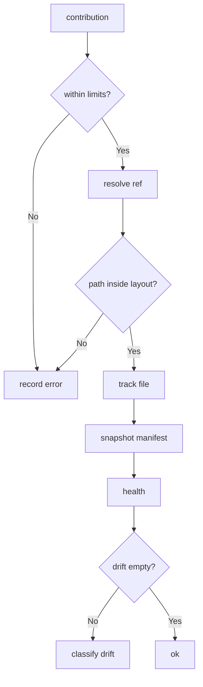

---
# MAM Metadata
id: template-repository-advanced
name: Repository Template (Advanced)
version: 2.0.0
type: repository

author: MAM Team
description: >
  A production-shaped source collection with enforced limits, branch depth
  tracking, explicit drift classification, and a health check that reports
  every failure with its cause.

license: MIT

runtime:
  language: python
  version: ">=3.12"

tags:
  - template
  - repository
  - advanced
  - drift
  - health

dependencies:
  - name: vcs-provider
    version: "^1.0"
  - name: telemetry
    version: "^2.0"

capabilities:
  - index
  - resolve
  - verify
  - drift
  - branch
  - health
  - contribute

permissions:
  filesystem:
    - read
  network:
    - internet
  environment:
    - read
---

# Repository Template (Advanced)

## Purpose

A repository you can leave running. On top of the basic lifecycle it enforces
hard limits on entries, path length, file size and branch depth; it classifies
drift per path instead of returning a flat list; it isolates every failure so
one bad path cannot take the collection down; and it exposes a health check
that names each outstanding problem.

## Inputs

| Name | Type | Required | Description |
|------|------|----------|-------------|
| root | string | Yes | Path prefix every tracked file must live under |
| default_ref | string | No | Ref used when a call does not name one. Defaults to `main` |
| manifest | object | No | Expected `path -> sha256` digests for tracked files |
| limits | object | No | Overrides for the declared limits |

## Outputs

| Name | Type | Description |
|------|------|-------------|
| index | array | Sorted paths of every tracked file |
| refs | object | Known refs and the commit each one points at |
| manifest | object | Digest of every tracked file |
| drift | object | Path to `missing`, `modified` or `untracked` |
| health | object | Overall `ok` flag plus the outstanding problems |
| errors | array | Failures from the most recent operation, with their cause |

## Capabilities

### index

List the tracked paths in the collection, sorted.

### resolve

Turn a ref name into the commit it currently points at.

### verify

Compare every tracked file against its recorded digest.

### drift

Classify each path as missing, modified or untracked.

### branch

Create a ref at a bounded depth above an existing ref.

### health

Report whether the collection matches its manifest.

### contribute

Accept a change on a ref, enforcing the declared limits.

## Contents

| Path | Kind | Description |
|------|------|-------------|
| modules/ | tree | MAM module sources owned by the collection |
| contracts/ | tree | Contract modules other collections depend on |
| manifests/ | tree | Digest manifests, one per ref |
| archives/ | tree | Imported snapshots, never indexed directly |
| README.md | file | Human entry point for the collection |

## Layout

A tracked path is valid when it is relative, uses forward slashes, and starts
with one of the declared roots. `archives/` is readable but is never part of
the index, so a snapshot cannot silently become live content.

## Versioning

Refs are opaque names pointing at commit ids. Branch depth is tracked so a
ref cannot be nested forever; folding a contribution back into `main` resets
the count for the branch that was folded.

## Limits

| Limit | Value | On breach |
|-------|-------|-----------|
| max_entries | 1000 | `RepositoryError`, reason `entry limit reached` |
| max_path_length | 200 | `RepositoryError`, path is refused |
| max_file_bytes | 262144 | `RepositoryError`, file is refused |
| max_branch_depth | 5 | `RepositoryError`, branch is not created |

## Rules

- Tracked paths must stay inside a declared root.
- Every limit is enforced before a path enters the index.
- The manifest is the source of truth for integrity, not the working tree.
- Every failure is recorded in `errors` with its cause before it is raised.
- A path is healthy only when it is tracked, present, and digest-matched.
- A contribution never rewrites an existing commit id.
- One refused path never invalidates the rest of the batch.

## Workflow



## Python

```python
import hashlib

ROOTS = ("modules/", "contracts/", "manifests/")

LIMITS = {
    "max_entries": 1000,
    "max_path_length": 200,
    "max_file_bytes": 262144,
    "max_branch_depth": 5,
}


class RepositoryError(Exception):
    """Raised when a contribution violates a declared repository rule."""


class Repository:
    """A source collection with limits, drift classification and health."""

    def __init__(self, root="modules/", default_ref="main", manifest=None, limits=None):
        self.root = root
        self.default_ref = default_ref
        self.limits = dict(LIMITS)
        if limits:
            self.limits.update(limits)
        self.refs = {default_ref: "0" * 12}
        self.depth = {default_ref: 0}
        self.entries = {}
        self.manifest = dict(manifest or {})
        self.errors = []

    def _fail(self, reason):
        self.errors.append(reason)
        raise RepositoryError(reason)

    def index(self):
        return sorted(self.entries)

    def resolve(self, ref=None):
        key = ref or self.default_ref
        if key not in self.refs:
            self._fail(f"unknown ref: {key}")
        return key, self.refs[key]

    def digest(self, path):
        return hashlib.sha256(self.entries[path].encode("utf-8")).hexdigest()

    def add(self, path, content, ref=None):
        self.resolve(ref)
        if not path.startswith(ROOTS):
            self._fail(f"path outside declared layout: {path}")
        if len(path) > self.limits["max_path_length"]:
            self._fail(f"path too long: {path}")
        if len(content.encode("utf-8")) > self.limits["max_file_bytes"]:
            self._fail(f"file too large: {path}")
        if len(self.entries) >= self.limits["max_entries"] and path not in self.entries:
            self._fail("entry limit reached")
        self.entries[path] = content
        return path

    def verify(self):
        return {
            path: ("missing" if path not in self.entries else "modified")
            for path, expected in sorted(self.manifest.items())
            if path not in self.entries or self.digest(path) != expected
        }

    def drift(self):
        report = self.verify()
        report.update({path: "untracked" for path in self.index() if path not in self.manifest})
        return report

    def snapshot(self, ref=None):
        self.resolve(ref)
        self.manifest = {path: self.digest(path) for path in self.index()}
        return self.manifest

    def branch(self, name, base=None):
        base_ref, _ = self.resolve(base)
        depth = self.depth[base_ref] + 1
        if depth > self.limits["max_branch_depth"]:
            self._fail("branch depth limit reached")
        self.refs[name] = self.refs[base_ref]
        self.depth[name] = depth
        return name

    def health(self):
        problems = self.drift()
        return {
            "ok": not problems,
            "entries": len(self.entries),
            "refs": len(self.refs),
            "problems": problems,
            "errors": list(self.errors),
        }

    def contribute(self, path, content, ref=None):
        key, base = self.resolve(ref)
        self.add(path, content, ref)
        commit = hashlib.sha256(f"{base}:{path}".encode("utf-8")).hexdigest()[:12]
        self.refs[key] = commit
        return {"ref": key, "commit": commit, "path": path}
```

## Tests

### Input

```yaml
root: modules/
default_ref: main
limits:
  max_path_length: 24
```

### Expected

```yaml
health:
  ok: true
drift: {}
```

```python
def test_health_and_drift():
    repo = Repository()
    repo.add("modules/core/auth.mam", "# Auth\n")
    repo.add("modules/core/rbac.mam", "# RBAC\n")
    repo.snapshot()

    assert repo.drift() == {}
    assert repo.health()["ok"] is True

    repo.entries["modules/core/auth.mam"] = "# Auth changed\n"
    assert repo.verify() == {"modules/core/auth.mam": "modified"}

    del repo.entries["modules/core/rbac.mam"]
    assert repo.verify()["modules/core/rbac.mam"] == "missing"

    repo.add("modules/core/audit.mam", "# Audit\n")
    assert repo.drift()["modules/core/audit.mam"] == "untracked"
    assert repo.health()["ok"] is False


def test_limits_and_branch_depth():
    repo = Repository(limits={"max_path_length": 24})
    try:
        repo.add("modules/core/a-very-long-name.mam", "# Long\n")
    except RepositoryError:
        pass
    else:
        raise AssertionError("expected RepositoryError for an over-long path")
    assert repo.errors[-1].startswith("path too long")
    assert repo.index() == []

    shallow = Repository(limits={"max_branch_depth": 1})
    name = shallow.branch("feature/docs")
    assert shallow.depth[name] == 1
    try:
        shallow.branch("feature/docs/nested", base="feature/docs")
    except RepositoryError:
        pass
    else:
        raise AssertionError("expected RepositoryError for an over-deep branch")
    assert "feature/docs/nested" not in shallow.refs


def test_contribute_leaves_main_untouched_on_failure():
    repo = Repository()
    repo.add("modules/core/auth.mam", "# Auth\n")
    before = repo.resolve()[1]
    try:
        repo.contribute("scratch/notes.txt", "scratch")
    except RepositoryError:
        pass
    else:
        raise AssertionError("expected RepositoryError for an undeclared path")
    assert repo.resolve()[1] == before
```

## Examples

```python
repo = Repository(root="modules/", default_ref="main")
branch = repo.branch("feature/rbac")
repo.contribute("modules/core/rbac.mam", "# RBAC\n", branch)
repo.snapshot()

print(repo.health())
print(repo.drift())

for path, state in repo.verify().items():
    print(f"{path}: {state}")
```

## References

- MAM Source Collection Conventions
- MAM Digest Manifest Format
- MAM Drift Reconciliation
- MAM Module Layout Rules
