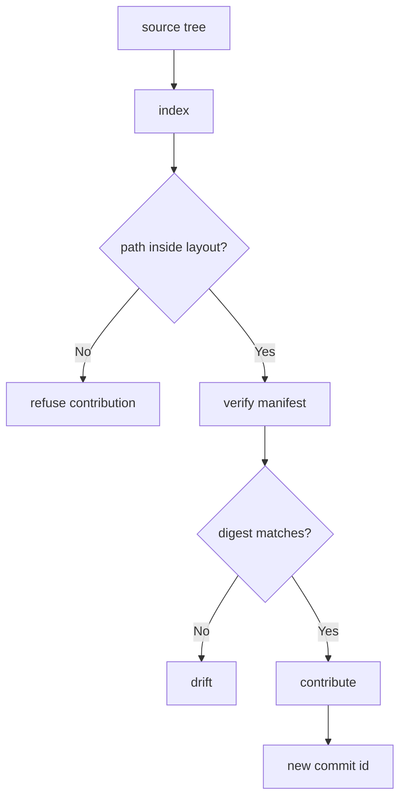

---
# MAM Metadata
id: template-repository-basic
name: Repository Template (Basic)
version: 2.0.0
type: repository

author: MAM Team
description: >
  A single-ref source collection: one default ref, one declared root, and a
  digest check over the tracked files.

license: MIT

runtime:
  language: python
  version: ">=3.12"

tags:
  - template
  - repository
  - basic

dependencies:
  - name: vcs-provider
    version: "^1.0"

capabilities:
  - index
  - verify
  - contribute

permissions:
  filesystem:
    - read
  network:
    - internet
---

# Repository Template (Basic)

## Purpose

The smallest useful repository: one declared root, one ref, a list of tracked
paths, and a digest check. Use [`repository.mam`](../repository.mam) when you
need multiple refs and a manifest you record deliberately, and
[`repository-advanced.mam`](./repository-advanced.mam) for limits, health
checks and drift reporting.

## Inputs

| Name | Type | Required | Description |
|------|------|----------|-------------|
| root | string | Yes | Path prefix every tracked file must live under |
| manifest | object | No | Expected `path -> sha256` digests |

## Outputs

| Name | Type | Description |
|------|------|-------------|
| index | array | Sorted paths of every tracked file |
| manifest | object | Digest of every tracked file |
| drift | array | Tracked paths whose digest no longer matches |

## Capabilities

### index

List the tracked paths in the collection, sorted.

### verify

Check every tracked file against its recorded digest.

### contribute

Accept a change and record the resulting commit id.

## Contents

| Path | Kind | Description |
|------|------|-------------|
| modules/ | tree | MAM module sources owned by the collection |
| README.md | file | Human entry point for the collection |

## Layout

A tracked path is valid when it is relative, uses forward slashes, and starts
with the declared root.

## Rules

- Tracked paths must stay inside the declared root.
- The manifest is the source of truth for integrity, not the working tree.
- Paths outside the declared layout are refused, not ignored.
- A contribution never rewrites an existing commit id.

## Workflow



## Python

```python
import hashlib


class Repository:
    """A source collection tracked against a digest manifest."""

    def __init__(self, root="modules/", manifest=None):
        self.root = root
        self.ref = "main"
        self.commit = "0" * 12
        self.entries = {}
        self.manifest = dict(manifest or {})

    def index(self):
        return sorted(self.entries)

    def digest(self, path):
        return hashlib.sha256(self.entries[path].encode("utf-8")).hexdigest()

    def add(self, path, content):
        if not path.startswith(self.root):
            raise ValueError(f"path outside declared layout: {path}")
        self.entries[path] = content
        return path

    def snapshot(self):
        self.manifest = {path: self.digest(path) for path in self.index()}
        return self.manifest

    def verify(self):
        drift = []
        for path, expected in sorted(self.manifest.items()):
            if path not in self.entries or self.digest(path) != expected:
                drift.append(path)
        return drift

    def contribute(self, path, content):
        self.add(path, content)
        self.commit = hashlib.sha256(f"{self.commit}:{path}".encode("utf-8")).hexdigest()[:12]
        return {"ref": self.ref, "commit": self.commit, "path": path}
```

## Tests

### Input

```yaml
root: modules/
```

### Expected

```yaml
drift: []
```

```python
def test_index_and_verify():
    repo = Repository(root="modules/")
    repo.add("modules/core/auth.mam", "# Auth\n")
    repo.snapshot()

    assert repo.index() == ["modules/core/auth.mam"]
    assert repo.verify() == []

    repo.entries["modules/core/auth.mam"] = "# Auth changed\n"
    assert repo.verify() == ["modules/core/auth.mam"]


def test_contribute_rejects_undeclared_path():
    repo = Repository(root="modules/")
    assert repo.contribute("modules/core/rbac.mam", "# RBAC\n")["ref"] == "main"
    try:
        repo.add("scratch/notes.txt", "scratch")
    except ValueError:
        pass
    else:
        raise AssertionError("expected ValueError for an undeclared path")
```

## Examples

```python
repo = Repository(root="modules/")
repo.add("modules/core/auth.mam", "# Auth\n")
repo.snapshot()
print(repo.index(), repo.verify())
print(repo.contribute("modules/core/rbac.mam", "# RBAC\n"))
```

## References

- MAM Source Collection Conventions
- MAM Module Layout Rules
