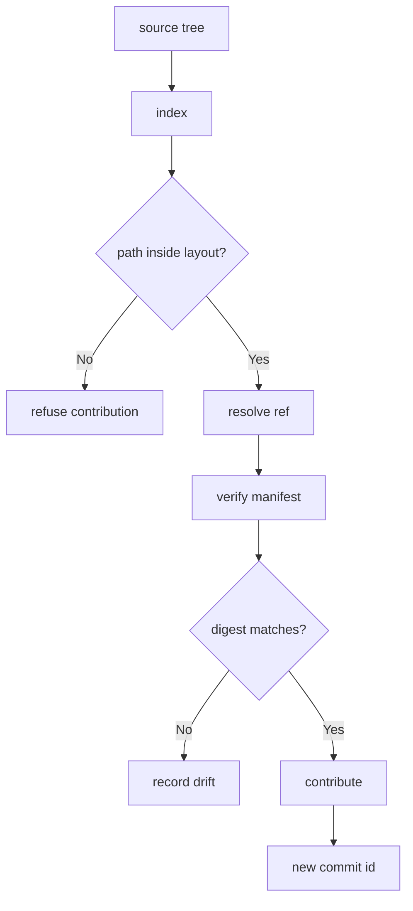

---
# MAM Metadata
id: template-repository
name: Repository Template
version: 2.0.0
type: repository
author: MAM Team
description: >
  Starter template for a source collection module: a declared content set,
  a fixed directory layout, a ref strategy, and a digest manifest that makes
  integrity verifiable.
license: MIT
runtime:
  language: python
  version: ">=3.12"
tags:
  - template
  - repository
  - source
  - versioning
dependencies:
  - name: vcs-provider
    version: "^1.0"
capabilities:
  - index
  - resolve
  - verify
  - contribute
permissions:
  filesystem:
    - read
  network:
    - internet
  environment:
    - read
---

# Repository Template

## Purpose

Describe a source collection as a module. A repository does not own the
content, it declares it: which paths belong to the collection, which ref is
current, and what each tracked file must hash to. The template gives you an
index you can list, a ref you can resolve, a manifest you can verify, and a
single entry point for accepting a contribution.

## Inputs

| Name | Type | Required | Description |
|------|------|----------|-------------|
| root | string | Yes | Path prefix every tracked file must live under |
| default_ref | string | No | Ref used when a call does not name one. Defaults to `main` |
| manifest | object | No | Expected `path -> sha256` digests for tracked files |

## Outputs

| Name | Type | Description |
|------|------|-------------|
| index | array | Sorted paths of every tracked file |
| refs | object | Known refs and the commit each one points at |
| manifest | object | Digest of every tracked file |
| status | string | `ok` when the tree matches the manifest |

## Capabilities

### index

List the tracked paths in the collection, sorted.

### resolve

Turn a ref name into the commit it currently points at.

### verify

Check every tracked file against its recorded digest.

### contribute

Accept a change on a ref and record the resulting commit.

## Contents

| Path | Kind | Description |
|------|------|-------------|
| modules/ | tree | MAM module sources owned by the collection |
| contracts/ | tree | Contract modules other collections depend on |
| manifests/ | tree | Digest manifests, one per ref |
| README.md | file | Human entry point for the collection |

## Layout

A tracked path is valid when it is relative, uses forward slashes, and starts
with one of the declared roots. Anything else is not part of the collection
and is refused before it can be indexed.

## Versioning

Refs are opaque names. `main` is the ref a consumer reads; feature refs carry
contributions until they are folded back. The template never parses ref names
as versions — a commit id is the only thing a resolve returns.

## Rules

- Tracked paths must stay inside a declared root.
- The manifest is the source of truth for integrity, not the working tree.
- A contribution never rewrites an existing commit id.
- Refs resolve to a commit id, never to a mutable working tree.
- Paths outside the declared layout are refused, not ignored.

## Workflow



## Python

```python
import hashlib

ROOTS = ("modules/", "contracts/", "manifests/")


class Repository:
    """A source collection with a declared layout and a digest manifest."""

    def __init__(self, root="modules/", default_ref="main", manifest=None):
        self.root = root
        self.default_ref = default_ref
        self.refs = {default_ref: "0" * 12}
        self.entries = {}
        self.manifest = dict(manifest or {})

    def resolve(self, ref=None):
        """Return the (ref, commit) pair a ref currently points at."""
        key = ref or self.default_ref
        if key not in self.refs:
            raise KeyError(f"unknown ref: {key}")
        return key, self.refs[key]

    def index(self):
        """Return every tracked path, sorted."""
        return sorted(self.entries)

    def add(self, path, content, ref=None):
        """Track a file, refusing anything outside the declared layout."""
        if not path.startswith(ROOTS):
            raise ValueError(f"path outside declared layout: {path}")
        self.resolve(ref)
        self.entries[path] = content
        return path

    def digest(self, path):
        """Return the sha256 of a tracked file."""
        return hashlib.sha256(self.entries[path].encode("utf-8")).hexdigest()

    def verify(self):
        """Return the paths whose digest no longer matches the manifest."""
        drift = []
        for path, expected in sorted(self.manifest.items()):
            if path not in self.entries:
                drift.append(path)
            elif self.digest(path) != expected:
                drift.append(path)
        return drift

    def snapshot(self):
        """Record the current digests as the manifest."""
        self.manifest = {path: self.digest(path) for path in self.index()}
        return self.manifest

    def contribute(self, path, content, ref=None):
        """Accept a change on a ref and return the resulting commit id."""
        key, base = self.resolve(ref)
        self.add(path, content, ref)
        commit = hashlib.sha256(f"{base}:{path}".encode("utf-8")).hexdigest()[:12]
        self.refs[key] = commit
        return {"ref": key, "commit": commit, "path": path}
```

## Tests

### Input

```yaml
root: modules/
default_ref: main
manifest:
  modules/core/auth.mam: <sha256>
```

### Expected

```yaml
status: ok
index:
  - modules/core/auth.mam
```

```python
def test_index_verify_and_contribute():
    repo = Repository(root="modules/")
    repo.add("modules/core/auth.mam", "# Auth\n")
    repo.snapshot()

    assert repo.index() == ["modules/core/auth.mam"]
    assert repo.verify() == []

    result = repo.contribute("modules/core/rbac.mam", "# RBAC\n")
    assert result["ref"] == "main"
    assert len(result["commit"]) == 12

    # A tracked file edited behind the manifest's back shows up as drift.
    repo.entries["modules/core/auth.mam"] = "# Auth changed\n"
    assert repo.verify() == ["modules/core/auth.mam"]


def test_refusals():
    repo = Repository()
    try:
        repo.add("scratch/notes.txt", "scratch")
    except ValueError:
        pass
    else:
        raise AssertionError("expected ValueError for an undeclared path")
    assert repo.index() == []
```

## Examples

```python
repo = Repository(root="modules/", default_ref="main")
repo.add("modules/core/auth.mam", "# Auth\n")
repo.snapshot()

print(repo.index())
print(repo.resolve())

if repo.verify():
    print("drift:", repo.verify())

print(repo.contribute("modules/core/rbac.mam", "# RBAC\n"))
```

## References

- MAM Source Collection Conventions
- MAM Digest Manifest Format
- MAM Module Layout Rules
