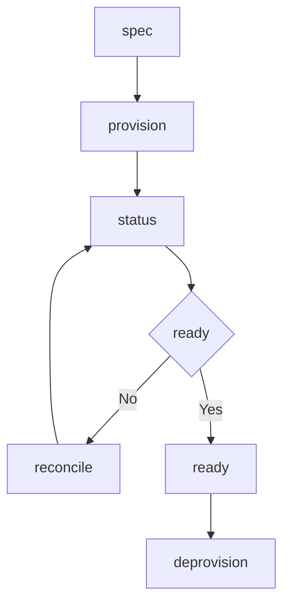

# Resource Template

## Purpose

Describe a resource that a provider manages outside the MAM runtime. The template declares the desired state, the provider that applies it, the permissions the provider needs, and a reconcile loop that drives the actual state toward the desired state.

## Inputs

| Name | Type | Required | Description |
|------|------|----------|-------------|
| spec | object | Yes | Desired state for the resource |
| provider | string | Yes | Name of the provider that manages the resource |

## Outputs

| Name | Type | Description |
|------|------|-------------|
| id | string | Provider identifier for the resource |
| state | object | Actual state reported by the provider |
| ready | boolean | Whether the resource matches the desired state |

## Capabilities

### provision

Create the resource through the provider.

### deprovision

Remove the resource through the provider.

### status

Read the actual state from the provider.

### reconcile

Compare desired and actual state and apply the difference.

## Provider

| Field | Value | Description |
|-------|-------|-------------|
| name | example-provider | Provider that manages the resource |
| endpoint | api.example.com | Provider API endpoint |
| auth | environment | Credential source |

## Permissions

| Scope | Access | Reason |
|-------|--------|--------|
| filesystem | read | Read local spec files |
| network | internet | Reach the provider API |
| environment | read | Read provider credentials |

## Rules

- The resource is only changed through its provider.
- Credentials come from the environment and are never logged.
- Reconcile is idempotent and safe to repeat.
- A failed apply leaves the resource in its previous state.
- Actual state is refreshed before every reconcile.
- Removal waits for dependent resources to release the resource.

## Workflow



## Python

```python
class Resource:
    def __init__(self, provider="example-provider", spec=None):
        self.provider = provider
        self.spec = spec or {}
        self.state = {}
        self.id = None

    def provision(self):
        self.id = self.provider + ":resource"
        self.state = dict(self.spec)
        return self.id

    def status(self):
        return {"id": self.id, "state": self.state}

    def ready(self):
        return bool(self.id) and self.state == self.spec

    def reconcile(self):
        if self.id is None:
            return self.provision()
        self.state = dict(self.spec)
        return self.id

    def deprovision(self):
        self.id = None
        self.state = {}
        return None
```

## Tests

### Input

```yaml
spec:
  size: small
provider: example-provider
```

### Expected

```yaml
ready: true
```

```python
def test_provision_and_reconcile():
    resource = Resource(spec={"size": "small"})
    resource.provision()
    assert resource.ready() is True
    resource.spec = {"size": "large"}
    resource.reconcile()
    assert resource.status()["state"] == {"size": "large"}
    assert resource.deprovision() is None
    assert resource.ready() is False
```

## Examples

```python
resource = Resource(provider="example-provider", spec={"size": "small"})
resource.provision()
resource.reconcile()
print(resource.status())
resource.deprovision()
```

## References

- MAM Resource Provider Interface
- MAM Permission Model
