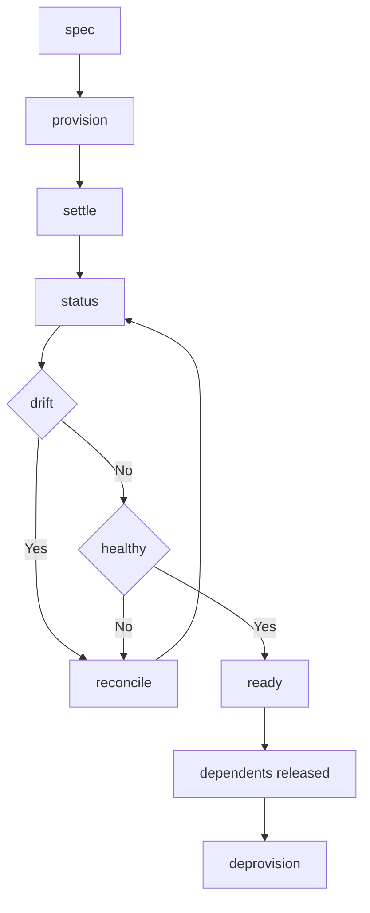

---
# MAM Metadata
id: template-resource-advanced
name: Resource Template (Advanced)
version: 2.0.0
type: resource

author: MAM Team
description: >
  A resource with health checks, drift detection, a settle window and
  dependency-aware teardown.

license: MIT

runtime:
  language: python
  version: ">=3.12"

tags:
  - template
  - resource
  - advanced
  - drift
  - health

dependencies:
  - name: provider-sdk
    version: "^1.0"
  - name: telemetry
    version: "^2.0"

capabilities:
  - provision
  - status
  - health
  - drift
  - reconcile
  - deprovision

permissions:
  filesystem:
    - read
    - write
  network:
    - internet
  environment:
    - read
---

# Resource Template (Advanced)

## Purpose

A production-shaped resource. In addition to the basic lifecycle it declares a
health check, explicit drift detection, a settle window before a resource is
called ready, and teardown that waits for dependents to release it.

## Inputs

| Name | Type | Required | Description |
|------|------|----------|-------------|
| spec | object | Yes | Desired state |
| provider | string | Yes | Provider that manages the resource |
| settle_seconds | number | No | Time to wait after apply before reporting ready |
| dependents | array | No | Resources that must release this one first |

## Outputs

| Name | Type | Description |
|------|------|-------------|
| id | string | Provider identifier for the resource |
| state | object | Actual state reported by the provider |
| ready | boolean | Whether the resource matches the desired state |
| healthy | boolean | Whether the provider reports the resource usable |
| drift | array | Fields where actual differs from desired |
| errors | array | Errors from the most recent operation |

## Capabilities

### provision

Create the resource through the provider and wait for it to settle.

### status

Read the actual state from the provider.

### health

Ask the provider whether the resource is usable.

### drift

Report the fields where actual state differs from desired state.

### reconcile

Apply the difference between actual and desired state, then re-check health.

### deprovision

Remove the resource once every dependent has released it.

## Provider

| Field | Value | Description |
|-------|-------|-------------|
| name | example-provider | Provider that manages the resource |
| endpoint | api.example.com | Provider API endpoint |
| auth | environment | Credential source |
| timeout_seconds | 30 | Per-request timeout |
| retries | 3 | Attempts before an operation is declared failed |

## Permissions

| Scope | Access | Reason |
|-------|--------|--------|
| filesystem | read | Read the local spec file |
| filesystem | write | Record reconcile history |
| network | internet | Reach the provider API |
| environment | read | Read provider credentials |

## Rules

- The resource is only changed through its provider.
- Credentials come from the environment and are never logged.
- Reconcile is idempotent and safe to repeat.
- A failed apply leaves the resource in its previous state.
- Actual state is refreshed before every reconcile.
- A resource is only ready once it is both converged and healthy.
- Removal waits for dependent resources to release the resource.
- Every failed operation is recorded in `errors` with its cause.

## Workflow



## Python

```python
class Resource:
    def __init__(self, provider="example-provider", spec=None,
                 settle_seconds=0, dependents=None):
        self.provider = provider
        self.spec = spec or {}
        self.settle_seconds = settle_seconds
        self.dependents = dependents or []
        self.state = {}
        self.id = None
        self.healthy = False
        self.errors = []

    def provision(self):
        self.id = f"{self.provider}:bucket"
        self.state = dict(self.spec)
        self.healthy = True
        return self.id

    def status(self):
        return {"id": self.id, "state": dict(self.state)}

    def drift(self):
        return sorted(k for k, v in self.spec.items() if self.state.get(k) != v)

    def ready(self):
        return bool(self.id) and not self.drift() and self.healthy

    def reconcile(self):
        try:
            if self.id is None:
                return self.provision()
            self.state = dict(self.spec)
            self.healthy = True
        except Exception as error:            # recorded, never raised to the caller
            self.errors.append(str(error))
            raise
        return self.id

    def deprovision(self):
        if self.dependents:
            return None
        self.id = None
        self.state = {}
        self.healthy = False
        return None
```

## Tests

### Input

```yaml
spec:
  size: small
provider: example-provider
settle_seconds: 1
```

### Expected

```yaml
ready: true
drift: []
```

```python
def test_drift_and_teardown():
    resource = Resource(spec={"size": "small"}, dependents=["logs"])
    resource.provision()
    assert resource.drift() == []
    assert resource.ready() is True

    resource.state["size"] = "large"
    assert resource.drift() == ["size"]

    resource.reconcile()
    assert resource.drift() == []

    assert resource.deprovision() is None      # dependents still hold it
    resource.dependents = []
    assert resource.deprovision() is None
    assert resource.ready() is False
```

## Examples

```python
resource = Resource(
    provider="example-provider",
    spec={"size": "small"},
    dependents=["logs"],
)
resource.provision()
resource.reconcile()
print(resource.status(), resource.drift(), resource.healthy)
resource.dependents = []
resource.deprovision()
```

## References

- MAM Resource Provider Interface
- MAM Permission Model
- MAM Drift Reconciliation
