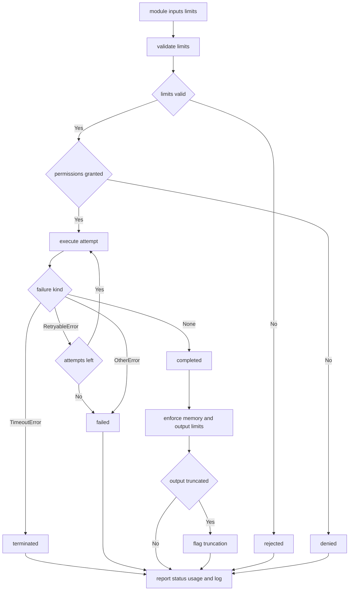

---
# MAM Metadata
id: template-runtime-advanced
name: Runtime Template (Advanced)
version: 2.0.0
type: runtime

author: MAM Team
description: >
  A production execution engine with permission enforcement, layered resource
  limits, bounded retries, crash-safe termination and per-run observability.

license: MIT

runtime:
  language: python
  version: ">=3.12"

tags:
  - template
  - runtime
  - execution
  - sandbox
  - advanced
  - observability

dependencies:
  - name: mam-runtime
    version: "^2.0"
  - name: telemetry
    version: "^2.0"

capabilities:
  - prepare
  - execute
  - terminate
  - retry
  - limit
  - report

permissions:
  filesystem:
    - read
    - write
  process:
    - spawn
  environment:
    - read
  python:
    - sandbox
---

# Runtime Template (Advanced)

## Purpose

A runtime you can leave running unattended. On top of the basic engine it
enforces declared permissions before a run starts, validates the limit set
instead of trusting it, retries only the failures that are safe to retry,
terminates hard when a ceiling is hit, and reports enough about every run —
attempts, usage, log tail, counters — to explain a failure after the fact.

## Inputs

| Name | Type | Required | Description |
|------|------|----------|-------------|
| module | object | Yes | The module to run, e.g. `{ "id": "orders", "type": "workflow" }` |
| inputs | object | No | Values bound to the module's declared inputs |
| limits | object | No | Resource limits for this run. Defaults to the table below |
| entrypoint | callable | No | The function the runtime invokes |
| peak_mb | number | No | Peak memory the host observed for the run. Defaults to `0` |

## Outputs

| Name | Type | Description |
|------|------|-------------|
| status | string | `ok`, `timeout`, `error`, `denied` or `rejected` |
| state | string | Terminal lifecycle state of the run |
| outputs | object | Values produced by the module |
| usage | object | Wall time, peak memory, output size and log lines |
| attempts | int | How many times the entrypoint was called |
| exit_code | int | `0` success, `1` error, `2` denied or rejected, `124` timeout |
| log | array | Bounded tail of the run's log lines |

## Capabilities

### prepare

Resolve the module, validate the limit set and check declared permissions.

### execute

Run the entrypoint inside the sandbox, measuring wall time and usage.

### terminate

Stop a run the moment it crosses a declared ceiling.

### retry

Re-invoke the entrypoint only for failures the module marked retryable.

### limit

Enforce timeout, memory, output and log ceilings on a running module.

### report

Return status, outputs, usage, attempts and the bounded log tail.

## Execution Model

| Property | Value | Description |
|----------|-------|-------------|
| model | one module per run | A run executes exactly one module |
| entrypoint | `run` | The callable the runtime invokes |
| state | none between runs | Nothing is carried from one run to the next |
| concurrency | one run per runtime | A second run is queued, not interleaved |
| clock | injected | The runtime owns time; module code never reads a clock |
| determinism | required | The same module, inputs and limits give the same outputs |
| retries | opt-in per error | Only `RetryableError` is retried, at most `max_attempts` |

## Isolation

| Boundary | Mechanism | Consequence for the module |
|----------|-----------|-----------------------------|
| filesystem | read-only mount of the module directory | A module cannot write beside itself |
| filesystem | scratch directory per run | Anything a module writes goes to scratch |
| process | child process, no fork of the host | A crash is contained and recoverable |
| network | denied unless declared | A module makes no outbound calls by default |
| environment | filtered allowlist | Only declared variables are visible |
| python | no host imports | The module may not reach host internals |
| environment | cleared on termination | Scratch is destroyed with the run |

Isolation is what turns `permissions` in the frontmatter from documentation
into enforcement, and it is why a terminated run leaves nothing behind.

## Resource Limits

| Limit | Default | Behaviour when exceeded |
|-------|---------|-------------------------|
| `timeout_ms` | 30000 | Run is terminated, status becomes `timeout`, exit code `124` |
| `memory_mb` | 512 | Run is terminated, status becomes `error`, exit code `1` |
| `max_output_bytes` | 1048576 | Output is replaced with a truncation marker |
| `max_log_lines` | 1000 | Log is a bounded deque; older lines are dropped |
| `max_attempts` | 3 | Upper bound on entrypoint invocations |

A limit set with a zero, negative or non-integer value is rejected before the
run starts. The runtime never silently substitutes a default.

## Lifecycle

| State | Meaning | Next |
|-------|---------|------|
| `new` | Run object created | `prepared`, `failed` |
| `prepared` | Module, limits and permissions checked | `running` |
| `running` | Entrypoint executing | `running` on retry, or terminal |
| `completed` | Entrypoint returned | terminal |
| `failed` | Entrypoint raised a non-retryable error | terminal |
| `terminated` | A ceiling was hit | terminal |

Every run reaches exactly one terminal state. A run rejected during
preparation never reaches `running` and is never retried.

## Failure Handling

| Failure | Status | Retried | Exit code |
|---------|--------|---------|-----------|
| Entrypoint raises `RetryableError` | `error` then `ok` | Yes, up to `max_attempts` | `0` if a later attempt succeeds |
| Entrypoint exceeds `timeout_ms` | `timeout` | No | `124` |
| Entrypoint exceeds `memory_mb` | `error` | No | `1` |
| Entrypoint raises anything else | `error` | No | `1` |
| Undeclared permission | `denied` | No | `2` |
| Invalid limits or missing entrypoint | `rejected` | No | `2` |

A retry resets the consecutive failure count. Retries are counted, never hidden.

## Observability

| Metric | Type | Meaning |
|--------|------|---------|
| `runs` | counter | Runs the runtime has accepted for execution |
| `ok` / `error` / `timeout` | counter | Terminal outcomes by status |
| `denied` / `rejected` | counter | Runs stopped before execution |
| `retries` | counter | Extra entrypoint invocations |
| `terminated` | gauge | Runs stopped by a ceiling |
| `usage.wall_ms` / `usage.peak_mb` | gauge | Per-run cost |
| `log` | bounded array | Last `max_log_lines` lines, payloads never recorded |

## Rules

- A run executes exactly one module; composition happens outside the runtime.
- Nothing is carried between runs; every run starts from declared inputs.
- Permissions and limits are validated before execution, never during it.
- A run that exceeds any ceiling is terminated, not paused or downgraded.
- Only a failure the module marked retryable is retried, and never a timeout.
- A denied or rejected run is never executed and never retried.
- The runtime owns the clock; module code may not read one.
- Module code may not import host internals.
- Usage and the log tail are reported even when a run fails.

## Workflow



## Python

```python
import time
from collections import deque

DEFAULT_LIMITS = {
    "timeout_ms": 30000,
    "memory_mb": 512,
    "max_output_bytes": 1048576,
    "max_log_lines": 1000,
    "max_attempts": 3,
}

INTEGER_LIMITS = ("timeout_ms", "memory_mb", "max_output_bytes", "max_attempts")


class PermissionDenied(Exception):
    """The module asked for a permission the host did not grant."""


class RetryableError(Exception):
    """The module failed in a way the runtime may try again."""


class LimitExceeded(Exception):
    """The run crossed a declared resource ceiling."""


def validate_limits(limits):
    """Return a list of problems; an empty list means the set is usable."""
    problems = []
    for name in INTEGER_LIMITS:
        value = limits.get(name)
        if isinstance(value, bool) or not isinstance(value, int) or value <= 0:
            problems.append(f"{name} must be a positive integer")
    return problems


class Run:
    def __init__(self, module, inputs=None, limits=None, granted=(),
                 clock=time.monotonic):
        self.module = module
        self.inputs = dict(inputs or {})
        self.limits = dict(DEFAULT_LIMITS)
        self.limits.update(limits or {})
        self.granted = set(granted)
        self.clock = clock
        self.declared = set(module.get("permissions", ()))
        self.log = deque(maxlen=self.limits["max_log_lines"])
        self.state = "new"
        self.status = "ok"
        self.exit_code = 0
        self.outputs = {}
        self.attempts = 0
        self.retryable = False
        self.usage = {"wall_ms": 0, "peak_mb": 0, "output_bytes": 0, "log_lines": 0}

    def note(self, message):
        self.log.append(f"attempt {self.attempts}: {message}"
                        if self.attempts else message)

    def prepare(self):
        if not self.module.get("id"):
            raise ValueError("module has no id")
        problems = validate_limits(self.limits)
        if problems:
            raise ValueError("; ".join(problems))
        missing = sorted(self.declared - self.granted)
        if missing:
            raise PermissionDenied(f"permissions not granted: {missing}")
        self.state = "prepared"
        return self.state

    def attempt(self, entrypoint):
        self.attempts += 1
        self.retryable = False
        started = self.clock()
        self.state = "running"
        self.note("started")
        try:
            self.outputs = entrypoint(self.inputs)
        except RetryableError as error:
            self.retryable = True
            self.status = "error"
            self.note(f"retryable failure: {error}")
        except TimeoutError as error:
            self.status = "timeout"
            self.exit_code = 124
            self.state = "terminated"
            self.outputs = {"error": str(error)}
            self.note(f"terminated: {error}")
        except Exception as error:
            self.status = "error"
            self.exit_code = 1
            self.state = "failed"
            self.outputs = {"error": str(error)}
            self.note(f"failed: {error}")
        else:
            self.status = "ok"
            self.exit_code = 0
            self.state = "completed"
            self.note("completed")
        self.usage["wall_ms"] += int((self.clock() - started) * 1000)
        return self.state

    def enforce(self, peak_mb=0):
        self.usage["peak_mb"] = max(self.usage["peak_mb"], int(peak_mb))
        self.usage["output_bytes"] = len(repr(self.outputs).encode("utf-8"))
        self.usage["log_lines"] = len(self.log)
        if self.usage["peak_mb"] > self.limits["memory_mb"]:
            raise LimitExceeded(
                f"peak {self.usage['peak_mb']}mb over {self.limits['memory_mb']}mb")
        if self.usage["output_bytes"] > self.limits["max_output_bytes"]:
            self.outputs = {"error": "output exceeds max_output_bytes",
                            "truncated": True}
            self.note("output truncated")
        return self.usage

    def report(self):
        return {
            "module": self.module.get("id"),
            "status": self.status,
            "state": self.state,
            "outputs": self.outputs,
            "usage": dict(self.usage),
            "attempts": self.attempts,
            "exit_code": self.exit_code,
            "log": list(self.log),
        }


class Runtime:
    def __init__(self, granted=(), clock=time.monotonic):
        self.granted = set(granted)
        self.clock = clock
        self.active = 0
        self.metrics = {"runs": 0, "ok": 0, "error": 0, "timeout": 0,
                        "denied": 0, "rejected": 0, "retries": 0,
                        "terminated": 0}

    def _finish(self, run, status, exit_code, outputs):
        self.metrics[status] += 1
        if run.state == "terminated":
            self.metrics["terminated"] += 1
        return {
            "module": run.module.get("id"),
            "status": status,
            "state": run.state,
            "outputs": outputs,
            "usage": dict(run.usage),
            "attempts": run.attempts,
            "exit_code": exit_code,
            "log": list(run.log),
        }

    def run(self, module, inputs=None, limits=None, entrypoint=None, peak_mb=0):
        run = Run(module, inputs=inputs, limits=limits, granted=self.granted,
                  clock=self.clock)
        self.metrics["runs"] += 1
        if entrypoint is None:
            run.note("rejected: no entrypoint declared")
            return self._finish(run, "rejected", 2,
                                {"error": "no entrypoint declared"})
        try:
            run.prepare()
        except PermissionDenied as error:
            run.note(f"denied: {error}")
            return self._finish(run, "denied", 2, {"error": str(error)})
        except ValueError as error:
            run.note(f"rejected: {error}")
            return self._finish(run, "rejected", 2, {"error": str(error)})
        self.active += 1
        try:
            run.attempt(entrypoint)
            while run.retryable and run.attempts < run.limits["max_attempts"]:
                self.metrics["retries"] += 1
                run.attempt(entrypoint)
            try:
                run.enforce(peak_mb)
            except LimitExceeded as error:
                run.status = "error"
                run.state = "terminated"
                run.exit_code = 1
                run.outputs = {"error": str(error)}
                run.note(f"terminated: {error}")
        finally:
            self.active -= 1
        return self._finish(run, run.status, run.exit_code, run.outputs)

    def health(self):
        return {
            "ready": self.active == 0,
            "active": self.active,
            "default_limits": dict(DEFAULT_LIMITS),
            "metrics": dict(self.metrics),
        }
```

## Tests

### Input

```yaml
module:
  id: orders
  type: workflow
  permissions:
    - filesystem:read
inputs:
  order_id: 21
limits:
  timeout_ms: 30000
  max_attempts: 3
```

### Expected

```yaml
status: ok
state: completed
attempts: 3
exit_code: 0
```

```python
def test_retryable_failure_is_retried_then_succeeds():
    runtime = Runtime(granted=("filesystem:read",))
    seen = []

    def flaky(inputs):
        seen.append(inputs["order_id"])
        if len(seen) < 3:
            raise RetryableError("provider warming up")
        return {"total": inputs["order_id"] * 2}

    report = runtime.run({"id": "orders", "permissions": ["filesystem:read"]},
                         inputs={"order_id": 21}, entrypoint=flaky)
    assert report["status"] == "ok"
    assert report["state"] == "completed"
    assert report["attempts"] == 3
    assert report["outputs"] == {"total": 42}
    assert runtime.health()["metrics"]["retries"] == 2


def test_memory_ceiling_terminates_the_run():
    runtime = Runtime()
    report = runtime.run({"id": "huge"}, entrypoint=lambda inputs: {"blob": "x"},
                         peak_mb=900)
    assert report["status"] == "error"
    assert report["state"] == "terminated"
    assert report["exit_code"] == 1
    assert report["usage"]["peak_mb"] == 900
    assert runtime.health()["metrics"]["terminated"] == 1


def test_bad_configuration_is_rejected_and_health_stays_ready():
    runtime = Runtime()
    report = runtime.run({"id": "orders"}, limits={"timeout_ms": 0},
                         entrypoint=lambda inputs: {})
    assert report["status"] == "rejected"
    assert report["exit_code"] == 2

    denied = runtime.run({"id": "net", "permissions": ["network:internet"]},
                         entrypoint=lambda inputs: {})
    assert denied["status"] == "denied"
    assert denied["state"] == "new"

    health = runtime.health()
    assert health["ready"] is True
    assert health["active"] == 0
    assert health["metrics"]["rejected"] == 1
    assert health["metrics"]["denied"] == 1
```

## Examples

```python
runtime = Runtime(granted=("filesystem:read",))
seen = []

def flaky(inputs):
    seen.append(inputs["order_id"])
    if len(seen) < 2:
        raise RetryableError("provider warming up")
    return {"total": inputs["order_id"] * 2}

report = runtime.run({"id": "orders", "permissions": ["filesystem:read"]},
                     inputs={"order_id": 21}, entrypoint=flaky)
print(report["attempts"], report["status"])                 # 2 ok
print(runtime.run({"id": "net", "permissions": ["network:internet"]},
                  entrypoint=flaky)["status"])               # denied
print(runtime.health()["metrics"])
```

## References

- MAM Runtime Specification
- MAM Permission Model
- MAM Resource Limit Policy
- [Runtime template](./runtime.mam)
- [Extension templates](../extension/)
