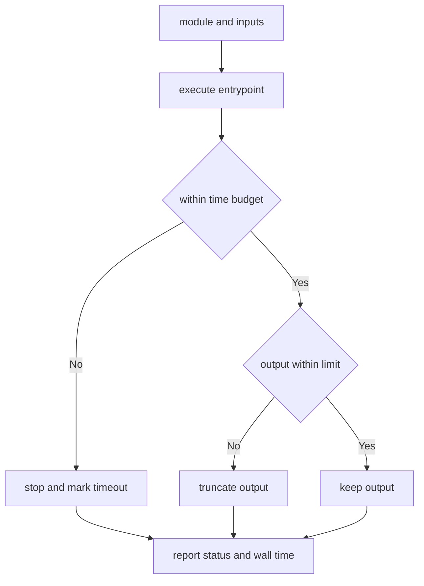

---
# MAM Metadata
id: template-runtime-basic
name: Runtime Template (Basic)
version: 2.0.0
type: runtime

author: MAM Team
description: >
  A minimal execution engine that runs one module call with a time limit.

license: MIT

runtime:
  language: python
  version: ">=3.12"

tags:
  - template
  - runtime
  - execution
  - basic

capabilities:
  - execute
  - report

permissions:
  process:
    - spawn
  python:
    - sandbox
---

# Runtime Template (Basic)

## Purpose

The smallest useful execution engine: run one module call, give it a time
budget, and report what came back. Use
[`runtime.mam`](../runtime.mam) when you need permission enforcement, memory
and output ceilings, and the full lifecycle table, and
[`runtime-advanced.mam`](./runtime-advanced.mam) for retries, concurrency,
metrics and crash forensics.

## Inputs

| Name | Type | Required | Description |
|------|------|----------|-------------|
| module | object | Yes | The module to run, e.g. `{ "id": "orders", "type": "workflow" }` |
| inputs | object | No | Values bound to the module's declared inputs |
| timeout_ms | number | No | Time budget for the run. Defaults to `5000` |

## Outputs

| Name | Type | Description |
|------|------|-------------|
| status | string | `ok`, `timeout` or `error` |
| outputs | object | Values produced by the module |
| wall_ms | int | Wall time the run consumed |

## Capabilities

### execute

Run the module's entrypoint for the length of its time budget.

### report

Return the run's status, outputs and elapsed time.

## Execution Model

| Property | Value | Description |
|----------|-------|-------------|
| model | one module per run | A run executes exactly one module |
| entrypoint | `run` | The callable the runtime invokes |
| state | none between runs | Nothing is carried from one run to the next |
| isolation | child process | A crash is contained by the host process |

## Resource Limits

| Limit | Default | Behaviour when exceeded |
|-------|---------|-------------------------|
| `timeout_ms` | 5000 | Run is stopped, status becomes `timeout` |
| `max_output_bytes` | 65536 | Output is replaced with a truncation marker |

Nothing else is measured. A basic runtime trusts its own modules to stay inside
their memory budget.

## Rules

- A run executes exactly one module.
- Nothing is carried between runs.
- A run that exceeds its time budget is stopped, not retried.
- A failed run still reports its status and elapsed time.
- Module code may not reach host internals.

## Workflow



## Python

```python
import time

DEFAULT_TIMEOUT_MS = 5000
MAX_OUTPUT_BYTES = 65536


class Run:
    def __init__(self, module, inputs=None, timeout_ms=DEFAULT_TIMEOUT_MS):
        self.module = module
        self.inputs = dict(inputs or {})
        self.timeout_ms = timeout_ms
        self.status = "ok"
        self.outputs = {}
        self.wall_ms = 0

    def execute(self, entrypoint):
        started = time.monotonic()
        try:
            self.outputs = entrypoint(self.inputs)
        except TimeoutError as error:
            self.status = "timeout"
            self.outputs = {"error": str(error)}
        except Exception as error:
            self.status = "error"
            self.outputs = {"error": str(error)}
        self.wall_ms = int((time.monotonic() - started) * 1000)
        if len(repr(self.outputs).encode("utf-8")) > MAX_OUTPUT_BYTES:
            self.outputs = {"error": "output truncated"}
        return self.status

    def report(self):
        return {
            "module": self.module.get("id"),
            "status": self.status,
            "outputs": self.outputs,
            "wall_ms": self.wall_ms,
        }


class Runtime:
    def run(self, module, inputs=None, entrypoint=None, timeout_ms=DEFAULT_TIMEOUT_MS):
        run = Run(module, inputs=inputs, timeout_ms=timeout_ms)
        if entrypoint is None:
            run.status = "error"
            run.outputs = {"error": "no entrypoint declared"}
            return run.report()
        run.execute(entrypoint)
        return run.report()
```

## Tests

### Input

```yaml
module:
  id: orders
  type: workflow
inputs:
  order_id: 42
timeout_ms: 1000
```

### Expected

```yaml
status: ok
outputs:
  total: 84
```

```python
def test_successful_run():
    report = Runtime().run(
        {"id": "orders"},
        inputs={"order_id": 42},
        entrypoint=lambda inputs: {"total": inputs["order_id"] * 2},
        timeout_ms=1000,
    )
    assert report["status"] == "ok"
    assert report["outputs"] == {"total": 84}
    assert report["wall_ms"] >= 0


def test_entrypoint_failure_is_reported():
    def boom(_inputs):
        raise ValueError("bad input")

    report = Runtime().run({"id": "orders"}, entrypoint=boom)
    assert report["status"] == "error"
    assert report["outputs"] == {"error": "bad input"}
```

## Examples

```python
runtime = Runtime()
print(runtime.run({"id": "orders"},
                  inputs={"order_id": 42},
                  entrypoint=lambda i: {"total": i["order_id"] * 2}))
print(runtime.run({"id": "orders"}, entrypoint=None)["status"])
```

## References

- MAM Runtime Specification
- [Runtime template](./runtime.mam)
- [Runtime template (advanced)](./runtime-advanced.mam)
