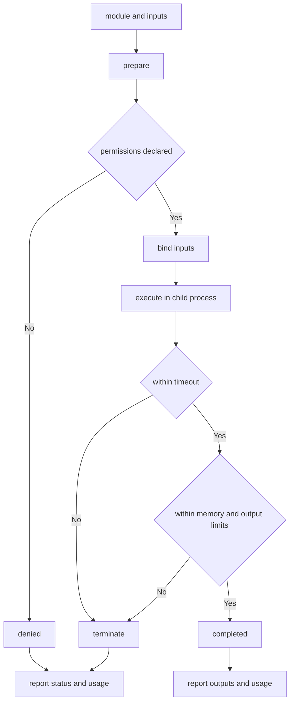

---
# MAM Metadata
id: template-runtime
name: Runtime Template
version: 2.0.0
type: runtime
author: MAM Team
description: >
  Starter template for an execution engine that prepares, runs and terminates
  MAM modules under declared isolation and resource limits.
license: MIT
runtime:
  language: python
  version: ">=3.12"
tags:
  - template
  - runtime
  - execution
  - sandbox
  - lifecycle
dependencies:
  - name: mam-runtime
    version: "^2.0"
capabilities:
  - prepare
  - execute
  - limit
  - report
permissions:
  filesystem:
    - read
    - write
  process:
    - spawn
  python:
    - sandbox
---

# Runtime Template

## Purpose

Describe the engine that actually runs a MAM module. The template declares the
execution model, how a run is isolated from the host, which resource limits a
run may consume, and the lifecycle a run moves through from preparation to
termination. The runtime is where declared permissions are enforced.

## Inputs

| Name | Type | Required | Description |
|------|------|----------|-------------|
| module | object | Yes | The module to run, e.g. `{ "id": "orders", "type": "workflow" }` |
| inputs | object | No | Values bound to the module's declared inputs |
| limits | object | No | Resource limits for this run. Defaults to the table below |

## Outputs

| Name | Type | Description |
|------|------|-------------|
| status | string | `ok`, `timeout`, `error` or `denied` |
| outputs | object | Values produced by the module |
| usage | object | Wall time and peak memory actually consumed |
| exit_code | int | `0` on success, non-zero on any failure |

## Capabilities

### prepare

Resolve the module, bind its inputs and check its declared permissions.

### execute

Run the module inside the sandbox for the length of its time budget.

### limit

Enforce timeout, memory and output ceilings on a running module.

### report

Return the run's status, outputs and measured resource usage.

## Execution Model

| Property | Value | Description |
|----------|-------|-------------|
| model | one module per run | A run executes exactly one module |
| entrypoint | `run` | The callable the runtime invokes |
| state | none between runs | Nothing is carried from one run to the next |
| concurrency | sequential | Runs are serialised per runtime instance |
| determinism | required | The same module and inputs give the same outputs |
| clock | injected | Timeouts never depend on wall-clock reading in module code |

## Isolation

| Boundary | Mechanism | Consequence for the module |
|----------|-----------|-----------------------------|
| filesystem | read-only mount of the module directory | A module cannot write beside itself |
| filesystem | scratch directory per run | Anything a module writes goes to scratch |
| process | child process, no fork of the host | A crash is contained |
| network | denied unless declared | A module makes no outbound calls by default |
| environment | filtered allowlist | Only declared variables are visible |
| python | no host imports | The module may not reach host internals |

Isolation is what turns `permissions` in the frontmatter from documentation
into enforcement.

## Resource Limits

| Limit | Default | Behaviour when exceeded |
|-------|---------|-------------------------|
| `timeout_ms` | 30000 | Run is terminated, status becomes `timeout` |
| `memory_mb` | 512 | Run is terminated, status becomes `error` |
| `max_output_bytes` | 1048576 | Output is truncated and flagged |
| `max_log_lines` | 1000 | Further log lines are dropped |

Limits are per run. A run that hits any of them stops; the runtime does not
retry on the module's behalf.

## Lifecycle

| State | Meaning | Next |
|-------|---------|------|
| `new` | Run object created | `prepared` |
| `prepared` | Permissions and inputs checked | `running` |
| `running` | Entrypoint executing | `completed`, `failed` or `terminated` |
| `completed` | Entrypoint returned | terminal |
| `failed` | Entrypoint raised | terminal |
| `terminated` | A limit was hit | terminal |

A terminal state is never left. If preparation fails the run never reaches
`running`.

## Rules

- A run executes exactly one module; composition happens outside the runtime.
- Nothing is carried between runs; every run starts from declared inputs.
- A module that exceeds any limit is terminated, not paused or downgraded.
- A run that is terminated is not retried by the runtime.
- Permissions are checked before execution, never during it.
- Module code may not import host internals.
- Declared permissions are the only way to widen isolation.
- Usage is reported even when a run fails.

## Workflow



## Python

```python
import time

DEFAULT_LIMITS = {
    "timeout_ms": 30000,
    "memory_mb": 512,
    "max_output_bytes": 1048576,
}


class PermissionDenied(Exception):
    """Raised when a module asks for a permission it did not declare."""


class Run:
    def __init__(self, module, inputs=None, limits=None, granted=()):
        self.module = module
        self.inputs = dict(inputs or {})
        self.limits = dict(DEFAULT_LIMITS)
        self.limits.update(limits or {})
        self.granted = set(granted)
        self.declared = set(module.get("permissions", ()))
        self.state = "new"
        self.outputs = {}
        self.usage = {"wall_ms": 0, "output_bytes": 0}
        self.status = "ok"
        self.exit_code = 0

    def denied(self, permission):
        return permission not in self.declared or permission not in self.granted

    def prepare(self):
        missing = sorted(self.declared - self.granted)
        if missing:
            self.status = "denied"
            self.exit_code = 2
            self.state = "failed"
            raise PermissionDenied(f"permissions not granted: {missing}")
        self.state = "prepared"
        return self.state

    def execute(self, entrypoint):
        if self.state != "prepared":
            raise RuntimeError("run must be prepared before it executes")
        budget = self.limits["timeout_ms"] / 1000
        started = time.monotonic()
        self.state = "running"
        try:
            self.outputs = entrypoint(self.inputs)
        except TimeoutError as error:
            self.status = "timeout"
            self.exit_code = 124
            self.state = "terminated"
            self.outputs = {"error": str(error)}
        except Exception as error:
            self.status = "error"
            self.exit_code = 1
            self.state = "failed"
            self.outputs = {"error": str(error)}
        else:
            self.state = "completed"
        self.usage["wall_ms"] = int((time.monotonic() - started) * 1000)
        return self.state

    def measure(self):
        self.usage["output_bytes"] = len(repr(self.outputs).encode("utf-8"))
        if self.usage["output_bytes"] > self.limits["max_output_bytes"]:
            self.status = "error"
            self.exit_code = 1
            self.state = "terminated"
            self.outputs = {"error": "output exceeds max_output_bytes"}
        return self.usage

    def report(self):
        return {
            "module": self.module.get("id"),
            "status": self.status,
            "state": self.state,
            "outputs": self.outputs,
            "usage": dict(self.usage),
            "exit_code": self.exit_code,
        }


class Runtime:
    def __init__(self, granted=("filesystem:read", "process:spawn")):
        self.granted = set(granted)

    def run(self, module, inputs=None, limits=None, entrypoint=None):
        run = Run(module, inputs=inputs, limits=limits, granted=self.granted)
        if entrypoint is None:
            run.state = "failed"
            run.status = "error"
            run.exit_code = 1
            return run.report()
        try:
            run.prepare()
        except PermissionDenied:
            return run.report()
        run.execute(entrypoint)
        run.measure()
        return run.report()
```

## Tests

### Input

```yaml
module:
  id: orders
  type: workflow
  permissions:
    - filesystem:read
inputs:
  order_id: 42
limits:
  timeout_ms: 1000
```

### Expected

```yaml
status: ok
state: completed
exit_code: 0
```

```python
def test_successful_run():
    runtime = Runtime()
    report = runtime.run(
        {"id": "orders", "permissions": ["filesystem:read"]},
        inputs={"order_id": 42},
        limits={"timeout_ms": 1000},
        entrypoint=lambda inputs: {"total": inputs["order_id"] * 2},
    )
    assert report["status"] == "ok"
    assert report["state"] == "completed"
    assert report["outputs"] == {"total": 84}
    assert report["exit_code"] == 0
    assert report["usage"]["output_bytes"] > 0


def test_timeout_is_terminated():
    runtime = Runtime()

    def slow(_inputs):
        raise TimeoutError("exceeded 1000ms")

    report = runtime.run({"id": "slow", "permissions": []},
                         entrypoint=slow)
    assert report["status"] == "timeout"
    assert report["state"] == "terminated"
    assert report["exit_code"] == 124


def test_undeclared_permission_is_denied():
    runtime = Runtime()
    report = runtime.run({"id": "net", "permissions": ["network:internet"]},
                         entrypoint=lambda inputs: {})
    assert report["status"] == "denied"
    assert report["exit_code"] == 2
```

## Examples

```python
runtime = Runtime(granted=("filesystem:read", "process:spawn"))
module = {"id": "orders", "permissions": ["filesystem:read"]}

print(runtime.run(module, inputs={"order_id": 42},
                  entrypoint=lambda i: {"total": i["order_id"] * 2}))
print(runtime.run({"id": "net", "permissions": ["network:internet"]},
                  entrypoint=lambda i: {})["status"])
```

## References

- MAM Runtime Specification
- MAM Permission Model
- [Resource templates](../resource/)
- [Service templates](../service/)
