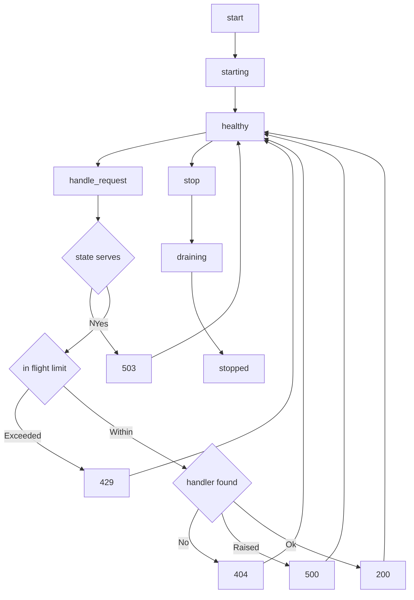

---
# MAM Metadata
id: template-service-advanced
name: Service Template (Advanced)
version: 2.0.0
type: service

author: MAM Team
description: >
  A long running service with a four state health model, graceful draining on
  stop, an in flight request limit, and every request failure returned rather
  than raised.

license: MIT

runtime:
  language: python
  version: ">=3.12"

tags:
  - template
  - service
  - advanced
  - lifecycle
  - observability

dependencies:
  - name: http-server
    version: "^1.0"
  - name: health-monitor
    version: "^1.0"
  - name: telemetry
    version: "^2.0"

capabilities:
  - start
  - stop
  - health
  - handle_request
  - drain
  - observe

permissions:
  filesystem:
    - read
  network:
    - internet
---

# Service Template (Advanced)

## Purpose

A service that can be put into production. It has a four state health model,
a `draining` state that lets a stop finish in-flight work before the listener
goes away, a per-instance in-flight limit that answers `429` instead of
queueing without bound, and a request path that converts a handler failure into
a `500` response and an event rather than letting it escape. Use
[`service-basic.mam`](./service-basic.mam) when the process only has to start,
serve and stop.

## Inputs

| Name | Type | Required | Description |
|------|------|----------|-------------|
| port | integer | Yes | Port the service listens on |
| config | object | No | Service configuration values |
| max_in_flight | integer | No | Concurrent requests allowed before `429` |
| method | string | No | Method of a request, e.g. `GET` |
| path | string | No | Path of a request, e.g. `/health` |

## Outputs

| Name | Type | Description |
|------|------|-------------|
| status | string | Service state |
| endpoints | array | Declared endpoints |
| health | object | Latest health report |
| response | object | Status, body or error for a handled request |
| events | array | Ordered lifecycle and error events |

## Capabilities

### start

Bind the port, move through `starting`, and settle into `healthy`.

### stop

Move into `draining`, wait for in-flight work to finish, then settle into
`stopped`.

### health

Return the current health report including uptime, in-flight work and the
error count.

### handle_request

Route a request through the in-flight limit and the endpoint table, returning
`429`, `404`, `500` or `200` and never raising to the caller.

### drain

Hold new work off, let the in-flight count reach zero, and report how many
requests were drained.

### observe

Return the ordered event log of starts, stops and request errors.

## Endpoints

| Method | Path | Handler | Description |
|--------|------|---------|-------------|
| GET | /health | health | Return the health report |
| GET | /status | status | Return the service status |
| GET | /metrics | metrics | Return counters and the event log |
| POST | /task | task | Accept a task for processing |

## Health Check

The service reports one of four states.

| State | Meaning | Requests answered |
|-------|---------|-------------------|
| `stopped` | Created or fully stopped | `503` |
| `starting` | Bound but not yet serving | `503` |
| `healthy` | Serving | `200`, `404`, `429` or `500` |
| `draining` | Stop requested, finishing in-flight work | `200`, `404`, `429` or `500` |

The health report carries the fields a host needs to decide whether to restart
the process:

| Field | Type | Description |
|-------|------|-------------|
| status | string | One of the four declared states |
| port | integer | Port the service listens on |
| requests | integer | Requests answered since the service was created |
| in_flight | integer | Requests currently being handled |
| errors | integer | Requests answered with `4xx` or `5xx` |
| uptime_seconds | number | Seconds since `start`, `0` before it |

A service is only `healthy` once it has finished starting, and only `stopped`
once draining has completed.

## Limits

| Limit | Value | Behaviour when exceeded |
|-------|-------|-------------------------|
| max_in_flight | 4 by default | `429` returned, request not counted as served |
| startup_timeout | 30 seconds | `starting` is treated as `stopped` by the host |
| stop_timeout | 30 seconds | Draining is abandoned and the process is killed |

## Rules

- The service must report health within the startup timeout.
- Stop drains in-flight requests before it returns.
- The in-flight limit is enforced per instance and never queues without bound.
- A request to a service that is not `healthy` or `draining` returns `503`.
- A request past the in-flight limit returns `429` and increments `errors`.
- A handler that raises produces a `500` and an event, never a propagated exception.
- Errors are returned in the standard error shape.
- Secrets are never written to logs.

## Workflow



## Python

```python
import time

STATES = ("stopped", "starting", "healthy", "draining")
SERVING = ("healthy", "draining")


class Service:
    def __init__(self, port=8080, config=None, max_in_flight=4):
        self.port = port
        self.config = dict(config or {})
        self.max_in_flight = max_in_flight
        self.status = "stopped"
        self.handlers = {}
        self.request_count = 0
        self.in_flight = 0
        self.errors = 0
        self.started_at = None
        self.events = []

    def register(self, method, path, handler):
        self.handlers[(method, path)] = handler
        return self

    def endpoints(self):
        return [{"method": method, "path": path} for method, path in self.handlers]

    def _record(self, event, **data):
        self.events.append({"event": event, **data})

    def start(self):
        self.status = "starting"
        self.started_at = time.monotonic()
        self._record("start", port=self.port)
        self.status = "healthy"
        return self.status

    def drain(self):
        drained = self.in_flight
        self.in_flight = 0
        self._record("drain", drained=drained)
        return drained

    def stop(self):
        self.status = "draining"
        self.drain()
        self.status = "stopped"
        self._record("stop", requests=self.request_count)
        return self.status

    def health(self):
        uptime = 0.0 if self.started_at is None else time.monotonic() - self.started_at
        return {
            "status": self.status,
            "port": self.port,
            "requests": self.request_count,
            "in_flight": self.in_flight,
            "errors": self.errors,
            "uptime_seconds": round(uptime, 3),
        }

    def observe(self):
        return list(self.events)

    def handle_request(self, method, path, payload=None):
        if self.status not in SERVING:
            self.errors += 1
            return {"status": 503, "error": "service unavailable", "state": self.status}
        if self.in_flight >= self.max_in_flight:
            self.errors += 1
            return {"status": 429, "error": "too many in flight", "limit": self.max_in_flight}
        handler = self.handlers.get((method, path))
        if handler is None:
            self.errors += 1
            return {"status": 404, "error": "not found"}
        self.in_flight += 1
        self.request_count += 1
        try:
            body = handler(payload)
        except Exception as error:
            self.errors += 1
            self._record("error", path=path, reason=str(error))
            return {"status": 500, "error": "internal error"}
        finally:
            self.in_flight -= 1
        return {"status": 200, "body": body}
```

## Tests

### Input

```yaml
port: 9000
max_in_flight: 1
```

### Expected

```yaml
status: healthy
uptime_seconds: 0.0
```

```python
def test_health_state_model():
    service = Service(port=9000)
    assert service.health()["status"] == "stopped"
    assert service.start() == "healthy"
    report = service.health()
    assert report["uptime_seconds"] >= 0
    assert report["in_flight"] == 0
    assert service.stop() == "stopped"


def test_in_flight_limit_returns_429():
    service = Service(port=9000, max_in_flight=1)
    service.register("GET", "/task", lambda payload: {"ok": True})
    service.start()

    service.in_flight = 1
    limited = service.handle_request("GET", "/task")
    assert limited["status"] == 429
    assert limited["limit"] == 1

    service.in_flight = 0
    assert service.handle_request("GET", "/task")["status"] == 200
    assert service.in_flight == 0
    assert service.errors == 1


def test_handler_failure_is_reported_not_raised():
    def boom(payload):
        raise RuntimeError("downstream unavailable")

    service = Service()
    service.register("POST", "/task", boom)
    service.start()

    response = service.handle_request("POST", "/task", {})
    assert response["status"] == 500
    assert service.in_flight == 0
    assert service.errors == 1
    errors = [e for e in service.observe() if e["event"] == "error"]
    assert errors[0]["reason"] == "downstream unavailable"


def test_stop_drains_and_blocks_requests():
    service = Service()
    service.register("GET", "/health", lambda payload: service.health())
    service.start()
    service.in_flight = 2

    assert service.stop() == "stopped"
    assert service.drain() == 0
    blocked = service.handle_request("GET", "/health")
    assert blocked["status"] == 503
    assert blocked["state"] == "stopped"


def test_event_log_is_append_only():
    service = Service()
    service.start()
    service.stop()
    assert [e["event"] for e in service.observe()] == ["start", "drain", "stop"]
```

## Examples

```python
service = Service(port=8080, max_in_flight=8)
service.register("GET", "/health", lambda payload: service.health())
service.register("POST", "/task", lambda payload: {"accepted": payload})

service.start()
print(service.handle_request("POST", "/task", {"id": 1}))
print(service.health())
print(service.observe())
service.stop()
```

## References

- [MAM Service Template](./service.mam)
- [MAM Service Specification](../../spec/sections/)
- [MAM Endpoint Contract](../../spec/sections/)
- [MAM Health Model](../../spec/sections/)
