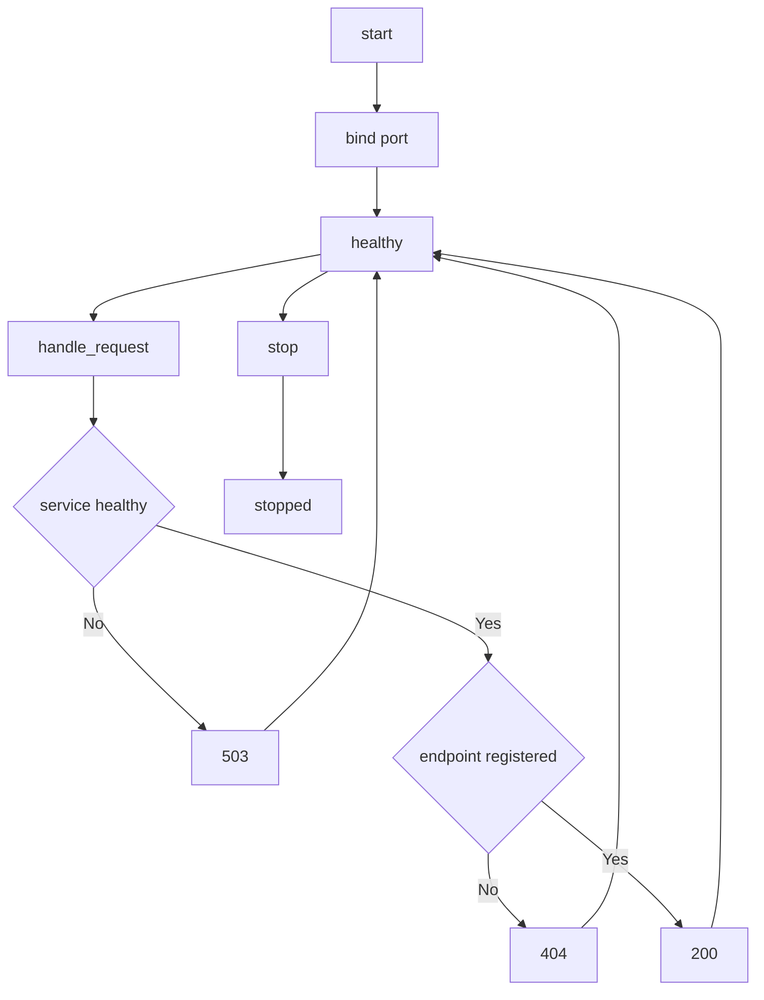

---
# MAM Metadata
id: template-service-basic
name: Service Template (Basic)
version: 2.0.0
type: service

author: MAM Team
description: >
  A long running service with an explicit start, healthy and stopped lifecycle,
  a declared endpoint table, and a health report a host can poll.

license: MIT

runtime:
  language: python
  version: ">=3.12"

tags:
  - template
  - service
  - basic
  - lifecycle

dependencies:
  - name: http-server
    version: "^1.0"
  - name: health-monitor
    version: "^1.0"

capabilities:
  - start
  - stop
  - health
  - handle_request

permissions:
  filesystem:
    - read
  network:
    - internet
---

# Service Template (Basic)

## Purpose

A service that starts, serves requests, reports its health, and stops cleanly.
The three declared states are enough for a host to supervise the process:
`stopped` before `start`, `healthy` while it serves, and `stopped` again after
`stop`. Use [`service.mam`](../service.mam) for the documented version of the
same shape, and [`service-advanced.mam`](./service-advanced.mam) when the
service needs draining, in-flight limits and request error paths.

## Inputs

| Name | Type | Required | Description |
|------|------|----------|-------------|
| port | integer | Yes | Port the service listens on |
| config | object | No | Service configuration values |
| method | string | No | Method of a request, e.g. `GET` |
| path | string | No | Path of a request, e.g. `/health` |

## Outputs

| Name | Type | Description |
|------|------|-------------|
| status | string | Service state |
| endpoints | array | Declared endpoints |
| health | object | Latest health report |
| response | object | Status, body or error for a handled request |

## Capabilities

### start

Open the listener and move the service into the `healthy` state.

### stop

Drain nothing, clear the listener, and move the service back to `stopped`.

### health

Return the current health report including the port and the request count.

### handle_request

Route a request to the matching endpoint handler, or report `404` when no
handler is registered.

## Endpoints

| Method | Path | Handler | Description |
|--------|------|---------|-------------|
| GET | /health | health | Return the health report |
| GET | /status | status | Return the service status |
| POST | /task | task | Accept a task for processing |

## Health Check

The service reports one of three states: `stopped`, `healthy`, or `stopped`
again after a stop. The health report carries the port and the number of
handled requests:

| Field | Type | Description |
|-------|------|-------------|
| status | string | One of the three declared states |
| port | integer | Port the service listens on |
| requests | integer | Requests handled since the service was created |

A service that is not `healthy` answers every request with `503` before it
looks at the endpoint table, so a stopped process never appears to be serving.

## Rules

- The service must report health within the startup timeout.
- Stop returns the service to `stopped` before it returns.
- Every request is validated against the endpoint contract.
- A request to an unregistered endpoint returns `404` and is not counted.
- A request to a service that is not healthy returns `503`.
- Errors are returned in the standard error shape.
- Secrets are never written to logs.

## Workflow



## Python

```python
class Service:
    def __init__(self, port=8080, config=None):
        self.port = port
        self.config = dict(config or {})
        self.status = "stopped"
        self.handlers = {}
        self.request_count = 0

    def register(self, method, path, handler):
        self.handlers[(method, path)] = handler
        return self

    def endpoints(self):
        return [{"method": method, "path": path} for method, path in self.handlers]

    def start(self):
        self.status = "healthy"
        return self.status

    def stop(self):
        self.status = "stopped"
        return self.status

    def health(self):
        return {"status": self.status, "port": self.port, "requests": self.request_count}

    def handle_request(self, method, path, payload=None):
        if self.status != "healthy":
            return {"status": 503, "error": "service unavailable"}
        handler = self.handlers.get((method, path))
        if handler is None:
            return {"status": 404, "error": "not found"}
        self.request_count += 1
        return {"status": 200, "body": handler(payload)}
```

## Tests

### Input

```yaml
method: GET
path: /health
```

### Expected

```yaml
status: 200
```

```python
def test_lifecycle():
    service = Service(port=9000)
    service.register("GET", "/health", lambda payload: service.health())
    assert service.start() == "healthy"

    response = service.handle_request("GET", "/health")
    assert response["status"] == 200
    assert response["body"]["requests"] == 1
    assert service.health()["port"] == 9000

    assert service.stop() == "stopped"
    assert service.handle_request("GET", "/health")["status"] == 503


def test_unknown_endpoint_is_not_counted():
    service = Service()
    service.start()
    assert service.handle_request("GET", "/missing")["status"] == 404
    assert service.request_count == 0


def test_health_before_start():
    service = Service(port=8080)
    assert service.health() == {"status": "stopped", "port": 8080, "requests": 0}
    assert service.endpoints() == []
```

## Examples

```python
service = Service(port=8080)
service.register("GET", "/health", lambda payload: service.health())
service.register("POST", "/task", lambda payload: {"accepted": payload})

service.start()
print(service.handle_request("POST", "/task", {"id": 1}))
print(service.health())
service.stop()
```

## References

- [MAM Service Template](./service.mam)
- [MAM Service Specification](../../spec/sections/)
- [MAM Endpoint Contract](../../spec/sections/)
