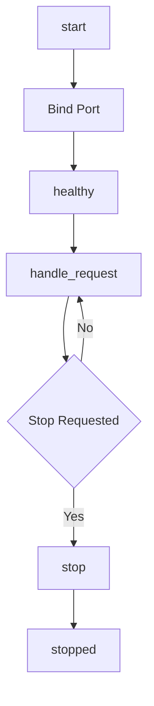

---
# MAM Metadata
id: template-service
name: Service Template
version: 2.0.0
type: service
author: MAM Team
description: >
  Starter template for a long running MAM service with start and stop
  lifecycle, a health check, and declared endpoints.
license: MIT
runtime:
  language: python
  version: ">=3.12"
tags:
  - template
  - service
  - lifecycle
  - endpoints
dependencies:
  - name: http-server
    version: "^1.0"
  - name: health-monitor
    version: "^1.0"
capabilities:
  - start
  - stop
  - health
  - handle_request
permissions:
  filesystem:
    - read
  network:
    - internet
---

# Service Template

## Purpose

Provide a service that starts, serves requests, reports its health, and stops cleanly. This starter declares the lifecycle, the endpoint table, and a health check so a host can supervise the service.

## Inputs

| Name | Type | Required | Description |
|------|------|----------|-------------|
| port | integer | Yes | Port the service listens on |
| config | object | No | Service configuration values |

## Outputs

| Name | Type | Description |
|------|------|-------------|
| status | string | Service state |
| endpoints | array | Declared endpoints |
| health | object | Latest health report |

## Capabilities

### start

Open the listener and move the service into the running state.

### stop

Drain in flight work and move the service into the stopped state.

### health

Return the current health report for the service.

### handle_request

Route a request to the matching endpoint handler.

## Endpoints

| Method | Path | Handler | Description |
|--------|------|---------|-------------|
| GET | /health | health | Return the health report |
| GET | /status | status | Return the service status |
| POST | /task | task | Accept a task for processing |

## Health Check

The service reports one of three states: starting, healthy, or stopped. The health report includes the uptime and the number of handled requests.

## Rules

- The service must report health within the startup timeout.
- Stop drains in flight requests before it returns.
- Every request is validated against the endpoint contract.
- Errors are returned in the standard error shape.
- Secrets are never written to logs.
- Requests are rate limited per client.

## Workflow



## Python

```python
class Service:
    def __init__(self, port=8080, config=None):
        self.port = port
        self.config = config or {}
        self.status = "stopped"
        self.handlers = {}
        self.request_count = 0

    def register(self, method, path, handler):
        self.handlers[(method, path)] = handler
        return self

    def start(self):
        self.status = "healthy"
        return self.status

    def stop(self):
        self.status = "stopped"
        return self.status

    def health(self):
        return {"status": self.status, "port": self.port, "requests": self.request_count}

    def handle_request(self, method, path, payload=None):
        handler = self.handlers.get((method, path))
        if handler is None:
            return {"status": 404, "error": "not found"}
        self.request_count += 1
        return {"status": 200, "body": handler(payload)}
```

## Tests

### Input

```yaml
method: GET
path: /health
```

### Expected

```yaml
status: 200
```

```python
def test_service_lifecycle():
    service = Service(port=9000)
    service.register("GET", "/health", lambda payload: service.health())
    assert service.start() == "healthy"
    resp = service.handle_request("GET", "/health")
    assert resp["status"] == 200
    assert resp["body"]["requests"] == 1
    assert service.stop() == "stopped"

def test_missing_endpoint():
    service = Service()
    assert service.handle_request("GET", "/missing")["status"] == 404
```

## Examples

```python
service = Service(port=8080)
service.register("GET", "/health", lambda payload: service.health())
service.register("POST", "/task", lambda payload: {"accepted": payload})
service.start()
service.handle_request("POST", "/task", {"id": 1})
service.stop()
```

## References

- MAM Service Specification
- MAM Endpoint Contract
