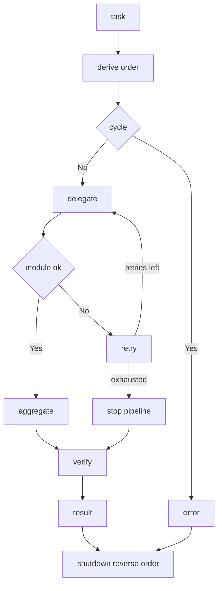

---
# MAM Metadata
id: template-system-advanced
name: System Template (Advanced)
version: 2.0.0
type: system

author: MAM Team
description: >
  A composed system with dependency derived ordering, cycle rejection,
  bounded retries, failure isolation, a verification stage and a reverse order
  shutdown.

license: MIT

runtime:
  language: python
  version: ">=3.12"

tags:
  - template
  - system
  - advanced
  - composition
  - orchestration
  - observability

dependencies:
  - name: planner
    version: "^1.0"
  - name: executor
    version: "^1.0"
  - name: reporter
    version: "^1.0"
  - name: telemetry
    version: "^2.0"

capabilities:
  - orchestrate
  - delegate
  - aggregate
  - verify
  - shutdown

permissions:
  filesystem:
    - read
  network:
    - internet
---

# System Template (Advanced)

## Purpose

A composed system that derives its own run order from the declared edges
instead of trusting a hand written list, refuses a cyclic composition outright,
retries a failing module a bounded number of times, stops the pipeline at the
first module that cannot succeed, records every failure, and knows how to shut
down in reverse order. Use [`system-basic.mam`](./system-basic.mam) when a
fixed three stage pipeline is enough.

## Inputs

| Name | Type | Required | Description |
|------|------|----------|-------------|
| task | string | Yes | Task description for the system |
| context | object | No | Additional context passed to the modules |
| edges | array | No | Module edges as `[source, target]` pairs |
| max_retries | integer | No | Retries per module. Defaults to `1` |
| policy | string | No | Policy enforced across the system |

## Outputs

| Name | Type | Description |
|------|------|-------------|
| result | object | Final aggregated result |
| steps | array | Ordered list of module outputs that succeeded |
| stages | array | Names of the modules that actually ran |
| order | array | Dependency derived run order |
| log | array | One entry per module with its outcome |
| failures | array | Every failed attempt with its module and reason |
| complete | boolean | Whether every module in the order ran |

## Capabilities

### orchestrate

Derive the run order, delegate to every module in that order, and return the
aggregated result with the log and the failure list.

### delegate

Call each module with the shared context, retrying a raised error up to
`max_retries` times and stopping the pipeline when the retries run out.

### aggregate

Merge the stages that succeeded into one system result, naming each stage.

### verify

Report whether every module in the run order produced an output.

### shutdown

Return the run order reversed, so dependents are torn down before the modules
they depend on.

## Modules

- Planner
- Executor
- Reporter
- Guardian

## System Definition

```text
module MySystem

type:
    system

modules:
    - Planner
    - Executor
    - Reporter
    - Guardian

edges:
    Planner -> Executor
    Executor -> Reporter
    Reporter -> Guardian

retries: 1

policy:
    SafeExecution
```

## Edges

| Source | Target | Meaning |
|--------|--------|---------|
| Planner | Executor | The plan is the only thing the executor may act on |
| Executor | Reporter | Only executed work may be reported |
| Reporter | Guardian | Only a report may be approved |

`order` is derived from the edges by repeatedly taking every module with no
unresolved inbound edge. A module that can never be taken that way means the
composition has a cycle, and `order` raises rather than guessing.

## Failure Handling

| Situation | Behaviour |
|-----------|-----------|
| Module raises | Retried up to `max_retries` times, each attempt recorded in `failures` |
| Retries exhausted | The pipeline stops, the failing module is not recorded as a stage |
| Module not registered | Skipped, and `complete` stays false |
| Cycle in the edges | `order` raises before any module runs |
| Success | Recorded in `log` with status `ok` |

Aggregation always uses the last stage that succeeded, so a partial run returns
a real result and the caller can see from `complete` that it is partial.

## Rules

- Each module operates only within the declared scope.
- The run order is derived from the edges and is never hand written.
- A cyclic composition is rejected before any module runs.
- One module must finish before the next module starts.
- Outputs pass through the declared edges without modification.
- A module is retried at most `max_retries` times and every attempt is recorded.
- A failure stops the pipeline and is reported in `failures`.
- Results are validated before aggregation.
- Shutdown runs in reverse dependency order.
- The SafeExecution policy is enforced at all times.

## Workflow



## Python

```python
class SystemComposer:
    def __init__(self, modules=None, edges=None, policy="SafeExecution", max_retries=1):
        self.modules = dict(modules or {})
        self.policy = policy
        self.max_retries = max_retries
        self.edges = [tuple(edge) for edge in (edges or [
            ("Planner", "Executor"),
            ("Executor", "Reporter"),
            ("Reporter", "Guardian"),
        ])]
        self.log = []
        self.failures = []

    def register(self, name, module):
        self.modules[name] = module
        return self

    def order(self):
        pending = set(self.modules) | {name for edge in self.edges for name in edge}
        order = []
        while pending:
            ready = sorted(
                n for n in pending
                if not any(dst == n and src in pending for src, dst in self.edges)
            )
            if not ready:
                raise RuntimeError("cycle detected: " + ", ".join(sorted(pending)))
            for name in ready:
                order.append(name)
                pending.discard(name)
        return order

    def delegate(self, task, context=None):
        context = dict(context or {})
        for name in self.order():
            module = self.modules.get(name)
            if module is None:
                self.log.append({"module": name, "status": "skipped"})
                continue
            output = None
            ok = False
            for attempt in range(self.max_retries + 1):
                try:
                    output = module(task, context)
                    ok = True
                    break
                except Exception as error:
                    self.failures.append(
                        {"module": name, "attempt": attempt, "reason": str(error)}
                    )
            if not ok:
                self.log.append({"module": name, "status": "failed"})
                break
            context[name] = output
            self.log.append({"module": name, "status": "ok"})
        return context

    def verify(self, context):
        stages = [name for name in self.order() if name in context]
        return {"complete": stages == self.order(), "stages": stages}

    def aggregate(self, context):
        stages = [name for name in self.order() if name in context]
        return {
            "policy": self.policy,
            "stages": stages,
            "steps": [{"module": name, "output": context[name]} for name in stages],
            "result": context[stages[-1]] if stages else None,
        }

    def orchestrate(self, task, context=None):
        shared = self.delegate(task, context)
        out = self.aggregate(shared)
        out["order"] = self.order()
        out["log"] = list(self.log)
        out["failures"] = list(self.failures)
        out["complete"] = self.verify(shared)["complete"]
        return out

    def shutdown(self):
        return list(reversed(self.order()))
```

## Tests

### Input

```yaml
task: example
max_retries: 0
```

### Expected

```yaml
order: 4
complete: true
```

```python
def build():
    composer = SystemComposer()
    composer.register("Planner", lambda task, ctx: {"plan": task})
    composer.register("Executor", lambda task, ctx: {"done": task})
    composer.register("Reporter", lambda task, ctx: {"report": task})
    composer.register("Guardian", lambda task, ctx: {"approved": True})
    return composer


def test_order_is_derived_from_the_edges():
    assert build().order() == ["Planner", "Executor", "Reporter", "Guardian"]


def test_orchestrate_runs_the_full_pipeline():
    out = build().orchestrate("example")
    assert [s["module"] for s in out["steps"]] == ["Planner", "Executor", "Reporter", "Guardian"]
    assert out["result"] == {"approved": True}
    assert out["complete"] is True
    assert out["failures"] == []


def test_failure_is_isolated_and_reported():
    def broken(task, ctx):
        raise RuntimeError("executor unavailable")

    composer = SystemComposer(max_retries=0)
    composer.register("Planner", lambda task, ctx: {"plan": task})
    composer.register("Executor", broken)

    out = composer.orchestrate("example")
    assert [s["module"] for s in out["steps"]] == ["Planner"]
    assert out["result"] == {"plan": "example"}
    assert out["complete"] is False
    assert out["failures"][0]["reason"] == "executor unavailable"
    assert {"module": "Reporter", "status": "skipped"} not in out["log"]


def test_retries_are_bounded():
    attempts = []

    def flaky(task, ctx):
        attempts.append(1)
        raise RuntimeError("transient")

    composer = SystemComposer(edges=[("Flaky", "Reporter")], max_retries=2)
    composer.register("Flaky", flaky)
    composer.register("Reporter", lambda task, ctx: {"report": task})

    out = composer.orchestrate("example")
    assert len(attempts) == 3
    assert out["result"] is None
    assert [f["attempt"] for f in out["failures"]] == [0, 1, 2]


def test_cycle_is_rejected():
    composer = SystemComposer(edges=[("A", "B"), ("B", "A")])
    try:
        composer.order()
    except RuntimeError as error:
        assert "cycle detected" in str(error)
    else:
        raise AssertionError("expected a cycle error")


def test_shutdown_reverses_the_order():
    assert build().shutdown() == ["Guardian", "Reporter", "Executor", "Planner"]
```

## Examples

```python
composer = SystemComposer(policy="SafeExecution", max_retries=0)
composer.register("Planner", lambda task, ctx: {"plan": task})
composer.register("Executor", lambda task, ctx: {"done": task})
composer.register("Reporter", lambda task, ctx: {"report": task})
composer.register("Guardian", lambda task, ctx: {"approved": True})

print(composer.order())
print(composer.orchestrate("build the report")["result"])
print(composer.shutdown())
```

## References

- [MAM System Template](./system.mam)
- [MAM System Examples](../../spec/sections/)
- [MAM Composition Guide](../../spec/sections/)
- [MAM Failure Isolation](../../spec/sections/)
