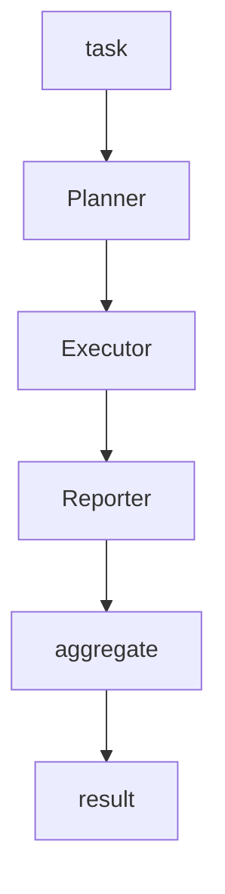

---
# MAM Metadata
id: template-system-basic
name: System Template (Basic)
version: 2.0.0
type: system

author: MAM Team
description: >
  Three modules wired into one pipeline with a fixed slot order, delegating
  work to each module in turn and aggregating the outputs into one result.

license: MIT

runtime:
  language: python
  version: ">=3.12"

tags:
  - template
  - system
  - basic
  - composition

dependencies:
  - name: planner
    version: "^1.0"
  - name: executor
    version: "^1.0"
  - name: reporter
    version: "^1.0"

capabilities:
  - orchestrate
  - delegate
  - aggregate

permissions:
  filesystem:
    - read
  network:
    - internet
---

# System Template (Basic)

## Purpose

Compose three modules into one pipeline. The system declares a fixed slot
order, calls each registered module in that order with a shared context, and
aggregates the outputs into a single result. A module that was never registered
is skipped rather than treated as a failure, so a partially built system still
runs. Use [`system.mam`](../system.mam) for the documented version of the same
shape, and [`system-advanced.mam`](./system-advanced.mam) when the composition
needs derived ordering, retries, failure isolation and a shutdown order.

## Inputs

| Name | Type | Required | Description |
|------|------|----------|-------------|
| task | string | Yes | Task description for the system |
| context | object | No | Additional context passed to the modules |
| slots | array | No | Slot order. Defaults to Planner, Executor, Reporter |

## Outputs

| Name | Type | Description |
|------|------|-------------|
| result | object | Final aggregated result |
| steps | array | Ordered list of module outputs |
| stages | array | Names of the modules that actually ran |

## Capabilities

### orchestrate

Run the slot order end to end and return the aggregated result.

### delegate

Call each registered module in slot order with the shared context, recording
the output under the module name.

### aggregate

Merge the stage outputs into one system result and name the stages that ran.

## Modules

- Planner
- Executor
- Reporter

## System Definition

```text
module MySystem

type:
    system

modules:
    - Planner
    - Executor
    - Reporter

edges:
    Planner -> Executor
    Executor -> Reporter

policy:
    SafeExecution
```

## Slot Order

| Slot | Module | Receives | Produces |
|------|--------|----------|----------|
| 1 | Planner | task | plan |
| 2 | Executor | task and plan | result |
| 3 | Reporter | task and result | report |

Each stage reads the shared context, so a later slot can see what an earlier
slot produced without the system knowing anything about their internals.

## Rules

- Each module operates only within the declared scope.
- One module must finish before the next module starts.
- Outputs pass through the declared edges without modification.
- A module that was never registered is skipped, not failed.
- A failure in a module is not isolated: the caller sees it.
- Results are validated before aggregation.
- The SafeExecution policy is enforced at all times.

## Workflow



## Python

```python
class SystemComposer:
    def __init__(self, slots=None):
        self.modules = {}
        self.slots = list(slots) if slots is not None else ["Planner", "Executor", "Reporter"]

    def register(self, name, module):
        self.modules[name] = module
        return self

    def order(self):
        return list(self.slots)

    def delegate(self, task, context=None):
        context = dict(context or {})
        for name in self.order():
            module = self.modules.get(name)
            if module is not None:
                context[name] = module(task, context)
        return context

    def aggregate(self, context):
        stages = [name for name in self.order() if name in context]
        return {
            "stages": stages,
            "steps": [{"module": name, "output": context[name]} for name in stages],
            "result": context[stages[-1]] if stages else None,
        }

    def orchestrate(self, task, context=None):
        return self.aggregate(self.delegate(task, context))
```

## Tests

### Input

```yaml
task: example
```

### Expected

```yaml
stages: 3
result: report
```

```python
def test_orchestrate_runs_every_slot():
    composer = SystemComposer()
    composer.register("Planner", lambda task, ctx: {"plan": task})
    composer.register("Executor", lambda task, ctx: {"done": task})
    composer.register("Reporter", lambda task, ctx: {"report": task})

    out = composer.orchestrate("example")
    assert [s["module"] for s in out["steps"]] == ["Planner", "Executor", "Reporter"]
    assert out["result"] == {"report": "example"}


def test_unregistered_module_is_skipped():
    composer = SystemComposer()
    composer.register("Reporter", lambda task, ctx: {"report": task})
    out = composer.orchestrate("example")
    assert out["stages"] == ["Reporter"]
    assert out["result"] == {"report": "example"}


def test_empty_system_returns_no_result():
    out = SystemComposer(slots=[]).orchestrate("example")
    assert out["steps"] == []
    assert out["result"] is None


def test_later_slot_sees_earlier_output():
    def executor(task, ctx):
        return {"done": ctx["Planner"]["plan"]}

    composer = SystemComposer(slots=["Planner", "Executor"])
    composer.register("Planner", lambda task, ctx: {"plan": task})
    composer.register("Executor", executor)
    assert composer.orchestrate("example")["result"] == {"done": "example"}
```

## Examples

```python
composer = SystemComposer()
composer.register("Planner", lambda task, ctx: {"plan": task})
composer.register("Executor", lambda task, ctx: {"done": task})
composer.register("Reporter", lambda task, ctx: {"report": task})

print(composer.order())
print(composer.orchestrate("build the report"))
```

## References

- [MAM System Template](./system.mam)
- [MAM System Examples](../../spec/sections/)
- [MAM Composition Guide](../../spec/sections/)
