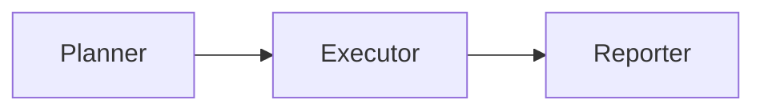

---
# MAM Metadata
id: template-system
name: System Template
version: 2.0.0
type: system
author: MAM Team
description: >
  Starter template for composing several modules into one complete MAM system
  with a planning stage, an execution stage, and a reporting stage.
license: MIT
runtime:
  language: python
  version: ">=3.12"
tags:
  - template
  - system
  - composition
  - orchestration
dependencies:
  - name: planner
    version: "^1.0"
  - name: executor
    version: "^1.0"
  - name: reporter
    version: "^1.0"
capabilities:
  - orchestrate
  - delegate
  - aggregate
permissions:
  filesystem:
    - read
  network:
    - internet
---

# System Template

## Purpose

Compose several modules into one executable system. This starter wires a planner, an executor, and a reporter into a single pipeline and exposes the composed capabilities.

## Modules

- Planner
- Executor
- Reporter

## Inputs

| Name | Type | Required | Description |
|------|------|----------|-------------|
| task | string | Yes | Task description for the system |
| context | object | No | Additional context passed to the modules |

## Outputs

| Name | Type | Description |
|------|------|-------------|
| result | object | Final aggregated result |
| steps | array | Ordered list of module outputs |

## Capabilities

### orchestrate

Coordinate the composed modules in the declared order.

### delegate

Send each task to the module that owns the matching capability.

### aggregate

Merge the module outputs into one system result.

## System Definition

module MySystem

type:
    system

agents:
    - Planner
    - Executor
    - Reporter

edges:
    Planner -> Executor
    Executor -> Reporter

policy:
    SafeExecution

## Rules

- Each module operates only within the declared scope.
- One module must finish before the next module starts.
- Outputs pass through the declared edges without modification.
- A failure stops the pipeline and is reported.
- Results are validated before aggregation.
- The SafeExecution policy is enforced at all times.

## Workflow



## Python

```python
class SystemComposer:
    def __init__(self):
        self.modules = {}
        self.slots = ["Planner", "Executor", "Reporter"]

    def register(self, name, module):
        self.modules[name] = module
        return self

    def order(self):
        return list(self.slots)

    def orchestrate(self, task, context=None):
        context = context or {}
        steps = []
        for name in self.order():
            module = self.modules.get(name)
            if module is None:
                continue
            output = module(task, context)
            steps.append({"module": name, "output": output})
        return self.aggregate(steps)

    def aggregate(self, steps):
        result = steps[-1]["output"] if steps else None
        return {"steps": steps, "result": result}
```

## Tests

### Input

```yaml
task: example
```

### Expected

```yaml
result: present
steps: 3
```

```python
def test_orchestrate():
    composer = SystemComposer()
    composer.register("Planner", lambda task, ctx: {"plan": task})
    composer.register("Executor", lambda task, ctx: {"done": task})
    composer.register("Reporter", lambda task, ctx: {"report": task})
    out = composer.orchestrate("example")
    assert out["result"] == {"report": "example"}
    assert len(out["steps"]) == 3
```

## Examples

```text
MySystem.run(task="example")
  then Planner, then Executor, then Reporter
```

## References

- MAM System Examples
- MAM Composition Guide
