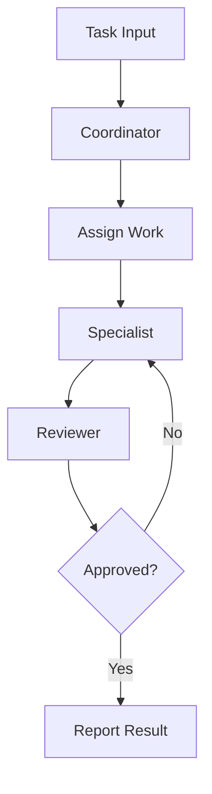

---
# MAM Metadata
id: template-team
name: Team Template
version: 1.0.0
type: team
author: MAM Team
description: >
  Starter template for MAM teams. Defines the members, their roles, the
  handoff order, and the shared policy for coordinated agent work.

license: MIT

runtime:
  language: python
  version: ">=3.12"

members:
  - Coordinator
  - Specialist
  - Reviewer

policy: TeamPolicy

tags:
  - template
  - team
  - starter

dependencies:
  - name: mam-runtime
    version: ">=1.0.0"

capabilities:
  - assign
  - coordinate
  - review

permissions:
  filesystem:
    - read
  network:
    - internet
  python:
    - sandbox
---

# Team Template

## Purpose

Starter template for a MAM team. A team groups members with distinct roles and a shared policy so that work can be assigned, coordinated, and reviewed. Replace the members, roles, and handoff order for your own team.

## Inputs

| Name | Type | Required | Description |
|------|------|----------|-------------|
| task | string | Yes | Work item assigned to the team |
| context | object | No | Shared context passed to members |
| policy | string | No | Policy applied to the team |

## Outputs

| Name | Type | Description |
|------|------|-------------|
| assignments | array | Task to member assignments |
| results | object | Member results keyed by name |
| status | string | Final team status |

## Members

- Coordinator
- Specialist
- Reviewer

## Roles

| Member | Role | Responsibility |
|--------|------|----------------|
| Coordinator | Coordination | Decompose the task and assign work |
| Specialist | Execution | Perform the assigned work |
| Reviewer | Review | Validate the result before completion |

## Capabilities

### assign

Map work items to the member whose role best matches the task.

### coordinate

Order the member handoffs and aggregate their results.

### review

Validate combined output against the team policy.

## Rules

- Every member must have a distinct role
- Work is assigned to the member whose role matches best
- Handoffs follow the declared order
- The shared policy applies to every member
- Review must pass before the team reports completion
- A team must declare at least one member

## Workflow



## Python

```python
from dataclasses import dataclass, field
from typing import Any, Dict, List


@dataclass
class Member:
    name: str
    role: str
    responsibility: str
    results: List[Any] = field(default_factory=list)


class Team:
    def __init__(self, policy: str = "TeamPolicy") -> None:
        self.policy = policy
        self.members: Dict[str, Member] = {}

    def add_member(self, name: str, role: str, responsibility: str) -> Member:
        member = Member(name=name, role=role, responsibility=responsibility)
        self.members[name] = member
        return member

    def assign(self, task: str) -> Dict[str, str]:
        if not self.members:
            return {"task": task, "assigned": ""}
        assigned = next(iter(self.members))
        return {"task": task, "assigned": assigned}

    def coordinate(self, results: Dict[str, Any]) -> Dict[str, Any]:
        for name, value in results.items():
            member = self.members.get(name)
            if member:
                member.results.append(value)
        return {"policy": self.policy, "results": results}

    def review(self, approved: bool) -> Dict[str, Any]:
        return {
            "policy": self.policy,
            "members": sorted(self.members),
            "approved": approved,
        }
```

## Tests

### Input

```yaml
task: summarize document
policy: TeamPolicy
```

### Expected

```yaml
members: 3
approved: true
```

```python
def test_add_member():
    team = Team()
    team.add_member("Coordinator", "Coordination", "Assign work")
    assert "Coordinator" in team.members


def test_assign():
    team = Team()
    team.add_member("Specialist", "Execution", "Do work")
    assignment = team.assign("summarize")
    assert assignment["assigned"] == "Specialist"


def test_review():
    team = Team("TeamPolicy")
    team.add_member("Reviewer", "Review", "Validate work")
    outcome = team.review(True)
    assert outcome["approved"] is True
    assert outcome["members"] == ["Reviewer"]
```

## Examples

### Basic Usage

```python
team = Team("TeamPolicy")
team.add_member("Coordinator", "Coordination", "Assign work")
team.add_member("Specialist", "Execution", "Do work")
team.add_member("Reviewer", "Review", "Validate work")

print(team.assign("summarize document"))
print(team.coordinate({"Specialist": "summary"}))
print(team.review(True))
```

### Expected Flow

```text
Task Input -> Coordinator -> Specialist -> Reviewer -> Report Result
```

## References

- [MAM Team Specification](../../spec/sections/)
- [Multi Agent Example](../examples/bug-hunter.mam.md)
