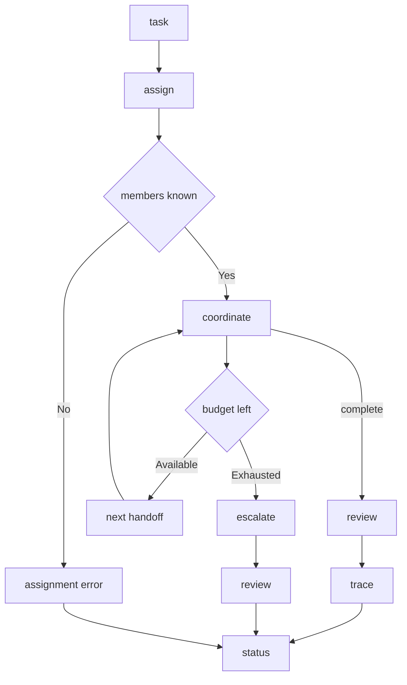

---
# MAM Metadata
id: template-team-advanced
name: Team Template (Advanced)
version: 2.0.0
type: team

author: MAM Team
description: >
  A production-shaped team with per-member budgets, escalation on exhaustion,
  a recorded handoff trace, and a policy gate that review has to pass.

license: MIT

runtime:
  language: python
  version: ">=3.12"

tags:
  - template
  - team
  - advanced
  - handoff
  - observability

members:
  - Coordinator
  - Specialist
  - Reviewer

policy: TeamPolicy

dependencies:
  - name: mam-runtime
    version: ">=1.0.0"
  - name: telemetry
    version: "^2.0"

capabilities:
  - assign
  - coordinate
  - review
  - escalate
  - trace

permissions:
  filesystem:
    - read
  network:
    - internet
  python:
    - sandbox
---

# Team Template (Advanced)

## Purpose

A production-shaped team. Every member carries a budget, a member that
exhausts its budget escalates instead of silently continuing, the handoff order
is explicit, and every step is recorded in a trace so a failed run can be
replayed. Use [`team-basic.mam`](./team-basic.mam) when the team is small
enough that budgets and traces are noise.

## Inputs

| Name | Type | Required | Description |
|------|------|----------|-------------|
| task | string | Yes | Work item assigned to the team |
| context | object | No | Shared context passed to every member |
| policy | string | No | Policy applied to the team. Defaults to `TeamPolicy` |
| handoff | array | No | Handoff order. Defaults to Coordinator, Specialist, Reviewer |

## Outputs

| Name | Type | Description |
|------|------|-------------|
| assignments | object | Task to member assignment, or the reason none was made |
| results | object | Member results keyed by member name |
| status | string | Final team status |
| blocked_at | string | Member that stopped the pipeline, or null |
| errors | array | Escalation reasons collected during the run |
| trace | array | Ordered record of handoffs, retries and escalations |

## Capabilities

### assign

Map the work item to the leading member and refuse when the handoff order names
a member the team does not have.

### coordinate

Run the handoff order end to end, applying each member's budget and stopping
the pipeline at the first escalation.

### review

Gate completion on the policy: approval is reported as false whenever the run
recorded an escalation.

### escalate

Stop the pipeline at a member that has no budget left and record the reason.

### trace

Return the ordered record of what the team did, one entry per handoff, retry or
escalation.

## Members

- Coordinator
- Specialist
- Reviewer

## Roles

| Member | Role | Responsibility | Budget |
|--------|------|----------------|--------|
| Coordinator | Coordination | Decompose the task and assign work | 2 |
| Specialist | Execution | Perform the assigned work | 1 |
| Reviewer | Review | Validate the result before completion | 1 |

## Handoff Protocol

| Step | Member | Enters with | Leaves with | Failure handling |
|------|--------|-------------|-------------|------------------|
| 1 | Coordinator | task | assignment | Escalate if the handoff order is invalid |
| 2 | Specialist | assignment | result | Escalate when the budget is exhausted |
| 3 | Reviewer | result | approval | Escalate when the budget is exhausted |

The pipeline stops at the first escalation. Members after the blocked member are
not run, and `blocked_at` names the member that stopped it.

## Rules

- A team must declare at least one member
- Every member must have a distinct role and a positive budget
- Handoffs follow the declared order and every handoff is traced
- Assignment is refused when the handoff order names an unknown member
- A member that exhausts its budget escalates instead of continuing
- The pipeline stops at the first escalation and names the blocked member
- The shared policy applies to every member
- Review must pass, and an escalated run can never pass review

## Workflow



## Python

```python
class Escalation(Exception):
    pass


class Member:
    def __init__(self, name, role, responsibility, budget=1):
        self.name = name
        self.role = role
        self.responsibility = responsibility
        self.budget = budget
        self.spent = 0

    def handle(self, task):
        if self.spent >= self.budget:
            raise Escalation(f"{self.name} exhausted its budget of {self.budget}")
        self.spent += 1
        return {"member": self.name, "task": task}


class Team:
    def __init__(self, policy="TeamPolicy", members=None, handoff=None):
        self.policy = policy
        self.members = {member.name: member for member in (members or [])}
        self.handoff = list(handoff or ["Coordinator", "Specialist", "Reviewer"])
        self.trace = []
        self.errors = []
        self.results = {}

    def add_member(self, name, role, responsibility, budget=1):
        member = Member(name, role, responsibility, budget)
        self.members[name] = member
        return member

    def assign(self, task):
        unknown = [name for name in self.handoff if name not in self.members]
        if unknown:
            self.errors.append("unknown members: " + ", ".join(unknown))
            return {"task": task, "assigned": None, "error": "unknown members"}
        self.trace.append({"event": "assign", "task": task})
        return {"task": task, "assigned": self.handoff[0]}

    def escalate(self, member, reason):
        self.errors.append(reason)
        self.trace.append({"event": "escalate", "member": member, "reason": reason})
        return {"completed": False, "blocked_at": member}

    def coordinate(self, task):
        for name in self.handoff:
            member = self.members.get(name)
            if member is None:
                continue
            try:
                self.results[name] = member.handle(task)
            except Escalation as error:
                return self.escalate(name, str(error))
            self.trace.append({"event": "handoff", "member": name})
        return {"completed": True, "blocked_at": None}

    def trace_report(self):
        return list(self.trace)

    def review(self, approved):
        return {
            "policy": self.policy,
            "members": sorted(self.members),
            "results": dict(self.results),
            "errors": list(self.errors),
            "trace": self.trace_report(),
            "approved": approved and not self.errors,
        }
```

## Tests

### Input

```yaml
task: summarize document
handoff:
  - Coordinator
  - Specialist
  - Reviewer
```

### Expected

```yaml
blocked_at: null
approved: true
```

```python
def test_handoff_completes_in_order():
    team = Team()
    team.add_member("Coordinator", "Coordination", "Assign work", budget=2)
    team.add_member("Specialist", "Execution", "Perform work", budget=2)
    team.add_member("Reviewer", "Review", "Validate work", budget=2)

    assert team.assign("summarize")["assigned"] == "Coordinator"
    assert team.coordinate("summarize") == {"completed": True, "blocked_at": None}

    outcome = team.review(True)
    assert outcome["approved"] is True
    handoffs = [e["member"] for e in outcome["trace"] if e["event"] == "handoff"]
    assert handoffs == ["Coordinator", "Specialist", "Reviewer"]


def test_budget_exhaustion_escalates():
    team = Team(handoff=["Specialist"])
    team.add_member("Specialist", "Execution", "Perform work", budget=1)

    assert team.coordinate("first")["completed"] is True
    blocked = team.coordinate("second")
    assert blocked["completed"] is False
    assert blocked["blocked_at"] == "Specialist"
    assert team.review(True)["approved"] is False
    assert "Specialist" in team.errors[0]


def test_assign_refuses_unknown_members():
    team = Team()
    result = team.assign("task")
    assert result["assigned"] is None
    assert result["error"] == "unknown members"
    assert len(team.errors) == 1


def test_trace_reports_escalation():
    team = Team(handoff=["Specialist"])
    team.add_member("Specialist", "Execution", "Perform work", budget=0)
    team.coordinate("task")
    assert team.trace_report()[-1]["event"] == "escalate"
    assert team.trace_report()[-1]["member"] == "Specialist"
```

## Examples

```python
team = Team("TeamPolicy", handoff=["Coordinator", "Specialist", "Reviewer"])
team.add_member("Coordinator", "Coordination", "Assign work", budget=2)
team.add_member("Specialist", "Execution", "Perform work", budget=1)
team.add_member("Reviewer", "Review", "Validate work", budget=1)

print(team.assign("summarize document"))
print(team.coordinate("summarize document"))
print(team.review(True))
```

## References

- [MAM Team Specification](../../spec/sections/)
- [MAM Team Template](./team.mam)
- [MAM Handoff Protocol](../../spec/sections/)
- [Multi Agent Example](../examples/bug-hunter.mam.md)
