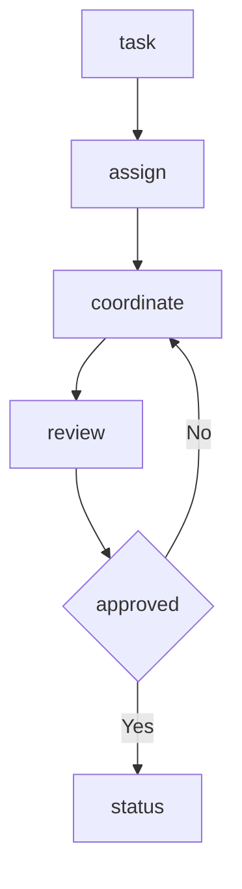

---
# MAM Metadata
id: template-team-basic
name: Team Template (Basic)
version: 2.0.0
type: team

author: MAM Team
description: >
  The smallest complete team: three members, one handoff order, and a shared
  policy applied to every member.

license: MIT

runtime:
  language: python
  version: ">=3.12"

tags:
  - template
  - team
  - basic
  - handoff

members:
  - Coordinator
  - Specialist
  - Reviewer

policy: TeamPolicy

dependencies:
  - name: mam-runtime
    version: ">=1.0.0"

capabilities:
  - assign
  - coordinate
  - review

permissions:
  filesystem:
    - read
  network:
    - internet
  python:
    - sandbox
---

# Team Template (Basic)

## Purpose

The smallest team that still carries a complete lifecycle: a member list, a
handoff order, a shared policy, and a review that has to pass before the team
reports completion. Use [`team.mam`](../team.mam) for the documented version of
the same shape, and [`team-advanced.mam`](./team-advanced.mam) when members need
budgets, escalation and a handoff trace.

## Inputs

| Name | Type | Required | Description |
|------|------|----------|-------------|
| task | string | Yes | Work item assigned to the team |
| context | object | No | Shared context passed to every member |
| policy | string | No | Policy applied to the team. Defaults to `TeamPolicy` |

## Outputs

| Name | Type | Description |
|------|------|-------------|
| assignments | object | Task to member assignment |
| results | object | Member results keyed by member name |
| status | string | Final team status |

## Capabilities

### assign

Map the work item to the member whose role matches it, and record the handoff.

### coordinate

Run the declared handoff order and aggregate the member results.

### review

Validate the combined output against the team policy and report approval.

## Members

- Coordinator
- Specialist
- Reviewer

## Roles

| Member | Role | Responsibility |
|--------|------|----------------|
| Coordinator | Coordination | Decompose the task and assign work |
| Specialist | Execution | Perform the assigned work |
| Reviewer | Review | Validate the result before completion |

## Handoff Order

| Step | Member | Enters with | Leaves with |
|------|--------|-------------|-------------|
| 1 | Coordinator | task | assignment |
| 2 | Specialist | assignment | result |
| 3 | Reviewer | result | approval |

## Rules

- A team must declare at least one member
- Every member must have a distinct role
- Work is assigned to the member whose role matches best
- Handoffs follow the declared order and are recorded
- The shared policy applies to every member
- Review must pass before the team reports completion

## Workflow



## Python

```python
class Member:
    def __init__(self, name, role, responsibility):
        self.name = name
        self.role = role
        self.responsibility = responsibility
        self.results = []

    def handle(self, task):
        self.results.append(task)
        return {"member": self.name, "task": task}


class Team:
    def __init__(self, policy="TeamPolicy", members=None):
        self.policy = policy
        self.members = {member.name: member for member in (members or [])}
        self.handoffs = []

    def add_member(self, name, role, responsibility):
        member = Member(name, role, responsibility)
        self.members[name] = member
        return member

    def assign(self, task):
        if not self.members:
            return {"task": task, "assigned": None}
        assigned = next(iter(self.members))
        self.handoffs.append(assigned)
        return {"task": task, "assigned": assigned}

    def coordinate(self, results):
        for name, value in results.items():
            member = self.members.get(name)
            if member is not None:
                member.results.append(value)
        return {"policy": self.policy, "results": results}

    def review(self, approved):
        return {
            "policy": self.policy,
            "members": sorted(self.members),
            "handoffs": list(self.handoffs),
            "approved": approved,
        }
```

## Tests

### Input

```yaml
task: summarize document
policy: TeamPolicy
```

### Expected

```yaml
assigned: Coordinator
approved: true
```

```python
def test_add_member():
    team = Team()
    team.add_member("Specialist", "Execution", "Perform the work")
    assert "Specialist" in team.members


def test_assign():
    team = Team()
    team.add_member("Specialist", "Execution", "Perform the work")
    assert team.assign("summarize")["assigned"] == "Specialist"
    assert team.handoffs == ["Specialist"]


def test_empty_team_is_unassigned():
    assert Team().assign("summarize")["assigned"] is None


def test_review():
    team = Team("TeamPolicy")
    team.add_member("Reviewer", "Review", "Validate work")
    team.assign("check")
    outcome = team.review(True)
    assert outcome["approved"] is True
    assert outcome["members"] == ["Reviewer"]
    assert outcome["handoffs"] == ["Reviewer"]
```

## Examples

```python
team = Team("TeamPolicy")
team.add_member("Coordinator", "Coordination", "Assign work")
team.add_member("Specialist", "Execution", "Perform work")
team.add_member("Reviewer", "Review", "Validate work")

print(team.assign("summarize document"))
print(team.coordinate({"Specialist": "summary"}))
print(team.review(True))
```

## References

- [MAM Team Specification](../../spec/sections/)
- [MAM Team Template](./team.mam)
- [Multi Agent Example](../examples/bug-hunter.mam.md)
