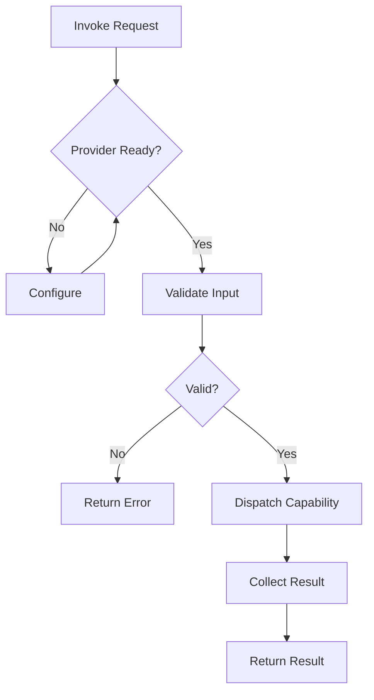

---
# MAM Metadata
id: template-tool
name: Tool Template
version: 1.0.0
type: tool
author: MAM Team
description: >
  Starter template for MAM tool modules. Defines a provider, the exposed
  capabilities, and the permission scopes a tool needs to run.

license: MIT

runtime:
  language: python
  version: ">=3.12"

provider: python

tags:
  - template
  - tool
  - starter

dependencies:
  - name: mam-runtime
    version: ">=1.0.0"
  - name: mam-permissions
    version: ">=1.0.0"

capabilities:
  - invoke
  - configure
  - health_check

permissions:
  filesystem:
    - read
  network:
    - internet
  python:
    - sandbox
---

# Tool Template

## Purpose

Starter template for a MAM tool. A tool exposes a provider plus a set of capabilities that other modules can call. Replace the provider name, the capability list, and the permission scopes to match your integration.

## Inputs

| Name | Type | Required | Description |
|------|------|----------|-------------|
| action | string | Yes | Capability to invoke |
| payload | object | No | Arguments passed to the capability |
| config | object | No | Provider configuration overrides |

## Outputs

| Name | Type | Description |
|------|------|-------------|
| result | object | Capability result payload |
| success | bool | Whether the invocation succeeded |
| error | string | Error message if the invocation failed |

## Capabilities

### invoke

Invoke a named capability through the configured provider.

### configure

Apply provider configuration and validate required settings.

### health_check

Report provider readiness and basic diagnostics.

## Rules

- A tool must declare a provider before it can run
- Only declared capabilities may be invoked
- Permissions are limited to the declared scopes
- Inputs are validated before any provider call
- Errors must not leak secrets or credentials
- Every invocation returns a structured result

## Workflow



## Python

```python
from dataclasses import dataclass, field
from typing import Any, Callable, Dict


@dataclass
class ToolResult:
    success: bool
    result: Dict[str, Any] = field(default_factory=dict)
    error: str = ""


class Tool:
    def __init__(self, provider: str = "python") -> None:
        self.provider = provider
        self.config: Dict[str, Any] = {}
        self._handlers: Dict[str, Callable[[Dict[str, Any]], Any]] = {}

    def register(self, capability: str, handler: Callable[[Dict[str, Any]], Any]) -> None:
        self._handlers[capability] = handler

    def configure(self, config: Dict[str, Any]) -> ToolResult:
        if not isinstance(config, dict):
            return ToolResult(success=False, error="config must be an object")
        self.config.update(config)
        return ToolResult(success=True, result={"provider": self.provider, "config": self.config})

    def invoke(self, action: str, payload: Dict[str, Any] = None) -> ToolResult:
        if action not in self._handlers:
            return ToolResult(success=False, error=f"Unknown capability: {action}")
        try:
            value = self._handlers[action](payload or {})
            return ToolResult(success=True, result={"value": value})
        except Exception as exc:
            return ToolResult(success=False, error=str(exc))

    def health_check(self) -> ToolResult:
        return ToolResult(
            success=True,
            result={"provider": self.provider, "capabilities": sorted(self._handlers)},
        )
```

## Tests

### Input

```yaml
action: invoke
capability: echo
payload:
  message: hello
```

### Expected

```yaml
success: true
value: hello
```

```python
def test_invoke():
    tool = Tool("python")
    tool.register("echo", lambda payload: payload.get("message"))
    result = tool.invoke("echo", {"message": "hello"})
    assert result.success is True
    assert result.result["value"] == "hello"


def test_unknown_capability():
    tool = Tool("python")
    result = tool.invoke("missing", {})
    assert result.success is False
    assert "Unknown capability" in result.error


def test_health_check():
    tool = Tool("python")
    tool.register("echo", lambda payload: payload)
    health = tool.health_check()
    assert health.success is True
    assert health.result["capabilities"] == ["echo"]
```

## Examples

### Basic Usage

```python
tool = Tool("python")
tool.register("echo", lambda payload: payload.get("message"))
tool.configure({"timeout": 10})

print(tool.invoke("echo", {"message": "hello"}))
print(tool.health_check())
```

### Expected Flow

```text
Invoke Request -> Provider Ready -> Validate Input -> Dispatch -> Return Result
```

## References

- [MAM Tool Specification](../../spec/sections/)
- [Tool Example](../examples/bug-hunter.mam.md)
