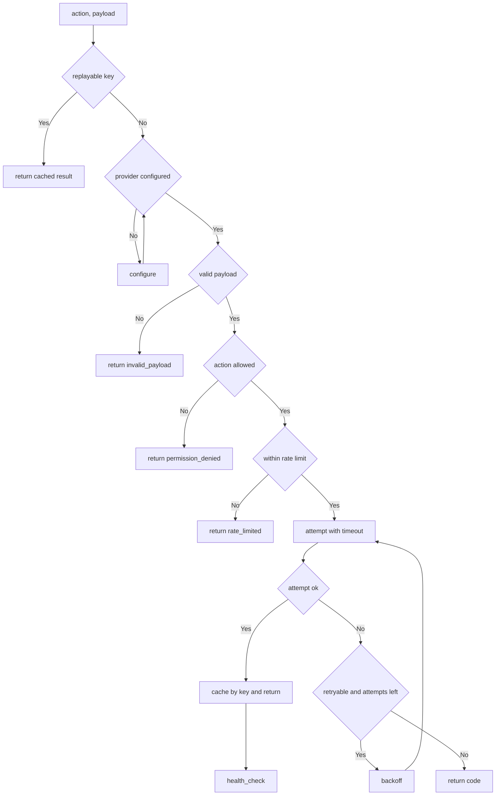

---
# MAM Metadata
id: template-tool-advanced
name: Tool Template (Advanced)
version: 2.0.0
type: tool

author: MAM Team
description: >
  A production tool with a versioned error taxonomy, per call timeouts,
  bounded retries, a sliding rate limit, idempotency keys and health reporting.

license: MIT

runtime:
  language: python
  version: ">=3.12"

provider: python

tags:
  - template
  - tool
  - advanced
  - reliability
  - limits

dependencies:
  - name: mam-runtime
    version: ">=1.0.0"
  - name: mam-permissions
    version: ">=1.0.0"
  - name: telemetry
    version: "^2.0"

capabilities:
  - invoke
  - configure
  - health_check
  - limit
  - retry

permissions:
  filesystem:
    - read
  network:
    - internet
  python:
    - sandbox
---

# Tool Template (Advanced)

## Purpose

A tool that other systems call unattended, so it cannot assume anything about
its caller. It validates before it dispatches, times each call, retries only
what is safe to retry, refuses calls that exceed its rate limit, deduplicates
retries through an idempotency key, and reports a stable error code for every
outcome. Side effects are real here, which is exactly why the limits and the
idempotency key exist.

## Inputs

| Name | Type | Required | Description |
|------|------|----------|-------------|
| action | string | Yes | Capability to invoke |
| payload | object | No | Arguments for the capability |
| config | object | No | Provider configuration overrides |
| idempotency_key | string | No | Key that makes a retried call safe |
| timeout_seconds | number | No | Per attempt timeout. Defaults to 0.5 |
| max_attempts | number | No | Attempts before the call is a failure. Defaults to 3 |

## Outputs

| Name | Type | Description |
|------|------|-------------|
| result | object | Capability result payload, empty on failure |
| success | boolean | Whether the call produced a result |
| code | string | Stable error code, empty on success |
| attempts | number | Attempts made, including the successful one |
| duration_ms | number | Total time spent on the call |
| replayed | boolean | Whether the result came from the idempotency cache |

## Capabilities

### invoke

Validate, authorize, rate limit and dispatch a capability, retrying within the
configured attempt and time bounds.

### configure

Apply provider configuration and validate the required settings.

### health_check

Report provider readiness, registered capabilities and remaining call budget.

### limit

Enforce the sliding rate limit and reject calls over budget.

### retry

Repeat a failed attempt that is safe to repeat, with a bounded backoff.

## Contract

| Field | Value | Description |
|-------|-------|-------------|
| signature | `invoke(action, payload, idempotency_key) -> Result` | Single entry point |
| required | `action: string` | Must name a registered capability |
| returns | `Result` | Six fields, always present |
| side effects | Yes | The capability may change external state |
| idempotent | Per key | Same key returns the first result, does not repeat the effect |

## Error Codes

| `code` | Retryable | Meaning |
|--------|-----------|---------|
| `""` | — | The call succeeded |
| `unknown_capability` | No | `action` is not registered on this tool |
| `invalid_payload` | No | `payload` was not an object |
| `config_incomplete` | No | `configure` left a required setting unset |
| `permission_denied` | No | The action is on the deny list |
| `rate_limited` | Yes, later | Over the call budget for the window |
| `timeout` | Yes | The attempt exceeded `timeout_seconds` |
| `provider_error` | Yes | The capability raised |

Codes are part of the contract. Renaming one is a breaking change; adding one
is not.

## Limits

| Limit | Default | Effect when exceeded |
|-------|---------|----------------------|
| `max_calls` | 5 per window | `rate_limited` before dispatch |
| `window_seconds` | 1.0 | The window the calls are counted in |
| `max_attempts` | 3 | The call is a `provider_error` or `timeout` |
| `timeout_seconds` | 0.5 | The attempt is abandoned as `timeout` |
| `backoff_seconds` | 0.01 | Pause before the next attempt |

## Permissions

| Scope | Access | Reason |
|-------|--------|--------|
| filesystem | read | Read local config |
| network | internet | Reach the upstream the capability wraps |
| python | sandbox | Run the handler in a sandbox |

## Rules

- Validation and authorization always run before dispatch.
- A retry only happens for a code marked retryable, and never past `max_attempts`.
- Every invocation consumes rate budget exactly once, retries included.
- An idempotency key is honoured for the lifetime of the tool instance.
- A timeout abandons the attempt; the tool cannot cancel the underlying work.
- The tool never raises to the caller; every outcome is an envelope with a code.
- The health check never invokes a capability and never spends rate budget.

## Workflow



## Python

```python
import time
from typing import Any, Callable, Dict, List, Optional

MAX_CALLS = 5
WINDOW_SECONDS = 1.0
MAX_ATTEMPTS = 3
TIMEOUT_SECONDS = 0.5
BACKOFF_SECONDS = 0.01

RETRYABLE = ("rate_limited", "timeout", "provider_error")
DEFAULT_DENY = ("shell.rm", "network.internal")


class ToolError(Exception):
    """Internal signal carrying a stable code. Never crosses to the caller."""

    def __init__(self, code: str) -> None:
        super().__init__(code)
        self.code = code


class Tool:
    """A bounded tool with a stable error taxonomy and no caller facing raises."""

    def __init__(self, provider: str = "python", max_calls: int = MAX_CALLS,
                 window_seconds: float = WINDOW_SECONDS,
                 max_attempts: int = MAX_ATTEMPTS,
                 timeout_seconds: float = TIMEOUT_SECONDS,
                 deny: List[str] = None) -> None:
        self.provider = provider
        self.config: Dict[str, Any] = {}
        self.max_calls = max_calls
        self.window_seconds = window_seconds
        self.max_attempts = max_attempts
        self.timeout_seconds = timeout_seconds
        self.deny = set(DEFAULT_DENY) | set(deny or [])
        self.required_config: List[str] = []
        self._handlers: Dict[str, Callable[[Dict[str, Any]], Any]] = {}
        self._replay: Dict[str, Dict[str, Any]] = {}
        self._calls: List[float] = []

    def register(self, capability: str, handler: Callable[[Dict[str, Any]], Any]) -> None:
        self._handlers[capability] = handler

    def configure(self, config: Dict[str, Any]) -> Dict[str, Any]:
        if not isinstance(config, dict):
            return self._envelope(False, {}, "invalid_payload")
        self.config.update(config)
        missing = [key for key in self.required_config if key not in self.config]
        if missing:
            return self._envelope(False, {"missing": missing}, "config_incomplete")
        return self._envelope(True, {"provider": self.provider, "config": self.config}, "")

    def health_check(self) -> Dict[str, Any]:
        missing = [key for key in self.required_config if key not in self.config]
        return self._envelope(
            not missing,
            {
                "provider": self.provider,
                "capabilities": sorted(self._handlers),
                "configured": not missing,
                "calls_remaining": max(0, self.max_calls - len(self._calls)),
            },
            "" if not missing else "config_incomplete",
        )

    def limit(self) -> bool:
        """Consume one slot of the sliding window. False when over budget."""
        now = time.monotonic()
        self._calls = [t for t in self._calls if now - t < self.window_seconds]
        if len(self._calls) >= self.max_calls:
            return False
        self._calls.append(now)
        return True

    def retry(self, action: str, attempts_left: int) -> bool:
        """Decide whether one more attempt is worth making."""
        if attempts_left <= 0:
            return False
        time.sleep(BACKOFF_SECONDS)
        return True

    def _envelope(self, success: bool, result: Dict[str, Any], code: str,
                  attempts: int = 0, duration_ms: float = 0.0,
                  replayed: bool = False) -> Dict[str, Any]:
        return {
            "result": result,
            "success": success,
            "code": code,
            "attempts": attempts,
            "duration_ms": round(duration_ms, 3),
            "replayed": replayed,
        }

    def _dispatch(self, action: str, payload: Dict[str, Any]) -> Any:
        started = time.perf_counter()
        try:
            value = self._handlers[action](payload)
        except Exception as error:
            raise ToolError("provider_error") from error
        if time.perf_counter() - started > self.timeout_seconds:
            raise ToolError("timeout")
        return value

    def invoke(self, action: str, payload: Dict[str, Any] = None,
               idempotency_key: Optional[str] = None) -> Dict[str, Any]:
        started = time.perf_counter()
        payload = {} if payload is None else payload

        if idempotency_key and idempotency_key in self._replay:
            cached = dict(self._replay[idempotency_key])
            cached["replayed"] = True
            return cached
        if action not in self._handlers:
            return self._envelope(False, {}, "unknown_capability")
        if not isinstance(payload, dict):
            return self._envelope(False, {}, "invalid_payload")
        if action in self.deny:
            return self._envelope(False, {}, "permission_denied")
        if not self.limit():
            return self._envelope(False, {}, "rate_limited")

        attempts, code = 0, ""
        value: Any = None
        while attempts < self.max_attempts:
            attempts += 1
            try:
                value = self._dispatch(action, payload)
                code = ""
                break
            except ToolError as error:
                code = error.code
                if code not in RETRYABLE or not self.retry(action, self.max_attempts - attempts):
                    break

        duration_ms = (time.perf_counter() - started) * 1000
        if code:
            return self._envelope(False, {}, code, attempts, duration_ms)
        envelope = self._envelope(True, {"value": value}, "", attempts, duration_ms)
        if idempotency_key:
            self._replay[idempotency_key] = dict(envelope)
        return envelope
```

## Tests

### Input

```yaml
action: echo
payload:
  message: hello
idempotency_key: call-1
```

### Expected

```yaml
success: true
result:
  value: hello
code: ""
```

```python
def test_invoke_returns_a_result():
    tool = Tool()
    tool.register("echo", lambda payload: payload.get("message"))
    out = tool.invoke("echo", {"message": "hello"})
    assert out["success"] is True
    assert out["result"]["value"] == "hello"
    assert out["code"] == ""
    assert out["attempts"] == 1


def test_envelope_shape_is_constant():
    tool = Tool()
    tool.register("echo", lambda payload: payload)
    keys = {"result", "success", "code", "attempts", "duration_ms", "replayed"}
    for out in (tool.invoke("echo"), tool.invoke("nope"), tool.invoke("echo", 7)):
        assert set(out) == keys


def test_unknown_capability_is_not_retried():
    tool = Tool()
    out = tool.invoke("nope")
    assert out["code"] == "unknown_capability"
    assert out["attempts"] == 0


def test_invalid_payload_is_rejected():
    tool = Tool()
    tool.register("echo", lambda payload: payload)
    assert tool.invoke("echo", 7)["code"] == "invalid_payload"


def test_permission_denied_blocks_dispatch():
    seen = []
    tool = Tool(deny=["echo"])
    tool.register("echo", lambda payload: seen.append(payload))
    out = tool.invoke("echo", {"message": "hello"})
    assert out["code"] == "permission_denied"
    assert seen == []


def test_rate_limit_is_enforced():
    tool = Tool(max_calls=2, window_seconds=60)
    tool.register("echo", lambda payload: "ok")
    assert tool.invoke("echo")["success"] is True
    assert tool.invoke("echo")["success"] is True
    out = tool.invoke("echo")
    assert out["code"] == "rate_limited"
    assert out["attempts"] == 0


def test_provider_error_is_retried_then_reported():
    calls = []

    def flaky(payload):
        calls.append(payload)
        raise RuntimeError("upstream down")

    tool = Tool(max_attempts=3)
    tool.register("flaky", flaky)
    out = tool.invoke("flaky")
    assert out["code"] == "provider_error"
    assert out["attempts"] == 3
    assert len(calls) == 3


def test_retry_stops_as_soon_as_it_succeeds():
    calls = []

    def flaky(payload):
        calls.append(payload)
        if len(calls) < 2:
            raise RuntimeError("upstream down")
        return "ok"

    tool = Tool(max_attempts=3)
    tool.register("flaky", flaky)
    out = tool.invoke("flaky")
    assert out["success"] is True
    assert out["attempts"] == 2


def test_timeout_is_reported_as_timeout():
    tool = Tool(timeout_seconds=0.001)
    tool.register("slow", lambda payload: time.sleep(0.01) or "late")
    assert tool.invoke("slow")["code"] == "timeout"


def test_idempotency_key_replays_instead_of_repeating():
    calls = []
    tool = Tool()
    tool.register("charge", lambda payload: calls.append(payload) or "charged")

    first = tool.invoke("charge", {"amount": 1}, idempotency_key="call-1")
    second = tool.invoke("charge", {"amount": 1}, idempotency_key="call-1")

    assert first["replayed"] is False
    assert second["replayed"] is True
    assert second["result"]["value"] == "charged"
    assert len(calls) == 1


def test_health_check_reports_readiness():
    tool = Tool(max_calls=5)
    tool.required_config = ["token"]
    tool.register("echo", lambda payload: "ok")

    before = tool.health_check()
    assert before["success"] is False
    assert before["code"] == "config_incomplete"

    tool.configure({"token": "abc"})
    after = tool.health_check()
    assert after["success"] is True
    assert after["result"]["configured"] is True
    assert after["result"]["capabilities"] == ["echo"]


def test_configure_reports_missing_required_settings():
    tool = Tool()
    tool.required_config = ["endpoint"]
    out = tool.configure({})
    assert out["code"] == "config_incomplete"
    assert out["result"]["missing"] == ["endpoint"]
```

## Examples

```python
tool = Tool(max_attempts=2)
tool.required_config = ["endpoint"]
tool.configure({"endpoint": "api.example.com"})
tool.register("echo", lambda payload: payload.get("message"))

out = tool.invoke("echo", {"message": "hello"}, idempotency_key="call-1")
print(out["success"], out["result"])      # True {'value': 'hello'}
print(tool.invoke("echo", {"message": "x"}, "call-1")["replayed"])   # True
print(tool.health_check()["result"]["calls_remaining"])
```

### Expected Flow

```text
invoke -> validate -> authorize -> rate limit -> attempt -> retry -> envelope
```

## References

- [MAM Tool Specification](../../spec/sections/)
- [Tool Template (full)](./tool.mam)
- [MAM Permission Model](../../spec/sections/)
- [MAM Specification](../../plan-doc/full-mam.md)
