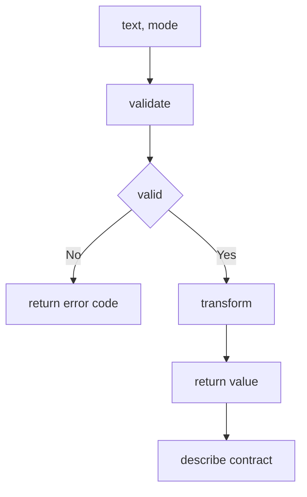

---
# MAM Metadata
id: template-tool-basic
name: Tool Template (Basic)
version: 2.0.0
type: tool

author: MAM Team
description: >
  A single callable tool with a narrow typed contract: one required input, one
  result envelope, and a fixed set of errors.

license: MIT

runtime:
  language: python
  version: ">=3.12"

provider: python

tags:
  - template
  - tool
  - basic
  - contract

capabilities:
  - invoke
  - describe

permissions:
  filesystem:
    - read
  python:
    - sandbox
---

# Tool Template (Basic)

## Purpose

The narrowest useful tool: a typed `text` in, a typed `result` out, and a
result envelope that says whether the call worked. It is pure and idempotent,
so calling it twice with the same input is indistinguishable from calling it
once. Use [`tool.mam`](../tool.mam) for the full provider and configuration
surface, and [`tool-advanced.mam`](./tool-advanced.mam) for timeouts, retries,
rate limits and a stable error taxonomy.

## Inputs

| Name | Type | Required | Description |
|------|------|----------|-------------|
| text | string | Yes | Value the tool operates on |
| mode | string | No | `upper`, `lower` or `identity`. Defaults to `upper` |

## Outputs

| Name | Type | Description |
|------|------|-------------|
| value | string | The transformed value, empty string on failure |
| success | boolean | Whether the call produced a value |
| error | string | Error code, empty on success |

## Capabilities

### invoke

Validate the input and run the requested transform, returning the envelope.

### describe

Return the tool's contract: its modes and whether it is idempotent.

## Contract

| Field | Value | Description |
|-------|-------|-------------|
| signature | `invoke(text: string, mode: str) -> Result` | Single entry point |
| required | `text: string` | Anything else has a default |
| returns | `Result` | Always the same three fields |
| side effects | None | Nothing outside the process is touched |
| idempotent | Yes | Same input, same output, any number of times |

## Error Contract

| `error` | Cause | Caller action |
|---------|-------|---------------|
| `""` | The call succeeded | Use `value` |
| `invalid_type` | `text` was not a string | Fix the input |
| `invalid_mode` | `mode` was not a declared mode | Fix the input |
| `empty_text` | `text` was an empty string | Supply a value |

The tool never raises. Every failure comes back as `success: false` with one of
the codes above, which makes it safe to call from a retry loop.

## Rules

- Exactly one required input; every other input has a declared default.
- Output is always the same envelope shape, on success and on failure.
- The tool never raises to the caller.
- `error` is a stable code, not a message that changes between releases.
- Validation happens before any work, so a bad input costs nothing.
- The call is side-effect free and idempotent.

## Workflow



## Python

```python
from typing import Any, Dict

MODES = ("upper", "lower", "identity")


def _transform(text: str, mode: str) -> str:
    if mode == "lower":
        return text.lower()
    if mode == "identity":
        return text
    return text.upper()


def invoke(text: Any, mode: str = "upper") -> Dict[str, Any]:
    """Validate then transform, always returning the same envelope."""
    if not isinstance(text, str):
        return {"value": "", "success": False, "error": "invalid_type"}
    if mode not in MODES:
        return {"value": "", "success": False, "error": "invalid_mode"}
    if not text:
        return {"value": "", "success": False, "error": "empty_text"}
    return {"value": _transform(text, mode), "success": True, "error": ""}


def describe() -> Dict[str, Any]:
    """Return the tool's contract."""
    return {"modes": list(MODES), "idempotent": True, "side_effects": False}
```

## Tests

### Input

```yaml
text: "mam"
mode: upper
```

### Expected

```yaml
value: MAM
success: true
error: ""
```

```python
def test_invoke_upper():
    out = invoke("mam", "upper")
    assert out == {"value": "MAM", "success": True, "error": ""}


def test_default_mode_is_upper():
    assert invoke("mam")["value"] == "MAM"


def test_rejects_wrong_type():
    out = invoke(42)
    assert out["success"] is False
    assert out["error"] == "invalid_type"
    assert out["value"] == ""


def test_rejects_unknown_mode():
    assert invoke("mam", "shout")["error"] == "invalid_mode"


def test_rejects_empty_text():
    assert invoke("")["error"] == "empty_text"


def test_envelope_shape_is_constant():
    keys = {"value", "success", "error"}
    for call in (invoke("mam"), invoke(42), invoke(""), invoke("mam", "shout")):
        assert set(call) == keys


def test_is_idempotent():
    assert invoke("mam", "lower") == invoke("mam", "lower")


def test_describe_reports_the_contract():
    contract = describe()
    assert contract["modes"] == ["upper", "lower", "identity"]
    assert contract["idempotent"] is True
    assert contract["side_effects"] is False
```

## Examples

```python
print(invoke("mam", "upper"))
# {'value': 'MAM', 'success': True, 'error': ''}

print(invoke("mam", "shout"))
# {'value': '', 'success': False, 'error': 'invalid_mode'}

print(describe())
# {'modes': ['upper', 'lower', 'identity'], 'idempotent': True, 'side_effects': False}
```

### Expected Flow

```text
text, mode -> validate -> transform -> envelope
```

## References

- [MAM Tool Specification](../../spec/sections/)
- [Tool Template (full)](./tool.mam)
- [MAM Specification](../../plan-doc/full-mam.md)
