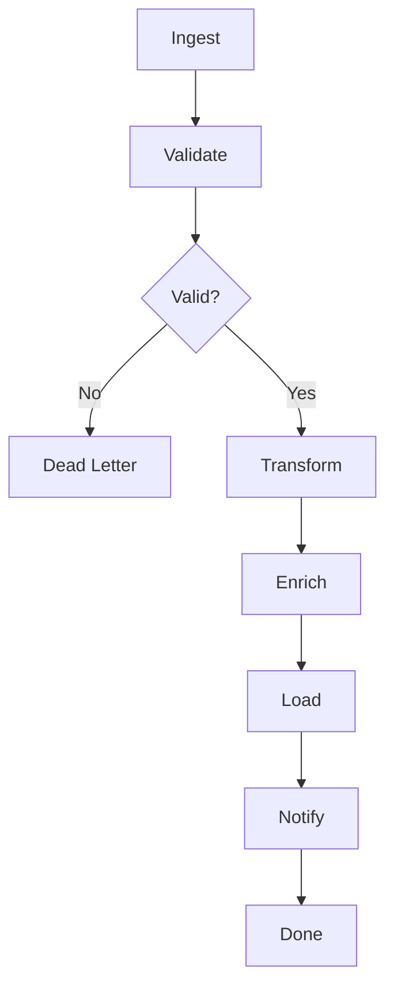

# Workflow Module Template

## Purpose

Template for creating multi-step workflows as directed acyclic graphs. Each step is an atomic operation with dependencies, conditions, retries, and error handlers. Customize the steps and handlers for your pipeline.

## Workflow Definition

module MyWorkflow

type:
    workflow

steps:
    - Ingest
    - Validate
    - Transform
    - Enrich
    - Load
    - Notify

## Step: Ingest

module Ingest

type:
    tool

provider:
    python

capabilities:
    - read
    - parse
    - normalize

## Step: Validate

module Validate

type:
    tool

provider:
    python

capabilities:
    - schema-check
    - type-check
    - required-fields

## Step: Transform

module Transform

type:
    tool

provider:
    python

capabilities:
    - map
    - filter
    - aggregate

## Step: Enrich

module Enrich

type:
    tool

provider:
    python

capabilities:
    - lookup
    - merge
    - augment

## Step: Load

module Load

type:
    tool

provider:
    python

capabilities:
    - write
    - upsert
    - batch-insert

## Step: Notify

module Notify

type:
    tool

provider:
    python

capabilities:
    - email
    - webhook
    - slack

## Rules

- Workflow steps must form a valid DAG (no cycles)
- Steps with unmet dependencies are skipped
- Maximum 100 steps per workflow
- Step retries are capped at 5
- Failed steps without error handlers halt the workflow
- Each step must have a unique name

## Workflow Diagram



## Python

```python
from typing import Any, Callable, Dict, List, Optional
from dataclasses import dataclass, field
import time

@dataclass
class Step:
    name: str
    handler: str
    depends_on: List[str] = field(default_factory=list)
    condition: Optional[str] = None
    error_handler: Optional[str] = None
    retries: int = 0
    params: Dict[str, Any] = field(default_factory=dict)

class WorkflowEngine:
    def __init__(self):
        self._workflows: Dict[str, List[Step]] = {}
        self._handlers: Dict[str, Callable] = {}

    def register_handler(self, name: str, fn: Callable):
        self._handlers[name] = fn

    def define(self, workflow_id: str, steps: List[Step]):
        self._workflows[workflow_id] = steps

    def run(self, workflow_id: str, input_data: Dict = None) -> Dict:
        """Execute workflow. Implement step-by-step DAG traversal."""
        # TODO: Implement topological sort + execution
        pass

# Custom step handlers
def handler_ingest(**kwargs) -> Any:
    """Extract and normalize data from source."""
    pass

def handler_validate(**kwargs) -> bool:
    """Validate data against schema."""
    pass

def handler_transform(**kwargs) -> Any:
    """Apply business transformations."""
    pass

def handler_enrich(**kwargs) -> Any:
    """Add external data to records."""
    pass

def handler_load(**kwargs) -> bool:
    """Write data to target store."""
    pass

def handler_notify(**kwargs) -> bool:
    """Send completion notification."""
    pass
```

## Examples

```python
engine = WorkflowEngine()
engine.register_handler("ingest", handler_ingest)
engine.register_handler("validate", handler_validate)
engine.register_handler("transform", handler_transform)

engine.define("my-pipeline", [
    Step(name="ingest", handler="ingest"),
    Step(name="validate", handler="validate", depends_on=["ingest"]),
    Step(name="transform", handler="transform", depends_on=["validate"]),
])

result = engine.run("my-pipeline", {"source": "data.csv"})
print(result)
```

## Dependencies

- None

## References

- [Workflow Section Spec](../../spec/sections/workflow.md)
- [Content Pipeline Example](../examples/data-pipeline.mam.md)
