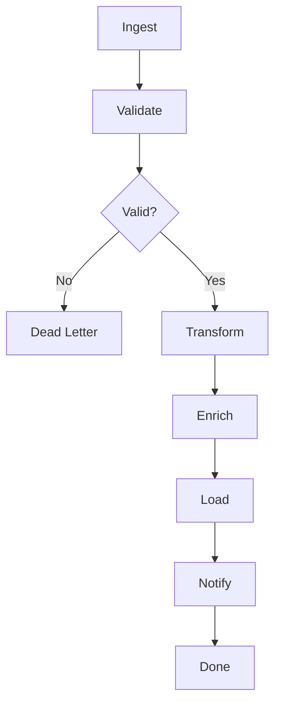

---
# MAM Metadata
id: template-workflow
name: Workflow Template
version: 2.0.0
type: workflow

author: MAM Team
description: >
  Starter template for building DAG based workflows with steps, conditions,
  and error handling.

license: MIT

runtime:
  language: python
  version: ">=3.12"

tags:
  - template
  - workflow
  - pipeline
  - orchestration

dependencies:
  - name: mam-runtime
    version: ">=1.0.0"

capabilities:
  - define
  - validate
  - run

permissions:
  filesystem:
    - read
  memory:
    - local
---

# Workflow Module Template

## Purpose

Template for creating multi step workflows as directed acyclic graphs. Each step is an atomic operation with dependencies, conditions, retries, and error handlers. Customize the steps and handlers for your pipeline.

## Inputs

| Name | Type | Required | Description |
|------|------|----------|-------------|
| action | string | Yes | run, validate, or status |
| workflow_id | string | No | Workflow to execute when action is run |
| input_data | object | No | Input payload for the workflow |

## Outputs

| Name | Type | Description |
|------|------|-------------|
| status | string | completed, failed, or skipped |
| results | object | Step by step results |
| output | any | Final workflow output |

## Capabilities

### define

Register a workflow as an ordered set of steps.

### validate

Validate the workflow DAG and detect missing or circular dependencies.

### run

Execute a workflow in dependency order and return results.

## Workflow Definition

module MyWorkflow

type:
    workflow

steps:
    - Ingest
    - Validate
    - Transform
    - Enrich
    - Load
    - Notify

## Step: Ingest

module Ingest

type:
    tool

provider:
    python

capabilities:
    - read
    - parse
    - normalize

## Step: Validate

module Validate

type:
    tool

provider:
    python

capabilities:
    - schema-check
    - type-check
    - required-fields

## Step: Transform

module Transform

type:
    tool

provider:
    python

capabilities:
    - map
    - filter
    - aggregate

## Step: Enrich

module Enrich

type:
    tool

provider:
    python

capabilities:
    - lookup
    - merge
    - augment

## Step: Load

module Load

type:
    tool

provider:
    python

capabilities:
    - write
    - upsert
    - batch-insert

## Step: Notify

module Notify

type:
    tool

provider:
    python

capabilities:
    - email
    - webhook
    - slack

## Rules

- Workflow steps must form a valid DAG with no cycles
- Steps with unmet dependencies are skipped
- Maximum 100 steps per workflow
- Step retries are capped at 5
- Failed steps without error handlers halt the workflow
- Each step must have a unique name

## Workflow



## Python

```python
from typing import Any, Callable, Dict, List, Optional
from dataclasses import dataclass, field

@dataclass
class Step:
    name: str
    handler: str
    depends_on: List[str] = field(default_factory=list)
    condition: Optional[str] = None
    error_handler: Optional[str] = None
    retries: int = 0
    params: Dict[str, Any] = field(default_factory=dict)

class WorkflowEngine:
    """Execute a workflow as an ordered list of dependent steps."""

    def __init__(self):
        self._workflows: Dict[str, List[Step]] = {}
        self._handlers: Dict[str, Callable] = {}

    def register_handler(self, name: str, fn: Callable):
        self._handlers[name] = fn

    def define(self, workflow_id: str, steps: List[Step]):
        self._workflows[workflow_id] = steps

    def run(self, workflow_id: str, input_data: Dict = None) -> Dict:
        steps = self._workflows.get(workflow_id, [])
        input_data = input_data or {}
        results: Dict[str, Any] = {}
        completed = set()

        for step in steps:
            if any(dep not in completed for dep in step.depends_on):
                results[step.name] = "skipped"
                continue

            handler = self._handlers.get(step.handler)
            if handler is None:
                results[step.name] = "missing handler"
                continue

            payload = {**input_data, **step.params,
                       **{dep: results[dep] for dep in step.depends_on}}
            try:
                results[step.name] = handler(**payload)
                completed.add(step.name)
            except Exception as exc:
                if step.error_handler and step.error_handler in self._handlers:
                    results[step.name] = self._handlers[step.error_handler](error=str(exc))
                    completed.add(step.name)
                else:
                    results[step.name] = f"error: {exc}"

        return {"workflow": workflow_id, "results": results}


def handler_ingest(**kwargs) -> Any:
    return kwargs.get("source", "data")

def handler_validate(**kwargs) -> bool:
    return bool(kwargs.get("ingest", True))

def handler_transform(**kwargs) -> Any:
    return kwargs

def handler_enrich(**kwargs) -> Any:
    return kwargs

def handler_load(**kwargs) -> bool:
    return True

def handler_notify(**kwargs) -> bool:
    return True
```

## Tests

### Input

```yaml
action: run
workflow_id: my-pipeline
```

### Expected

```yaml
status: completed
steps: 3
```

```python
def test_run_pipeline():
    engine = WorkflowEngine()
    engine.register_handler("ingest", handler_ingest)
    engine.register_handler("transform", handler_transform)

    engine.define("my-pipeline", [
        Step(name="ingest", handler="ingest", params={"source": "data.csv"}),
        Step(name="transform", handler="transform", depends_on=["ingest"]),
    ])

    result = engine.run("my-pipeline", {"source": "data.csv"})
    assert result["workflow"] == "my-pipeline"
    assert result["results"]["ingest"] == "data.csv"
```

## Examples

```python
engine = WorkflowEngine()
engine.register_handler("ingest", handler_ingest)
engine.register_handler("validate", handler_validate)
engine.register_handler("transform", handler_transform)

engine.define("my-pipeline", [
    Step(name="ingest", handler="ingest"),
    Step(name="validate", handler="validate", depends_on=["ingest"]),
    Step(name="transform", handler="transform", depends_on=["validate"]),
])

result = engine.run("my-pipeline", {"source": "data.csv"})
print(result)
```

## References

- [Workflow Section Spec](../../spec/sections/workflow.md)
- [Content Pipeline Example](../examples/data_pipeline.mam.md)
