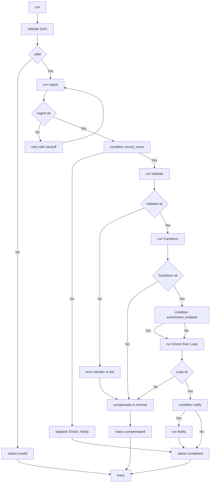

---
# MAM Metadata
id: template-workflow-advanced
name: Workflow Template (Advanced)
version: 2.0.0
type: workflow

author: MAM Team
description: >
  A branching workflow with conditional steps, bounded retries with backoff,
  per step timeouts, compensation for completed work and a run trace.

license: MIT

runtime:
  language: python
  version: ">=3.12"

tags:
  - template
  - workflow
  - advanced
  - retries
  - timeouts

dependencies:
  - name: mam-runtime
    version: ">=1.0.0"
  - name: telemetry
    version: "^2.0"

capabilities:
  - define
  - validate
  - run
  - retry
  - compensate
  - trace

permissions:
  filesystem:
    - read
  memory:
    - local
  network:
    - internet
---

# Workflow Template (Advanced)

## Purpose

A workflow for a pipeline that talks to systems which sometimes fail. Steps
branch on a condition, retry a bounded number of times with a backoff, run
under a per step timeout, hand their failure to a compensation step when one is
declared, and leave behind a trace of what every step did so a failed run can be
explained without re-running it.

## Inputs

| Name | Type | Required | Description |
|------|------|----------|-------------|
| action | string | Yes | `run`, `validate` or `status` |
| workflow_id | string | Yes | Workflow to execute or inspect |
| input_data | object | No | Payload handed to the entry steps |
| max_retries | number | No | Override for the declared retry cap. Defaults to the step value |

## Outputs

| Name | Type | Description |
|------|------|-------------|
| status | string | `completed`, `failed`, `invalid`, `timed_out` or `compensated` |
| results | object | Step name to step outcome |
| output | any | Output of the last step that ran |
| failed_step | string | Step that ended the run, empty otherwise |
| trace | array | One record per step attempt |

## Capabilities

### define

Register a workflow as a set of steps with dependencies, conditions, timeouts,
retries and compensation handlers.

### validate

Check for cycles, unknown dependencies, missing handlers and steps that can
never become runnable.

### run

Execute the steps in dependency order, applying conditions, timeouts and
retries, and stopping at the first unrecoverable failure.

### retry

Repeat a failed attempt while the step is retryable, the attempt is under the
error handler's budget and the step's timeout has not already elapsed.

### compensate

Roll back the work of completed steps, newest first, through each step's
declared compensation handler.

### trace

Return the per attempt record of the most recent run.

## Workflow Definition

```text
module ResilientPipeline

type:
    workflow

steps:
    - Ingest
    - Validate
    - Transform
    - Enrich
    - Load
    - Notify
```

## Step: Ingest

```text
module Ingest

type:
    tool

provider:
    python

capabilities:
    - read
    - parse
    - normalize

depends_on: []
timeout_seconds: 30
retries: 2
compensate:
    ingest.rollback
```

## Step: Validate

```text
module Validate

type:
    tool

provider:
    python

capabilities:
    - schema-check
    - required-fields

depends_on:
    - Ingest

condition:
    input.record_count > 0

timeout_seconds: 10
retries: 0
error_handler:
    validate.reject
```

## Step: Transform

```text
module Transform

type:
    tool

provider:
    python

capabilities:
    - map
    - filter
    - aggregate

depends_on:
    - Validate

timeout_seconds: 60
retries: 1
backoff_seconds: 0.5
```

## Step: Enrich

```text
module Enrich

type:
    tool

provider:
    python

capabilities:
    - lookup
    - merge

depends_on:
    - Transform

condition:
    result.enrichment_enabled == True

timeout_seconds: 20
retries: 1
```

## Step: Load

```text
module Load

type:
    tool

provider:
    python

capabilities:
    - write
    - upsert
    - batch-insert

depends_on:
    - Validate
    - Enrich

timeout_seconds: 120
retries: 3
backoff_seconds: 1.0
compensate:
    load.rollback
```

## Step: Notify

```text
module Notify

type:
    tool

provider:
    python

capabilities:
    - email
    - webhook

depends_on:
    - Load

condition:
    result.notify == True

timeout_seconds: 15
retries: 1
```

## Retry and Timeout Policy

| Step | `timeout_seconds` | `retries` | `backoff_seconds` | Compensates |
|------|-------------------|-----------|-------------------|-------------|
| Ingest | 30 | 2 | 0.1 | `ingest.rollback` |
| Validate | 10 | 0 | — | — |
| Transform | 60 | 1 | 0.5 | — |
| Enrich | 20 | 1 | 0.1 | — |
| Load | 120 | 3 | 1.0 | `load.rollback` |
| Notify | 15 | 1 | 0.1 | — |

A step is retried only when the failure is retryable: a timeout, a missing
dependency, or a handler that raises. A step that is conditioned out is
`skipped` and is never retried.

## Compensation

When a run fails, every completed step that declares a compensation handler is
rolled back in reverse completion order. Compensation failures are recorded and
do not stop the remaining rollbacks, because a partial rollback is still better
than an abandoned one.

## Rules

- Step order is the definition; execution follows dependency order.
- A condition is evaluated against the merged result and a false condition
  skips the step without an error.
- A step runs at most `1 + retries` times and never past its timeout.
- Retries use a linear backoff of `backoff_seconds * attempt`.
- A step with a missing dependency is skipped, not failed.
- An unhandled failure ends the run and starts compensation.
- Compensation runs newest first and never stops early.
- The trace records every attempt, including the ones that were retried.
- The engine never raises to the caller; status carries the outcome.

## Workflow



## Python

```python
import time
from dataclasses import dataclass, field
from typing import Any, Callable, Dict, List, Optional

MAX_STEPS = 100
MAX_RETRIES = 5


@dataclass
class Step:
    name: str
    handler: str
    depends_on: List[str] = field(default_factory=list)
    condition: Optional[str] = None
    error_handler: Optional[str] = None
    compensate: Optional[str] = None
    retries: int = 0
    timeout_seconds: float = 30.0
    backoff_seconds: float = 0.1
    params: Dict[str, Any] = field(default_factory=dict)


class WorkflowEngine:
    """Run a branching workflow with retries, timeouts and compensation."""

    def __init__(self) -> None:
        self._workflows: Dict[str, List[Step]] = {}
        self._handlers: Dict[str, Callable[..., Any]] = {}
        self._last_trace: List[Dict[str, Any]] = []

    def register_handler(self, name: str, fn: Callable[..., Any]) -> None:
        self._handlers[name] = fn

    def define(self, workflow_id: str, steps: List[Step]) -> Dict[str, Any]:
        if len(steps) > MAX_STEPS:
            return {"status": "invalid", "code": "too_many_steps"}
        self._workflows[workflow_id] = steps
        return {"status": "completed", "code": ""}

    def validate(self, workflow_id: str) -> Dict[str, Any]:
        steps = self._workflows.get(workflow_id)
        if not steps:
            return {"status": "invalid", "code": "unknown_workflow"}
        names = [step.name for step in steps]
        if len(set(names)) != len(names):
            return {"status": "invalid", "code": "duplicate_step"}
        for step in steps:
            if step.retries < 0 or step.retries > MAX_RETRIES:
                return {"status": "invalid", "code": "invalid_retry_count"}
            for dep in step.depends_on:
                if dep not in names:
                    return {"status": "invalid", "code": "unknown_dependency"}
        if self._has_cycle(steps):
            return {"status": "invalid", "code": "cycle_detected"}
        return {"status": "completed", "code": ""}

    def _has_cycle(self, steps: List[Step]) -> bool:
        """Depth first search over depends_on edges."""
        edges = {step.name: list(step.depends_on) for step in steps}
        settled: set = set()

        def visit(name: str, path: List[str]) -> bool:
            if name in path:
                return True
            if name in settled:
                return False
            for dep in edges[name]:
                if visit(dep, path + [name]):
                    return True
            settled.add(name)
            return False

        return any(visit(step.name, []) for step in steps)

    def _condition_holds(self, step: Step, context: Dict[str, Any]) -> bool:
        """A condition names a context field that must be present and truthy."""
        if not step.condition:
            return True
        return bool(context.get(step.condition))

    def retry(self, step: Step, attempt: int) -> None:
        """Sleep for the linear backoff before the next attempt."""
        if step.backoff_seconds > 0:
            time.sleep(step.backoff_seconds * attempt)

    def compensate(self, steps: List[Step], completed: List[str]) -> List[Dict[str, Any]]:
        """Roll completed work back in reverse order; never stop early."""
        undone: List[Dict[str, Any]] = []
        by_name = {step.name: step for step in steps}
        for name in reversed(completed):
            step = by_name[name]
            if not step.compensate or step.compensate not in self._handlers:
                continue
            try:
                self._handlers[step.compensate](step=name)
                undone.append({"step": name, "compensated": True})
            except Exception as error:
                undone.append({"step": name, "compensated": False, "error": str(error)})
        return undone

    def run(self, workflow_id: str, input_data: Dict[str, Any] = None,
            max_retries: Optional[int] = None) -> Dict[str, Any]:
        check = self.validate(workflow_id)
        if check["code"]:
            self._last_trace = []
            return {"status": "invalid", "results": {}, "output": None,
                    "failed_step": "", "trace": []}

        steps = self._workflows[workflow_id]
        input_data = input_data or {}
        context: Dict[str, Any] = dict(input_data)
        results: Dict[str, Any] = {}
        completed: List[str] = []
        trace: List[Dict[str, Any]] = []

        for step in steps:
            if any(dep not in results for dep in step.depends_on):
                results[step.name] = "skipped"
                trace.append({"step": step.name, "outcome": "skipped", "attempts": 0})
                continue
            if not self._condition_holds(step, context):
                results[step.name] = "skipped"
                trace.append({"step": step.name, "outcome": "condition_false", "attempts": 0})
                continue

            handler = self._handlers.get(step.handler)
            if handler is None:
                results[step.name] = "failed: missing_handler"
                trace.append({"step": step.name, "outcome": "missing_handler", "attempts": 0})
                return self._finish("failed", results, step.name, completed, trace)

            payload = dict(input_data)
            payload.update(step.params)
            payload.update({dep: results[dep] for dep in step.depends_on})

            budget = step.retries if max_retries is None else min(step.retries, max_retries)
            attempt, value, error = 0, None, None
            while attempt <= budget:
                attempt += 1
                started = time.perf_counter()
                try:
                    value = handler(**payload)
                    error = None
                    break
                except Exception as exc:
                    error = str(exc)
                    if time.perf_counter() - started > step.timeout_seconds:
                        error = "timeout"
                if attempt <= budget:
                    self.retry(step, attempt)

            elapsed_ok = error is None
            results[step.name] = value if elapsed_ok else f"failed: {error}"
            trace.append({
                "step": step.name, "attempts": attempt,
                "outcome": "ok" if elapsed_ok else "failed",
                "error": error or "",
            })

            if not elapsed_ok:
                if step.error_handler and step.error_handler in self._handlers:
                    results[step.name] = self._handlers[step.error_handler](error=error)
                    completed.append(step.name)
                    continue
                self.compensate(steps, completed)
                status = "timed_out" if error == "timeout" else "failed"
                return self._finish(status, results, step.name, completed, trace)

            completed.append(step.name)
            context.update({step.name: value})

        ran = [name for name, value in results.items() if value != "skipped"]
        output = results[ran[-1]] if ran else None
        return self._finish("completed", results, "", completed, trace, output)

    def _finish(self, status: str, results: Dict[str, Any], failed_step: str,
                completed: List[str], trace: List[Dict[str, Any]],
                output: Any = None) -> Dict[str, Any]:
        self._last_trace = trace
        return {"status": status, "results": results, "output": output,
                "failed_step": failed_step, "trace": trace}

    def trace(self) -> List[Dict[str, Any]]:
        return list(self._last_trace)
```

## Tests

### Input

```yaml
action: run
workflow_id: resilient-pipeline
input_data:
  record_count: 2
  enrichment_enabled: true
  notify: true
```

### Expected

```yaml
status: completed
failed_step: ""
```

```python
def _engine():
    engine = WorkflowEngine()
    engine.register_handler("ingest", lambda **kw: [1, 2])
    engine.register_handler("validate", lambda **kw: True)
    engine.register_handler("transform", lambda **kw: [2, 4])
    engine.register_handler("enrich", lambda **kw: kw["Transform"])
    engine.register_handler("load", lambda **kw: len(kw.get("Enrich", [])))
    engine.register_handler("notify", lambda **kw: "notified")
    engine.register_handler("validate.reject", lambda **kw: f"rejected: {kw['error']}")
    steps = [
        Step(name="Ingest", handler="ingest", retries=2, backoff_seconds=0),
        Step(name="Validate", handler="validate", depends_on=["Ingest"],
             error_handler="validate.reject"),
        Step(name="Transform", handler="transform", depends_on=["Validate"],
             condition="record_count", retries=1, backoff_seconds=0),
        Step(name="Enrich", handler="enrich", depends_on=["Transform"],
             condition="enrichment_enabled"),
        Step(name="Load", handler="load", depends_on=["Enrich"]),
        Step(name="Notify", handler="notify", depends_on=["Load"], condition="notify"),
    ]
    engine.define("resilient-pipeline", steps)
    return engine


PAYLOAD = {"record_count": 2, "enrichment_enabled": True, "notify": True}


def test_happy_path_completes_and_traces():
    engine = _engine()
    out = engine.run("resilient-pipeline", PAYLOAD)
    assert out["status"] == "completed"
    assert out["failed_step"] == ""
    assert out["results"]["Load"] == 2
    assert [record["step"] for record in out["trace"]] == [
        "Ingest", "Validate", "Transform", "Enrich", "Load", "Notify",
    ]
    assert engine.trace() == out["trace"]


def test_false_condition_skips_the_step():
    out = _engine().run("resilient-pipeline", dict(PAYLOAD, notify=False))
    assert out["results"]["Notify"] == "skipped"
    record = [r for r in out["trace"] if r["step"] == "Notify"][0]
    assert record["outcome"] == "condition_false"


def test_a_step_is_retried_then_succeeds():
    calls = []

    def flaky(**kw):
        calls.append(kw)
        if len(calls) < 3:
            raise RuntimeError("upstream down")
        return ["done"]

    engine = _engine()
    engine.register_handler("ingest", flaky)
    out = engine.run("resilient-pipeline", PAYLOAD)
    assert out["status"] == "completed"
    record = [r for r in out["trace"] if r["step"] == "Ingest"][0]
    assert record["attempts"] == 3


def test_retries_are_capped():
    calls = []

    def always_fails(**kw):
        calls.append(kw)
        raise RuntimeError("down")

    engine = _engine()
    engine.register_handler("ingest", always_fails)
    out = engine.run("resilient-pipeline", PAYLOAD)
    assert out["status"] == "failed"
    assert out["failed_step"] == "Ingest"
    assert len(calls) == 3          # 1 + retries(2)
    assert out["trace"][0]["error"] == "down"


def test_max_retries_override_caps_the_step():
    calls = []

    def always_fails(**kw):
        calls.append(kw)
        raise RuntimeError("down")

    engine = _engine()
    engine.register_handler("ingest", always_fails)
    out = engine.run("resilient-pipeline", PAYLOAD, max_retries=0)
    assert out["status"] == "failed"
    assert len(calls) == 1


def test_error_handler_receives_the_failure():
    engine = _engine()

    def explode(**kw):
        raise ValueError("bad record")

    engine.register_handler("validate", explode)
    engine.register_handler("validate.reject", lambda **kw: f"rejected: {kw['error']}")
    out = engine.run("resilient-pipeline", PAYLOAD)
    assert out["results"]["Validate"] == "rejected: bad record"
    assert out["status"] == "completed"


def test_compensation_runs_in_reverse_order():
    order = []
    engine = WorkflowEngine()
    engine.register_handler("ingest", lambda **kw: [1])
    engine.register_handler("load", lambda **kw: 1 / 0)
    engine.register_handler("ingest.rollback", lambda **kw: order.append("ingest"))

    def explode(**kw):
        raise RuntimeError("load failed")

    engine.register_handler("load", explode)
    engine.define("p", [
        Step(name="Ingest", handler="ingest", compensate="ingest.rollback"),
        Step(name="Load", handler="load", depends_on=["Ingest"]),
    ])
    out = engine.run("p", {})
    assert out["status"] == "failed"
    assert order == ["ingest"]


def test_compensation_failure_does_not_stop_the_rest():
    order = []
    engine = WorkflowEngine()
    engine.register_handler("ingest", lambda **kw: [1])
    engine.register_handler("transform", lambda **kw: [2])
    engine.register_handler("ingest.rollback", lambda **kw: order.append("ingest"))

    def explode(**kw):
        raise RuntimeError("transform failed")

    def explode_rollback(**kw):
        order.append("transform")
        raise RuntimeError("rollback failed")

    engine.register_handler("transform.rollback", explode_rollback)
    engine.register_handler("load", lambda **kw: 1 / 0)
    engine.define("p", [
        Step(name="Ingest", handler="ingest", compensate="ingest.rollback"),
        Step(name="Transform", handler="transform", depends_on=["Ingest"],
             compensate="transform.rollback"),
        Step(name="Load", handler="load", depends_on=["Transform"]),
    ])
    out = engine.run("p", {})
    assert out["status"] == "failed"
    assert order == ["transform", "ingest"]


def test_missing_handler_fails_the_run():
    engine = WorkflowEngine()
    engine.define("p", [Step(name="Ingest", handler="absent")])
    out = engine.run("p", {})
    assert out["status"] == "failed"
    assert out["results"]["Ingest"] == "failed: missing_handler"


def test_validate_detects_problems():
    engine = WorkflowEngine()
    assert engine.validate("nope")["code"] == "unknown_workflow"
    engine.define("dup", [Step(name="A", handler="a"), Step(name="A", handler="b")])
    assert engine.validate("dup")["code"] == "duplicate_step"
    engine.define("dep", [Step(name="A", handler="a", depends_on=["Ghost"])])
    assert engine.validate("dep")["code"] == "unknown_dependency"
    engine.define("retries", [Step(name="A", handler="a", retries=9)])
    assert engine.validate("retries")["code"] == "invalid_retry_count"
    engine.define("cycle", [
        Step(name="A", handler="a", depends_on=["B"]),
        Step(name="B", handler="b", depends_on=["A"]),
    ])
    assert engine.validate("cycle")["code"] == "cycle_detected"


def test_cycle_run_is_invalid():
    engine = WorkflowEngine()
    engine.define("cycle", [
        Step(name="A", handler="a", depends_on=["B"]),
        Step(name="B", handler="b", depends_on=["A"]),
    ])
    out = engine.run("cycle", {})
    assert out["status"] == "invalid"
    assert out["trace"] == []
```

## Examples

```python
engine = _engine()
out = engine.run("resilient-pipeline", PAYLOAD)
print(out["status"])          # completed
print(out["results"]["Load"])
print([record["attempts"] for record in out["trace"]])
```

### Expected Flow

```text
validate -> Ingest -> Validate -> Transform -> Enrich -> Load -> Notify -> trace
```

## References

- [Workflow Section Spec](../../spec/sections/workflow.md)
- [Workflow Template (full)](./workflow.mam)
- [Content Pipeline Example](../examples/data_pipeline.mam.md)
- [MAM Specification](../../plan-doc/full-mam.md)
