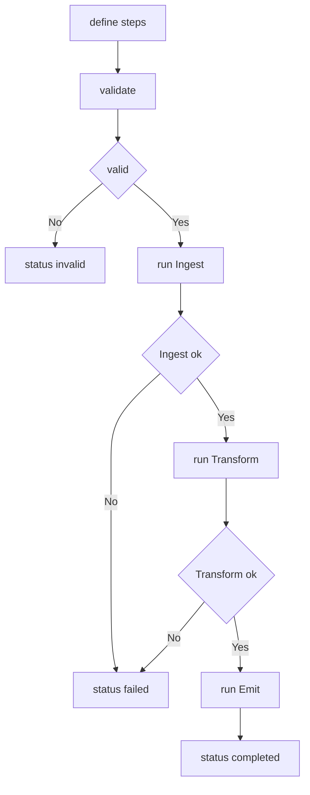

---
# MAM Metadata
id: template-workflow-basic
name: Workflow Template (Basic)
version: 2.0.0
type: workflow

author: MAM Team
description: >
  A linear three step workflow with a single dependency edge per step and a
  declared failure path. No branching, no retries, no timeouts.

license: MIT

runtime:
  language: python
  version: ">=3.12"

tags:
  - template
  - workflow
  - basic
  - linear

capabilities:
  - define
  - validate
  - run

permissions:
  filesystem:
    - read
  memory:
    - local
---

# Workflow Template (Basic)

## Purpose

A pipeline with no branches. Three steps, each declared to depend on the one
before it, run in order and stop at the first failure. The whole point of the
basic workflow is that the order is visible: if the steps are wrong, the
workflow definition is wrong, not the runtime. Use
[`workflow.mam`](../workflow.mam) for a full six step DAG with conditions and
error handlers, and [`workflow-advanced.mam`](./workflow-advanced.mam) for
branching, retries, per step timeouts and compensation.

## Inputs

| Name | Type | Required | Description |
|------|------|----------|-------------|
| action | string | Yes | `run` or `validate` |
| workflow_id | string | Yes | Workflow to execute |
| input_data | object | No | Payload handed to the first step |

## Outputs

| Name | Type | Description |
|------|------|-------------|
| status | string | `completed`, `failed` or `invalid` |
| results | object | Step name to step outcome |
| output | any | Output of the last step that ran |
| failed_step | string | First step that failed, empty otherwise |

## Capabilities

### define

Register a workflow as an ordered list of steps with their dependencies.

### validate

Check that every step has a unique name, a registered handler and no cycle.

### run

Execute the steps in dependency order and stop at the first failure.

## Workflow Definition

The basic workflow is a chain. Step order is the whole contract.

```text
module BasicPipeline

type:
    workflow

steps:
    - Ingest
    - Transform
    - Emit
```

## Step: Ingest

```text
module Ingest

type:
    tool

provider:
    python

capabilities:
    - read
    - parse
    - normalize

depends_on: []
```

## Step: Transform

```text
module Transform

type:
    tool

provider:
    python

capabilities:
    - map
    - filter
    - aggregate

depends_on:
    - Ingest
```

## Step: Emit

```text
module Emit

type:
    tool

provider:
    python

capabilities:
    - write
    - serialize

depends_on:
    - Transform
```

## Failure Handling

| Case | Result |
|------|--------|
| A dependency did not complete | Step is `skipped` |
| The step is `enabled: false` | Step is `skipped`, and so is anything downstream |
| A handler is not registered | Step is `failed` with `missing_handler` |
| A handler raises | Step is `failed` with the error text, the run stops |
| Every step completes | `status: completed` |

A failed run keeps the results of the steps that already succeeded, so a
partial run is still inspectable.

## Rules

- Step order in the definition is the execution order.
- Each step depends only on the step before it, forming a single chain.
- Step names are unique within a workflow.
- A step whose dependency did not complete is skipped, never executed.
- A failure halts the run; no later step executes.
- A workflow is pure with respect to its input: same input, same results.
- The engine never raises to the caller; status carries the outcome.

## Workflow



## Python

```python
from dataclasses import dataclass, field
from typing import Any, Callable, Dict, List

MAX_STEPS = 100


@dataclass
class Step:
    name: str
    handler: str
    depends_on: List[str] = field(default_factory=list)
    enabled: bool = True
    params: Dict[str, Any] = field(default_factory=dict)


class WorkflowEngine:
    """Run a linear workflow in definition order, halting on the first failure."""

    def __init__(self) -> None:
        self._workflows: Dict[str, List[Step]] = {}
        self._handlers: Dict[str, Callable[..., Any]] = {}

    def register_handler(self, name: str, fn: Callable[..., Any]) -> None:
        self._handlers[name] = fn

    def define(self, workflow_id: str, steps: List[Step]) -> Dict[str, Any]:
        if len(steps) > MAX_STEPS:
            return {"status": "invalid", "code": "too_many_steps"}
        self._workflows[workflow_id] = steps
        return {"status": "completed", "code": ""}

    def validate(self, workflow_id: str) -> Dict[str, Any]:
        steps = self._workflows.get(workflow_id)
        if not steps:
            return {"status": "invalid", "code": "unknown_workflow"}
        names = [step.name for step in steps]
        if len(set(names)) != len(names):
            return {"status": "invalid", "code": "duplicate_step"}
        for step in steps:
            for dep in step.depends_on:
                if dep not in names:
                    return {"status": "invalid", "code": "unknown_dependency"}
        return {"status": "completed", "code": ""}

    def run(self, workflow_id: str, input_data: Dict[str, Any] = None) -> Dict[str, Any]:
        check = self.validate(workflow_id)
        if check["code"]:
            return {"status": "invalid", "results": {}, "output": None, "failed_step": ""}

        input_data = input_data or {}
        results: Dict[str, Any] = {}
        completed: set = set()

        for step in self._workflows[workflow_id]:
            if not step.enabled or any(dep not in completed for dep in step.depends_on):
                results[step.name] = "skipped"
                continue

            handler = self._handlers.get(step.handler)
            if handler is None:
                results[step.name] = "failed: missing_handler"
                return {
                    "status": "failed", "results": results,
                    "output": None, "failed_step": step.name,
                }

            payload = dict(input_data)
            payload.update(step.params)
            payload.update({dep: results[dep] for dep in step.depends_on})
            try:
                results[step.name] = handler(**payload)
                completed.add(step.name)
            except Exception as error:
                results[step.name] = f"failed: {error}"
                return {
                    "status": "failed", "results": results,
                    "output": None, "failed_step": step.name,
                }

        last = self._workflows[workflow_id][-1].name
        return {
            "status": "completed", "results": results,
            "output": results.get(last), "failed_step": "",
        }
```

## Tests

### Input

```yaml
action: run
workflow_id: basic-pipeline
input_data:
  source: data.csv
```

### Expected

```yaml
status: completed
failed_step: ""
```

```python
def _engine():
    engine = WorkflowEngine()
    engine.register_handler("ingest", lambda **kw: list(kw.get("records", ["a", "b"])))
    engine.register_handler("transform", lambda **kw: [item.upper() for item in kw["Ingest"]])
    engine.register_handler("emit", lambda **kw: ",".join(kw["Transform"]))
    engine.define("basic-pipeline", [
        Step(name="Ingest", handler="ingest", params={"records": ["a", "b"]}),
        Step(name="Transform", handler="transform", depends_on=["Ingest"]),
        Step(name="Emit", handler="emit", depends_on=["Transform"]),
    ])
    return engine


def test_runs_every_step_in_order():
    out = _engine().run("basic-pipeline", {"source": "data.csv"})
    assert out["status"] == "completed"
    assert out["failed_step"] == ""
    assert out["results"]["Transform"] == ["A", "B"]
    assert out["output"] == "A,B"


def test_is_deterministic():
    first = _engine().run("basic-pipeline", {"source": "data.csv"})
    second = _engine().run("basic-pipeline", {"source": "data.csv"})
    assert first == second


def test_failure_halts_the_run():
    engine = WorkflowEngine()
    engine.register_handler("ingest", lambda **kw: ["a"])
    engine.register_handler("transform", lambda **kw: 1 / 0)
    engine.register_handler("emit", lambda **kw: "never")
    engine.define("p", [
        Step(name="Ingest", handler="ingest"),
        Step(name="Transform", handler="transform", depends_on=["Ingest"]),
        Step(name="Emit", handler="emit", depends_on=["Transform"]),
    ])
    out = engine.run("p", {})
    assert out["status"] == "failed"
    assert out["failed_step"] == "Transform"
    assert "Emit" not in out["results"]
    assert out["results"]["Ingest"] == ["a"]


def test_missing_handler_is_reported_not_raised():
    engine = WorkflowEngine()
    engine.define("p", [Step(name="Ingest", handler="ingest")])
    out = engine.run("p", {})
    assert out["status"] == "failed"
    assert out["results"]["Ingest"] == "failed: missing_handler"


def test_disabled_step_is_skipped_and_its_dependents_too():
    engine = WorkflowEngine()
    engine.register_handler("transform", lambda **kw: "ran")
    engine.register_handler("emit", lambda **kw: "emitted")
    engine.define("p", [
        Step(name="Transform", handler="transform", enabled=False),
        Step(name="Emit", handler="emit", depends_on=["Transform"]),
    ])
    out = engine.run("p", {})
    assert out["results"]["Transform"] == "skipped"
    assert out["results"]["Emit"] == "skipped"
    assert out["status"] == "completed"


def test_validate_rejects_duplicate_steps():
    engine = WorkflowEngine()
    engine.define("p", [Step(name="A", handler="a"), Step(name="A", handler="a")])
    assert engine.validate("p")["code"] == "duplicate_step"


def test_validate_rejects_unknown_workflow():
    assert WorkflowEngine().validate("nope")["code"] == "unknown_workflow"
```

## Examples

```python
engine = _engine()
out = engine.run("basic-pipeline", {"source": "data.csv"})
print(out["status"])   # completed
print(out["output"])   # A,B
```

### Expected Flow

```text
Ingest -> Transform -> Emit -> completed
```

## References

- [Workflow Section Spec](../../spec/sections/workflow.md)
- [Workflow Template (full)](./workflow.mam)
- [MAM Specification](../../plan-doc/full-mam.md)
