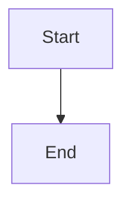

## Purpose

Full module purpose.

## Inputs

| Name | Type | Required | Description |
|------|------|----------|-------------|
| input1 | string | Yes | First input |

## Outputs

| Name | Type | Description |
|------|------|-------------|
| output1 | string | First output |

## Rules

- Rule 1
- Rule 2

## Workflow



## Python

```python
def process(input1: str) -> dict:
    return {"output1": input1}
```

## Examples

```python
result = process("hello")
print(result)
```

## Tests

```python
def test_process():
    result = process("test")
    assert result["output1"] == "test"
```

## References

- [Reference](https://example.com)

## Dependencies

- PyJWT >= 2.8.0