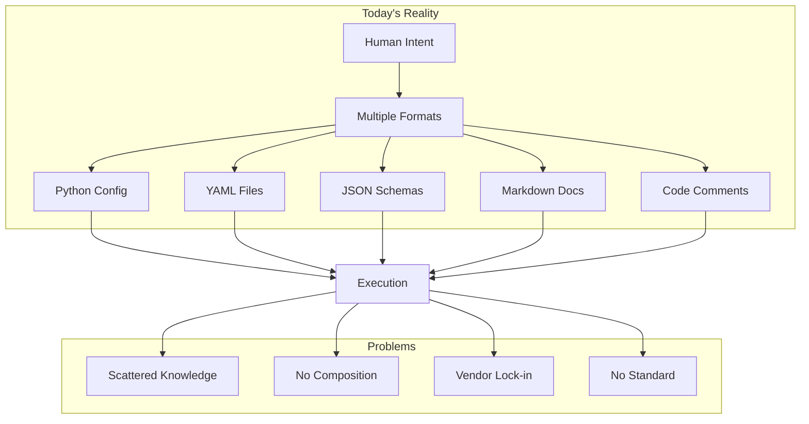
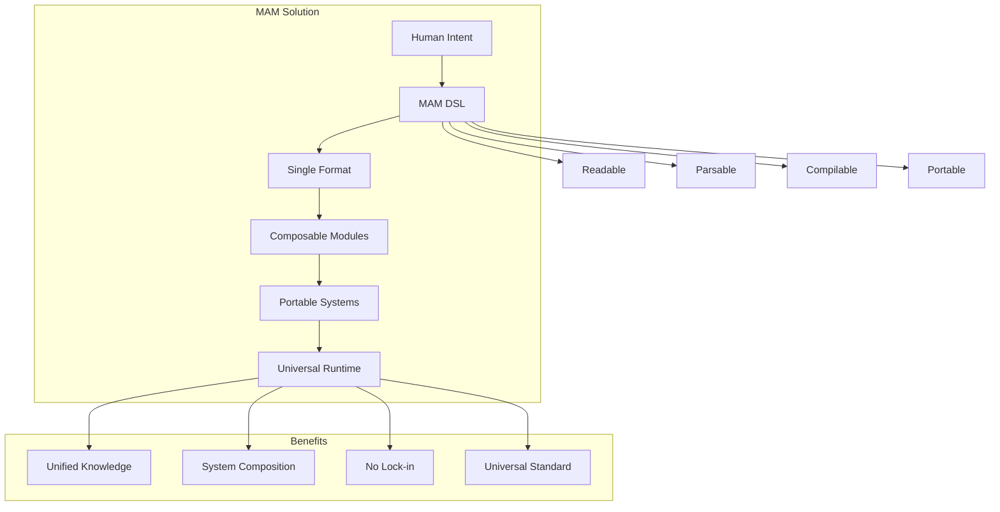
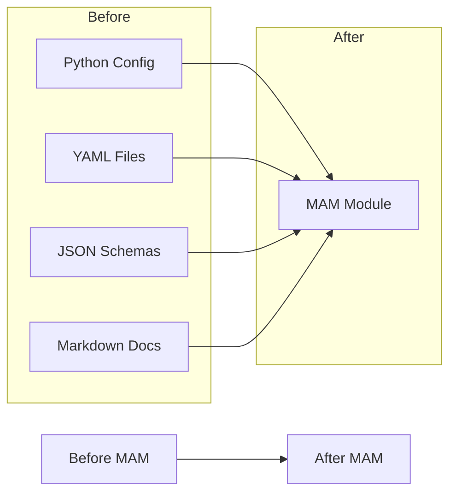
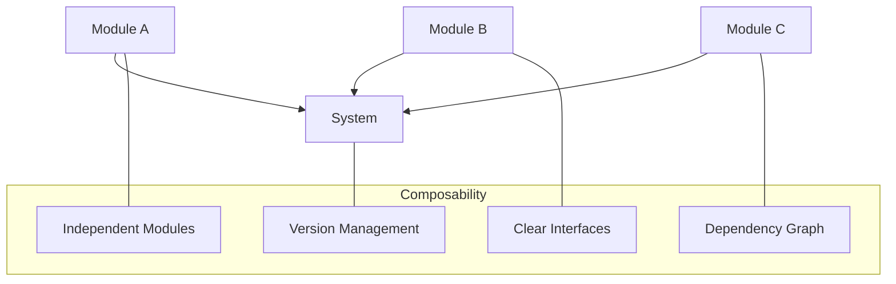
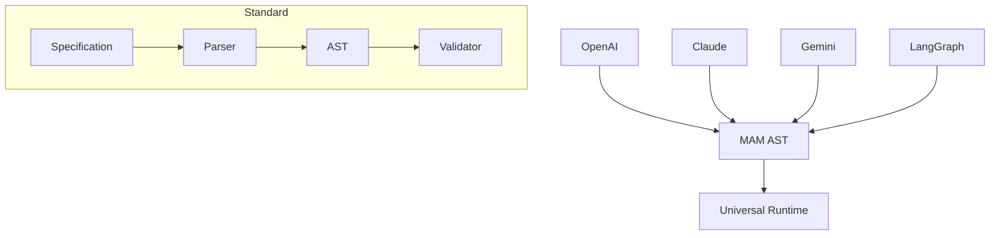
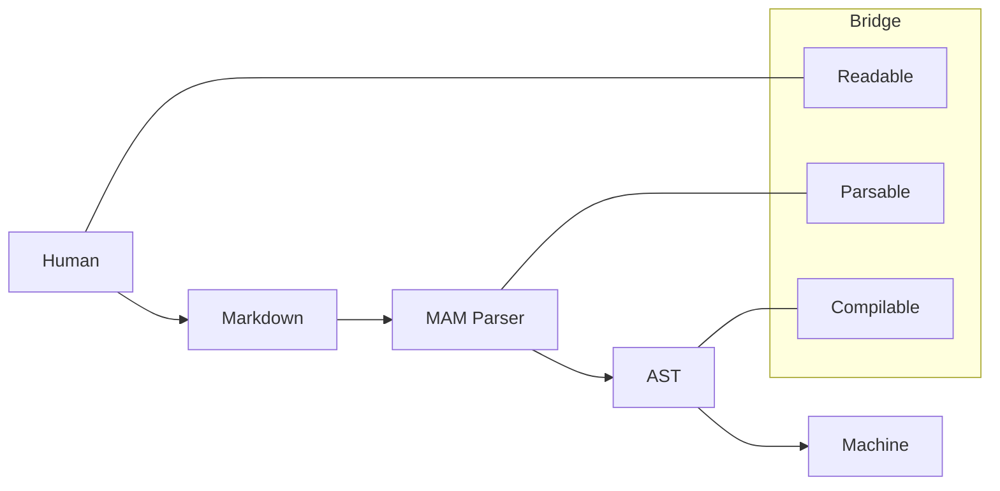
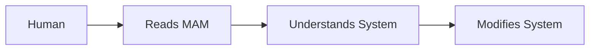
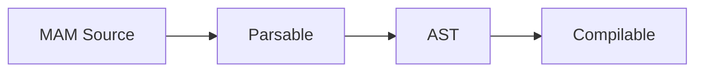
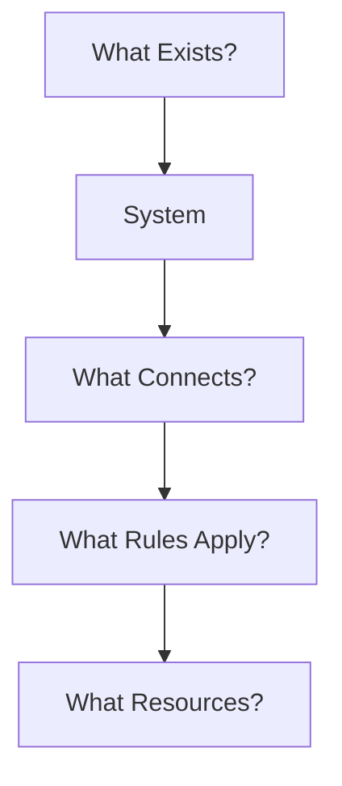
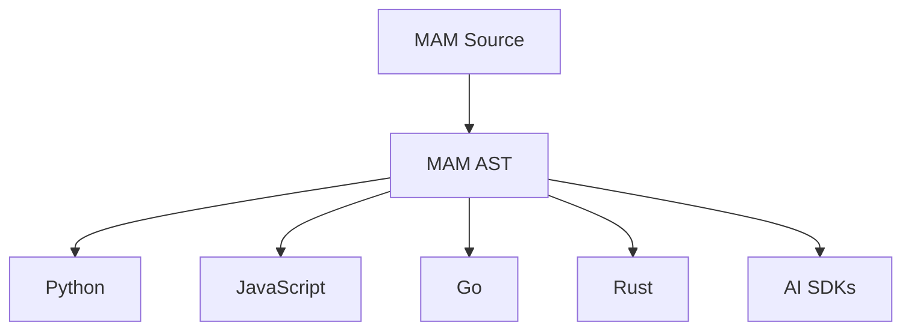

# MAM Purpose — Why MAM Exists

> **MAM exists to bridge the gap between human intent and machine execution.**

---

## The Problem

Modern AI systems suffer from fragmentation:

**Problems:**
1. Knowledge scattered across multiple formats
2. No standard way to compose systems
3. Vendor lock-in to specific frameworks
4. No portable module format
5. No universal agent description

---

## The Solution

MAM provides a unified, declarative language for describing systems:

---

## Core Purpose

### 1. Unify System Description

**Before:** Multiple formats, scattered knowledge
**After:** Single MAM module, unified description

### 2. Enable System Composition

**Before:** Monolithic systems, hard to compose
**After:** Modular systems, easy to compose

### 3. Provide Universal Standard

**Before:** Framework-specific formats
**After:** Universal MAM standard

### 4. Bridge Human and Machine

**Before:** Humans write code, machines execute
**After:** Humans describe systems, machines compile and execute

---

## Purpose Statement

> **MAM enables humans to describe complex systems in a readable, portable, and executable way.**

---

## What Is Built Today

The purpose is now backed by a working implementation:

| Capability | Status |
|------------|--------|
| **Native execution** | `mam run system.mam` executes `.mam` directly (no compilation to Python/JS) |
| **Native runtime** | 22/22 engines, ~11,000 lines (`runtime/src/v2/`) |
| **Full MAM spec** | structured runtime, capabilities, permissions, dependencies, inputs/outputs, exports |
| **Canonical formats** | `.mam` (canonical) + `.mam.md` (source), byte-identical twins |
| **Project composition** | `mam.toml` projects: `mam init / build / run / validate / graph / test / info` |
| **Compilation** | 16 targets: Python, JS, Go, Rust, C#, Java, Wasm, K8s, Terraform, Docker, OpenAI, LangGraph, CrewAI, Gemini, AutoGen, Claude |
| **Target routing** | `hello.mam.py` → python, `hello.mam.js` → node, etc. |
| **Runtime engines** | Core, State, Events, Permissions, Plugins, Security, Resource, Policy, Workflow, Registry, Resolver, Context, Token Budget, Memory, Knowledge, Model, Tool, Agent, Evaluation, Observability, Sandbox, CLI |
| **Registry (MAM Hub)** | Production service: real HTTP + GraphQL, persistent auth, atomic storage, inverted search, real tarballs, typed client; 654 tests (400 server + 123 api + 131 client) plus an 11-test client↔server integration suite |
| **Registry packages** | `@mam/registry-api` (contract), `@mam/registry-server` (service), `@mam/registry-client` (typed client with token persistence) |
| **CLI** | 45 commands (+ aliases) |
| **Examples & templates** | 5 example suites + one folder per module type in `modules/examples/`; 19 type folders (basic + advanced) in `modules/templates/` |
| **Tests** | 7,000+ across 264 test files, all passing |

**Principle kept intact:** MAM describes. The runtime executes. The compiler translates.

---

## Design Principles

### 1. Human First

MAM must be readable by humans without tooling.

### 2. Machine Friendly

MAM must be parsable by machines deterministically.

### 3. System Focused

MAM answers system questions, not implementation questions.

### 4. Runtime Independent

MAM compiles to any target, not tied to one runtime.

---

## Success Criteria

A successful MAM module is:

| Criteria | Description |
|----------|-------------|
| **Readable** | Humans understand it without tooling |
| **Parsable** | Machines parse it deterministically |
| **Composable** | Modules combine into systems |
| **Portable** | Works across all runtimes |
| **Versionable** | Tracks changes over time |
| **Testable** | Supports validation and testing |
| **Documentable** | Self-documenting structure |

---

## Comparison

| Aspect | Traditional | With MAM |
|--------|-------------|----------|
| **Knowledge** | Scattered across files | Unified in modules |
| **Composition** | Manual integration | Declarative composition |
| **Portability** | Framework-specific | Universal standard |
| **Readability** | Code-heavy | Human-readable |
| **Maintainability** | Difficult | Composable |
| **Reusability** | Copy-paste | Import/export |

---

## Impact

### For Developers

- Write system descriptions once
- Compile to any target
- Share modules across projects
- Version control system designs

### For AI Systems

- Parse system descriptions
- Execute module workflows
- Coordinate multi-agent systems
- Manage memory and state
- Compose context, retrieval, models, and tools at runtime
- Observe and evaluate execution (traces, metrics, token usage, cost)

### For Organizations

- Standardize system descriptions
- Enable cross-team collaboration
- Reduce vendor lock-in
- Improve system maintainability

---

## North Star

> **MAM is the universal language for describing modular systems.**

Not AI. Not infrastructure. Not applications.

**Systems.**

AI systems are simply one category. MAM provides a unique identity: not a general-purpose language, but a language for designing and orchestrating modular systems.

---

## Summary

MAM exists to:

1. **Unify** system description in a single format
2. **Enable** modular system composition
3. **Provide** a universal standard
4. **Bridge** human intent and machine execution
5. **Empower** developers, AI systems, and organizations

> **MAM doesn't replace programming languages — it sits above them, describing the systems they implement.**