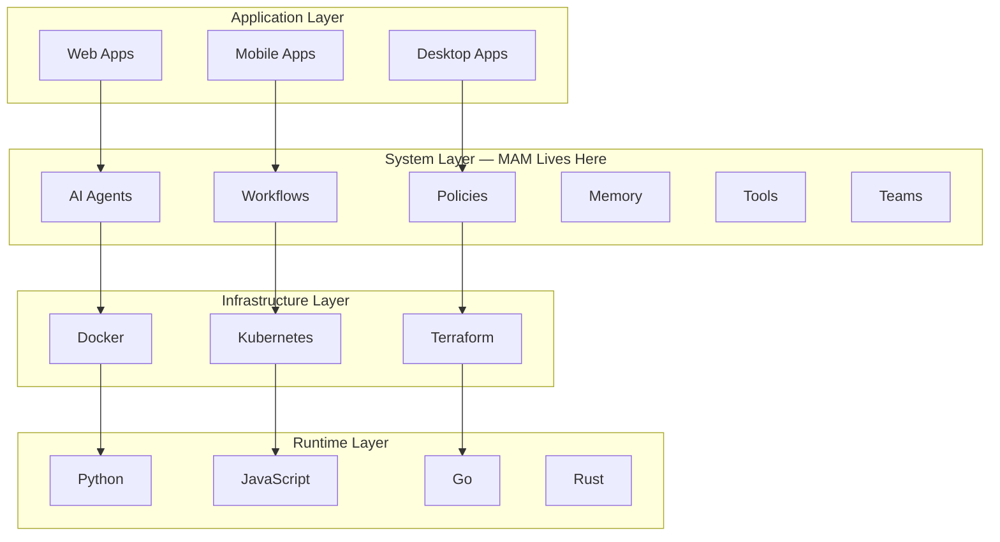
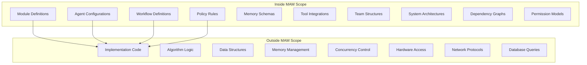
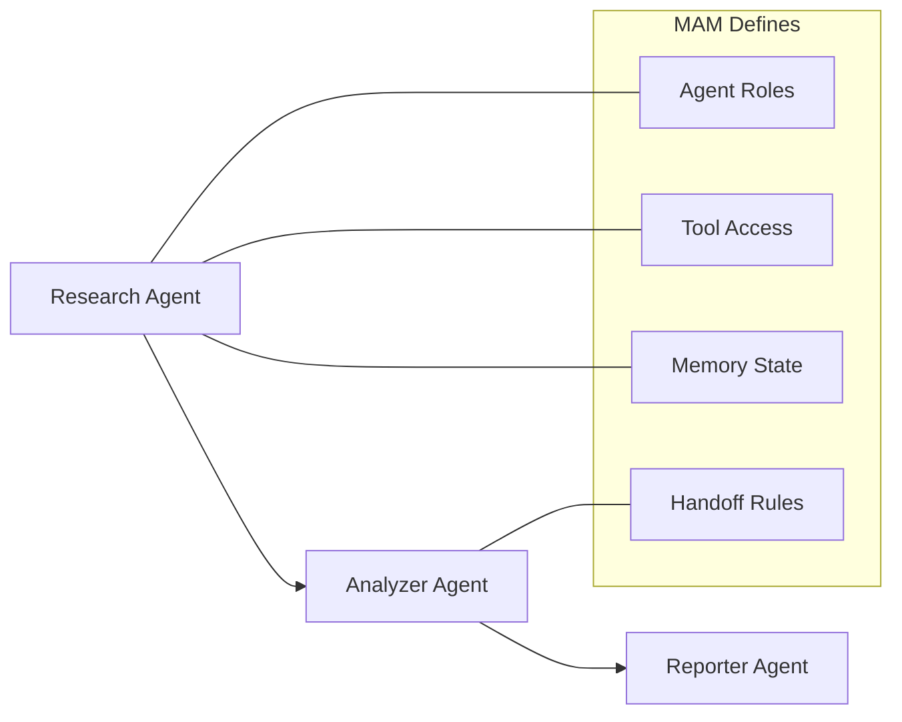
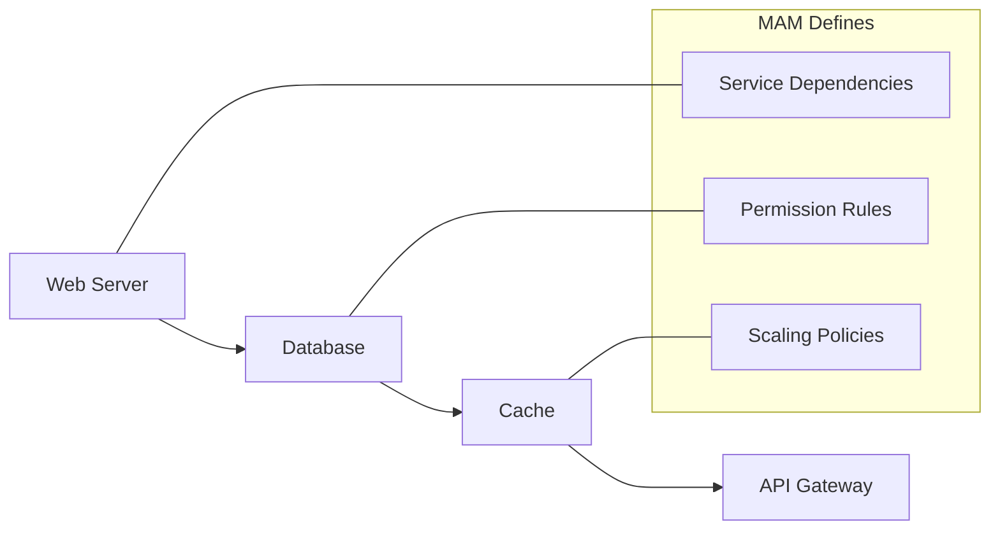
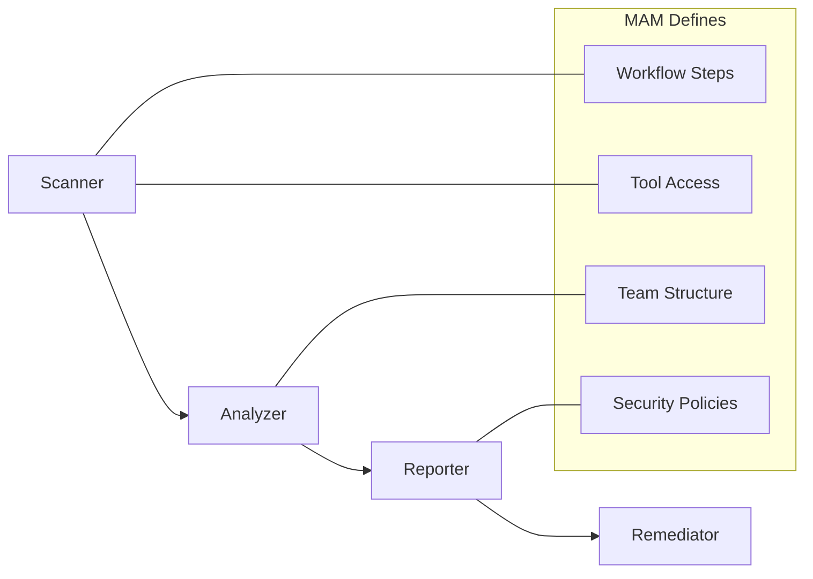
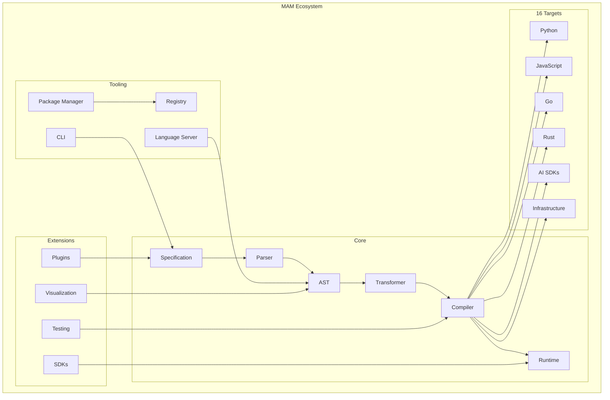

# MAM Scope — What MAM Covers

> **MAM is a language for describing systems. Not just AI. Not just infrastructure. Systems.**

---

## Scope Definition

MAM occupies a unique position in the technology stack:



---

## What MAM IS

| Category | MAM Handles |
|----------|-------------|
| **Agents** | AI agent definitions, roles, goals, tools; agent engine composition |
| **Workflows** | Process flows, step sequences, handoffs; workflow engine (DAG) |
| **Policies** | Allow/deny rules, timeouts, retries, execution limits; policy engine |
| **Memory** | Persistent state, knowledge bases; memory + knowledge engines |
| **Tools** | External integrations, capabilities; tool engine |
| **Teams** | Multi-agent coordination |
| **Systems** | Complete system architectures; `mam.toml` project composition |
| **Modules** | Reusable components (`.mam` + `.mam.md`) |
| **Dependencies** | Module relationships; dependency resolver + registry |
| **Events** | System events and triggers; event engine |
| **State** | System state management; state engine |
| **Interfaces** | Public contracts |
| **Resources** | External resources; resource manager |
| **Networks** | Communication patterns; sandbox network policy |
| **Storage** | Data persistence |
| **Observability** | Logs, metrics, traces, token usage, cost |
| **Sandboxing** | Filesystem/network/process isolation, limits, timeout |

---

## What MAM is NOT

| Category | MAM Does NOT Handle |
|----------|---------------------|
| **Algorithms** | Use Python, Rust, Go |
| **Data Structures** | Use language-native types |
| **Memory Management** | Use language runtime |
| **Concurrency** | Use language features |
| **Hardware** | Use OS/Infrastructure |
| **Networking** | Use language libraries |
| **Database Queries** | Use SQL/ORM |
| **UI Rendering** | Use frontend frameworks |

---

## Scope Boundaries



---

## Use Cases

### AI Systems



**MAM defines:** Agent roles, tools, memory, handoffs
**MAM does NOT define:** Agent algorithms, LLM calls, prompt engineering

### Cloud Infrastructure



**MAM defines:** Service relationships, policies, scaling rules
**MAM does NOT define:** Server config, database queries, cache implementation

### Security Workflows



**MAM defines:** Workflow steps, tool access, team structure, policies
**MAM does NOT define:** Scanning algorithms, vulnerability databases, remediation logic

---

## Scope Diagram



---

## Scope Matrix

| Dimension | MAM Scope | Out of Scope |
|-----------|-----------|--------------|
| **Abstraction** | System design | Implementation details |
| **Language** | Declarative DSL | Imperative code |
| **Execution** | Compilation target | Runtime internals |
| **State** | System state | Memory management |
| **Communication** | Agent handoffs | Network protocols |
| **Storage** | Memory schemas | Database queries |
| **Security** | Permission rules | Encryption algorithms |
| **Testing** | Test definitions | Test execution |
| **Documentation** | Module docs | API docs |
| **Deployment** | System topology | Container config |

---

## Summary

MAM is the **architecture layer** that sits above implementation:

```text
Human Intent
      │
      ▼
  MAM DSL          ← What exists, what connects, what rules apply
      │
      ▼
  Parser           ← Tokenizes and parses Markdown
      │
      ▼
  AST              ← Abstract Syntax Tree (MAMModule)
      │
      ▼
  Transformer      ← Converts MAMModule → V2ModuleNode
      │
      ▼
  Compiler         ← Translates to 16 targets
      │
      ▼
  Runtime          ← Executes the system
      │
      ▼
  Implementation   ← How it actually works
```

> **MAM answers "What?" — Programming languages answer "How?"**

---

## Current System Status

| Component | Status | Tests |
|-----------|--------|-------|
| Parser | ✅ Complete | 176 tests |
| AST | ✅ Complete | 480+ tests |
| Compiler | ✅ Complete | 72 tests (16 targets) |
| Transformer | ✅ Complete | Included in compiler |
| Runtime (V1) | ✅ Complete | 487 tests |
| **V2 Runtime** | ✅ Complete | **22/22 engines, ~11,000 lines** |
| CLI | ✅ Complete | 45 commands (+ aliases) |
| Validator | ✅ Complete | 130+ tests |
| LSP | ✅ Complete | 65 tests |
| Package Manager | ✅ Complete | 45+ tests |
| Registry API | ✅ Complete | 123 tests (OpenAPI + GraphQL SDL + resolvers) |
| Registry Server | ✅ Complete | 400 tests (handlers, store, auth, search, HTTP, GraphQL, e2e) |
| Registry Client | ✅ Complete | 131 tests (auth, retry, hydration) |
| SDKs | ✅ Complete | 96+ tests (JS) + Python/Go/Rust/C/C++/C#/Java/Ruby/SQL/TS |
| Testing Framework | ✅ Complete | 60+ tests |
| Visualization | ✅ Complete | 95 tests |
| Plugins API | ✅ Complete | 174 tests |
| Plugins (memory/mermaid/yaml/python) | ✅ Complete | 160 / 140 / 160 / 106 tests |
| **Native Execution** | ✅ Complete | `mam run system.mam` (no compiler) |
| **Project Composition** | ✅ Complete | `mam.toml` + project-aware commands |
| **Templates / Examples** | ✅ Complete | 19 type folders each |

**Total: 58 workspace packages, 7,000+ tests across 264 files, all passing**

### V2 Runtime Engines (22/22)

Core (Runtime, State, Events, Permissions, Plugins, Security, Resource Manager,
Policy Engine) · Intelligence (Context, Token Budget, Memory, Knowledge, Model,
Tool, Agent) · Orchestration (Workflow, Module Registry, Dependency Resolver) ·
Quality (Evaluation) · Operations (Observability, CLI) · Isolation (Sandboxing)