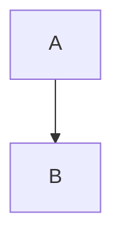

## Metadata

Complete metadata.

## Purpose

Show every standard section.

## Inputs

Input values.

## Outputs

Output values.

## Rules

Be deterministic.

## Workflow

1. Read inputs.
2. Produce outputs.

## Mermaid



## Python

```python
print("full")
```

## Prompt

Answer clearly.

## Memory

Remember context.

## Examples

- Example one

## Tests

Test the module.

## References

See the specification.

## Dependencies

- node

## Exports

- result

## Imports

- input

## Plugins

- none

## Permissions

- read

## Capabilities

- describe
