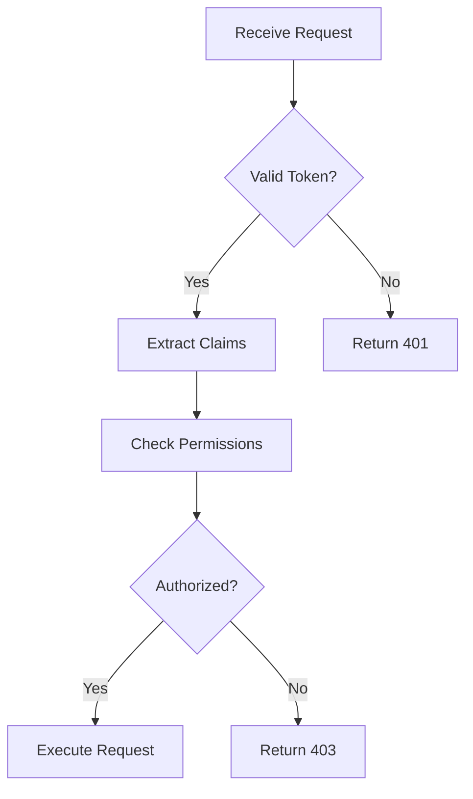

# MAM Specification v1.0.0

> **Markdown as Module — The Universal Intermediate Representation for AI Systems**

---

## 1. Overview

### 1.1 Purpose

MAM (Markdown as Module) defines a specification for transforming Markdown documents into structured, executable modules. A MAM module is a self-contained unit that combines human-readable documentation with machine-parseable metadata, executable code, workflow definitions, and agent instructions.

### 1.2 Design Goals

| Goal | Description |
|------|-------------|
| **Markdown First** | Markdown is the source of truth; no proprietary syntax |
| **Human Readable** | Modules must be readable by humans without tooling |
| **Machine Parseable** | Every section must be extractable as structured data |
| **Deterministic** | Same input always produces identical AST |
| **Extensible** | Custom section types via plugin system |
| **Runtime Agnostic** | Any language runtime can execute MAM modules |

### 1.3 File Extension

MAM modules use the `.mam.md` extension:

```
<module-name>.mam.md
```

Examples:
- `authentication.mam.md`
- `data-pipeline.mam.md`
- `agent-planner.mam.md`

---

## 2. Document Structure

A MAM document consists of three layers:

```
┌─────────────────────────────────────────┐
│           YAML Front Matter             │  ← Metadata layer
├─────────────────────────────────────────┤
│           Markdown Body                 │  ← Content layer
│  ┌─────────────────────────────────┐    │
│  │       MAM Sections              │    │  ← Structure layer
│  └─────────────────────────────────┘    │
└─────────────────────────────────────────┘
```

### 2.1 Front Matter (Required)

Every MAM module MUST begin with YAML front matter delimited by `---`:

```yaml
---
id: authentication
version: 2.0.0
name: Authentication Module
author: LifeJiggy
tags:
  - auth
  - security
  - tokens
runtime: python
dependencies: []
permissions:
  - network
  - filesystem
---
```

#### 2.1.1 Required Fields

| Field | Type | Description |
|-------|------|-------------|
| `id` | string | Unique identifier (lowercase, hyphens) |
| `version` | string | Semantic version (MAJOR.MINOR.PATCH) |
| `name` | string | Human-readable name |
| `author` | string | Module author |
| `runtime` | string | Primary runtime (python, javascript, rust, go) |

#### 2.1.2 Optional Fields

| Field | Type | Default | Description |
|-------|------|---------|-------------|
| `tags` | string[] | [] | Discovery tags |
| `description` | string | "" | Module description |
| `dependencies` | string[] | [] | Module dependencies |
| `permissions` | string[] | [] | Required permissions |
| `license` | string | "MIT" | License identifier |
| `repository` | string | "" | Source repository URL |
| `mam_version` | string | "1.0.0" | MAM spec version |

#### 2.1.3 ID Rules

- Lowercase alphanumeric and hyphens only
- Maximum 64 characters
- Must start with a letter
- No consecutive hyphens
- Pattern: `^[a-z][a-z0-9-]{0,63}$`

#### 2.1.4 Version Rules

- Must follow Semantic Versioning 2.0.0
- Format: `MAJOR.MINOR.PATCH`
- MAJOR: Breaking changes
- MINOR: New features (backward compatible)
- PATCH: Bug fixes (backward compatible)

---

## 3. Sections

MAM sections are Markdown headings that define structured content areas.

### 3.1 Section Syntax

Sections use ATX-style headings (`##`) with specific names:

```markdown
## SectionName

Content follows the heading until the next heading of equal or higher level.
```

### 3.2 Standard Sections

| Section | Purpose | Required |
|---------|---------|----------|
| `Purpose` | Module objective description | Yes |
| `Inputs` | Expected input parameters | No |
| `Outputs` | Expected output values | No |
| `Rules` | Behavioral constraints | No |
| `Workflow` | Process definition | No |
| `Mermaid` | Visual diagrams | No |
| `Python` | Python code blocks | No |
| `JavaScript` | JavaScript code blocks | No |
| `Prompt` | LLM instructions | No |
| `Memory` | Persistent state | No |
| `Examples` | Usage examples | No |
| `Tests` | Validation rules | No |
| `References` | External links | No |
| `Dependencies` | Required modules | No |
| `Exports` | Public interface | No |
| `Imports` | Required imports | No |
| `Plugins` | Plugin requirements | No |
| `Permissions` | Security requirements | No |
| `Capabilities` | System capabilities | No |

### 3.3 Section Ordering

Recommended order (not enforced unless validation mode is strict):

1. Purpose
2. Inputs
3. Outputs
4. Rules
5. Workflow
6. Mermaid
7. Python / JavaScript
8. Prompt
9. Memory
10. Examples
11. Tests
12. References
13. Dependencies
14. Exports
15. Imports
16. Plugins
17. Permissions
18. Capabilities

### 3.4 Section Content Types

#### 3.4.1 Text Sections

Plain Markdown content:

```markdown
## Purpose

Authenticate users securely using JWT tokens.
Support multiple authentication methods.
```

#### 3.4.2 List Sections

Markdown lists:

```markdown
## Rules

- Never expose secrets in logs
- Validate all inputs before processing
- Use constant-time comparison for tokens
- Rotate secrets every 90 days
```

#### 3.4.3 Code Sections

Fenced code blocks with language annotation:

```markdown
## Python

```python
from typing import Optional
import jwt

def verify_token(token: str) -> Optional[dict]:
    try:
        return jwt.decode(token, SECRET_KEY, algorithms=["HS256"])
    except jwt.InvalidTokenError:
        return None
```

#### 3.4.4 Diagram Sections

Mermaid diagrams:

```markdown
## Workflow



#### 3.4.5 Data Sections

Structured data within text:

```markdown
## Inputs

| Name | Type | Required | Description |
|------|------|----------|-------------|
| token | string | Yes | JWT token |
| audience | string | No | Expected audience |

## Outputs

| Name | Type | Description |
|------|------|-------------|
| claims | dict | Decoded token claims |
| error | string | Error message if failed |
```

---

## 4. Code Blocks

### 4.1 Code Block Detection

Code blocks are detected by triple backticks with optional language identifier:

````markdown
```python
code here
```

```javascript
code here
```
````

### 4.2 Language Identifiers

| Identifier | Runtime | Description |
|------------|---------|-------------|
| `python` | Python 3.10+ | Python execution |
| `javascript` / `js` | Node.js 20+ | JavaScript execution |
| `typescript` / `ts` | TypeScript 5+ | TypeScript execution |
| `rust` | Rust 1.70+ | Rust execution |
| `go` | Go 1.21+ | Go execution |
| `shell` / `bash` | Shell | Shell commands |
| `yaml` | - | Configuration data |
| `json` | - | Data structures |
| `mermaid` | Mermaid | Diagrams (not executed) |

### 4.3 Code Block Metadata

Code blocks can include metadata comments:

```python
# @mam:exec
# @mam:timeout=30s
# @mam:memory=256MB
# @mam:requires=network

def fetch_data(url: str) -> dict:
    import requests
    return requests.get(url).json()
```

### 4.4 Code Block Isolation

Each code block runs in its own execution context:
- Separate namespace
- Separate memory
- Separate timeout
- Separate permissions

---

## 5. AST (Abstract Syntax Tree)

### 5.1 AST Node Types

```typescript
interface MAMNode {
  type: 'MAMModule';
  frontmatter: FrontMatterNode;
  sections: SectionNode[];
  location: SourceLocation;
}

interface FrontMatterNode {
  type: 'FrontMatter';
  data: Record<string, unknown>;
  location: SourceLocation;
}

interface SectionNode {
  type: 'Section';
  name: string;
  content: ContentNode[];
  location: SourceLocation;
}

interface ContentNode {
  type: 'Paragraph' | 'List' | 'CodeBlock' | 'Table' | 'Heading' | 'Mermaid';
  value: string;
  language?: string;
  metadata?: Record<string, string>;
  location: SourceLocation;
}

interface SourceLocation {
  start: Position;
  end: Position;
  source: string;
}

interface Position {
  line: number;
  column: number;
  offset: number;
}
```

### 5.2 AST Serialization

AST can be serialized to:
- JSON (primary)
- YAML (for inspection)
- Binary (for storage)

### 5.3 AST Traversal

The AST supports visitor pattern:

```typescript
const visitor = {
  visitMAMModule(node: MAMNode) { /* ... */ },
  visitSection(node: SectionNode) { /* ... */ },
  visitCodeBlock(node: ContentNode) { /* ... */ }
};

traverse(ast, visitor);
```

---

## 6. Validation

### 6.1 Validation Levels

| Level | Description |
|-------|-------------|
| `syntax` | Valid Markdown structure |
| `schema` | Valid YAML front matter |
| `semantic` | Correct section content |
| `strict` | All rules enforced |

### 6.2 Validation Rules

#### 6.2.1 Required Rules

- Front matter must exist
- `id` field must be present
- `version` field must be present
- `Purpose` section must exist

#### 6.2.2 Format Rules

- ID must match pattern `^[a-z][a-z0-9-]{0,63}$`
- Version must be valid semver
- Code blocks must have language identifier

#### 6.2.3 Semantic Rules

- Section names must be from standard list or registered
- Code blocks must be parseable
- References must be valid URLs

### 6.3 Custom Rules

Plugins can add custom validation rules:

```typescript
interface ValidationRule {
  name: string;
  description: string;
  level: 'error' | 'warning' | 'info';
  check(node: MAMNode): ValidationResult[];
}
```

---

## 7. Plugin System

### 7.1 Plugin Interface

```typescript
interface MAMPlugin {
  name: string;
  version: string;
  
  // Section registration
  sections?: SectionDefinition[];
  
  // Validation rules
  rules?: ValidationRule[];
  
  // Runtime contexts
  contexts?: ExecutionContext[];
  
  // Exporters
  exporters?: Exporter[];
  
  // Renderers
  renderers?: Renderer[];
}
```

### 7.2 Section Registration

Plugins can define new section types:

```typescript
interface SectionDefinition {
  name: string;
  description: string;
  required: boolean;
  contentTypes: ContentType[];
  validator?: (content: ContentNode[]) => ValidationResult[];
}
```

### 7.3 Plugin Loading

Plugins are loaded from:
1. Built-in plugins
2. Project plugins (`.mam/plugins/`)
3. Global plugins (`~/.mam/plugins/`)
4. Registry plugins

---

## 8. Runtime

### 8.1 Execution Context

```typescript
interface ExecutionContext {
  module: MAMNode;
  inputs: Record<string, unknown>;
  permissions: Permission[];
  sandbox: Sandbox;
  
  execute(code: string, language: string): Promise<ExecutionResult>;
  getMemory(): Record<string, unknown>;
  setMemory(key: string, value: unknown): void;
}
```

### 8.2 Sandboxing

All code execution happens in sandboxes:
- Process isolation
- Memory limits
- CPU time limits
- Network restrictions
- Filesystem restrictions

### 8.3 Output Formats

| Format | Description |
|--------|-------------|
| `json` | Structured data |
| `html` | Rendered HTML |
| `markdown` | Processed Markdown |
| `text` | Plain text |
| `binary` | Serialized data |

---

## 9. Conformance

### 9.1 Conformance Levels

| Level | Requirements |
|-------|--------------|
| `basic` | Parseable, valid front matter |
| `standard` | All standard sections, validation passes |
| `strict` | All rules enforced, no warnings |
| `extended` | Custom sections, plugins |

### 9.2 Conformance Testing

A conformant MAM implementation must:
1. Parse all valid MAM modules
2. Reject all invalid MAM modules
3. Produce identical AST for identical input
4. Pass all conformance test cases

---

## 10. Versioning

### 10.1 Specification Versioning

This specification uses Semantic Versioning:
- MAJOR: Incompatible changes
- MINOR: New features (backward compatible)
- PATCH: Clarifications (no normative changes)

### 10.2 Module Versioning

Modules must declare their version and the spec version they conform to:

```yaml
---
version: 1.2.0
mam_version: 2.0.0
---
```

### 10.3 Compatibility

- Modules conforming to spec v1.x can be read by any v1.y implementation
- Breaking changes require major version bump
- Deprecation requires minor version with warnings

---

## Appendix A: Grammar

```bnf
<mam_module>      ::= <front_matter> <sections>
<front_matter>    ::= "---" <yaml_content> "---"
<sections>        ::= <section>*
<section>         ::= "##" <section_name> <content>
<section_name>    ::= <identifier>
<content>         ::= <content_item>*
<content_item>    ::= <paragraph> | <list> | <code_block> | <table> | <mermaid>
<paragraph>       ::= <text_line>+
<list>            ::= <list_item>+
<list_item>       ::= "-" <text>
<code_block>      ::= "```" <language> <code> "```"
<table>           ::= <table_header> <table_row>+
<mermaid>         ::= "```mermaid" <diagram> "```"
```

---

## Appendix B: Examples

See `modules/examples/` for complete MAM module examples.

---

**Specification Version:** 1.0.0
**Last Updated:** 2026-07-24
**Status:** Stable