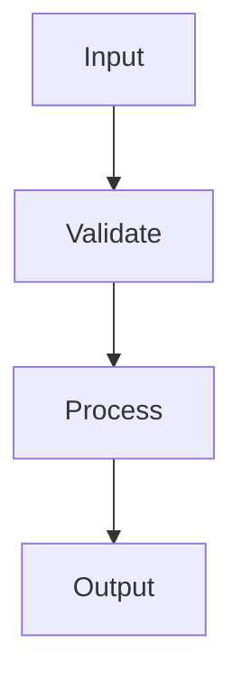

# MAM Workflow Grammar

## Overview

The MAM Workflow grammar defines how a module describes its process flow. A workflow is an ordered set of steps that transform module inputs into outputs. The grammar supports sequential steps, conditional branching, loops, parallel groups, and error handling paths.

The Workflow grammar is expressed through the `## Workflow` section, its `###` sub headings, numbered step lists, and optional Mermaid flowcharts.

## Description

A workflow section describes:

- **Process flow**: The sequence of operations
- **Data flow**: How data moves between steps
- **Control flow**: How branching and looping guide execution
- **Error flow**: How failures are detected and recovered
- **Integration flow**: How components and services interact

## Syntax

### Section Header

```markdown
## Workflow
```

### Sequential Steps

Use a numbered list for ordered steps:

```markdown
## Workflow

1. Receive input
2. Validate input
3. Process input
4. Return output
```

### Categorized Workflow

Use `###` sub headings to organize the workflow into groups:

```markdown
## Workflow

### Initialization

1. Load configuration
2. Initialize components

### Request Handling

1. Receive request
2. Validate request
3. Return response
```

### Conditional Branches

Nested bullet lists express branch and loop constructs:

```markdown
## Workflow

1. Attempt operation
2. If condition
   - Run primary path
3. Else
   - Run fallback path
4. Finalize
```

### Mermaid Flowchart

A `mermaid` code block visualizes the same flow:

```markdown
## Workflow


```

## Grammar Rules

| Rule | Description |
|------|-------------|
| Sequential | Steps appear in execution order |
| Complete | Workflow covers all operations |
| Clear | Step names are descriptive |
| Testable | Steps are independently testable |
| Documented | Each step is documented |
| Efficient | Workflow avoids redundant work |
| Robust | Workflow handles errors |
| Observable | Workflow records progress |
| Configurable | Parameters are configurable |

## Workflow Patterns

### Pattern 1: Linear Workflow

```markdown
1. Step one
2. Step two
3. Step three
```

### Pattern 2: Conditional Workflow

```markdown
1. Step one
2. If condition
   - Branch A
3. Else
   - Branch B
4. Step four
```

### Pattern 3: Loop Workflow

```markdown
1. Initialize
2. While condition
   - Repeat step
3. Finalize
```

### Pattern 4: Parallel Workflow

```markdown
1. Start parallel
   - Task A
   - Task B
2. Wait for all
3. Continue
```

## Implementation Notes

The Workflow grammar maps to the AST `WorkflowSection` node. Each numbered step becomes a `StepItem`, and Mermaid edges become `EdgeDeclaration` nodes. Conditional and loop constructs map to `ConditionalBlock` and `LoopBlock` nodes.

## Notes

- Step lists must use consistent numbering.
- Sub headings must increase in level by exactly one.
- Mermaid diagrams should match the textual steps.
- Edge labels describe transition conditions.
- Empty workflows are invalid.
- Steps with unmet dependencies are skipped at runtime.

## References

- MAM section grammar specification
- MAM AST specification
- MAM token definitions