# Mermaid Section

## Description
The Mermaid section contains visual diagrams for architecture, workflows, data models, and reasoning. It uses the Mermaid diagramming language to create visual representations that help humans understand complex systems, processes, and relationships.

The Mermaid section supports:
- **Flowcharts**: Process flows and decision trees
- **Sequence Diagrams**: Message flows between components
- **Class Diagrams**: Object-oriented structures
- **State Diagrams**: State transitions
- **Entity-Relationship Diagrams**: Database schemas
- **Gantt Charts**: Project timelines
- **Pie Charts**: Data distributions
- **Mind Maps**: Conceptual relationships
- **Timeline Diagrams**: Historical events

## Syntax

```markdown
## Mermaid

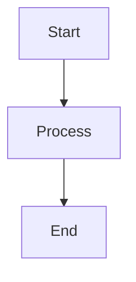
```

### Diagram Types

| Type | Syntax | Description |
|------|--------|-------------|
| Flowchart | `flowchart TD` | Process flows |
| Sequence | `sequenceDiagram` | Message sequences |
| Class | `classDiagram` | Class structures |
| State | `stateDiagram-v2` | State transitions |
| ER | `erDiagram` | Database schemas |
| Gantt | `gantt` | Project timelines |
| Pie | `pie` | Data distributions |
| Mindmap | `mindmap` | Concept maps |
| Timeline | `timeline` | Historical events |

### Flowchart Directions

| Direction | Description |
|-----------|-------------|
| `TD` or `TB` | Top to Bottom |
| `BT` | Bottom to Top |
| `LR` | Left to Right |
| `RL` | Right to Left |

## Rules

1. **Valid Mermaid syntax**: Code must be valid Mermaid
2. **Complete diagrams**: Diagrams should be complete and understandable
3. **Clear labels**: All nodes should have clear labels
4. **Consistent styling**: Use consistent styling throughout
5. **No secrets**: Never include secrets or sensitive data
6. **Document assumptions**: Document any assumptions in diagrams
7. **Use subgraphs**: Group related elements with subgraphs

### Styling Rules

```mermaid
%% Define styles
classDef default fill:#f9f,stroke:#333,stroke-width:2px
classDef error fill:#f00,stroke:#333,color:#fff
classDef success fill:#0f0,stroke:#333
```

### Node Shapes

| Shape | Syntax | Description |
|-------|--------|-------------|
| Rectangle | `[text]` | Default shape |
| Rounded | `(text)` | Rounded corners |
| Circle | `((text))` | Circle shape |
| Diamond | `{text}` | Decision node |
| Hexagon | `{{text}}` | Preparation |
| Parallelogram | `[/text/]` | Input/Output |
| Cylinder | `[(text)]` | Database |

## Description

The Mermaid section provides visual documentation:

### 1. Architecture Diagrams

System architecture visualization:

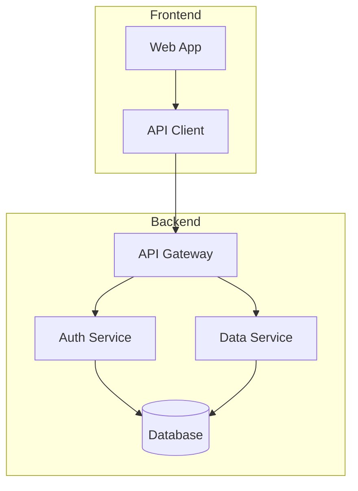

### 2. Sequence Diagrams

Message flow between components:

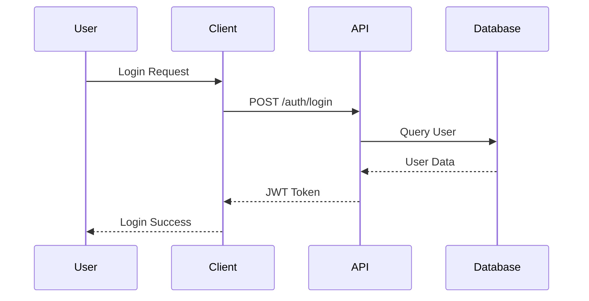

### 3. Class Diagrams

Object-oriented structures:

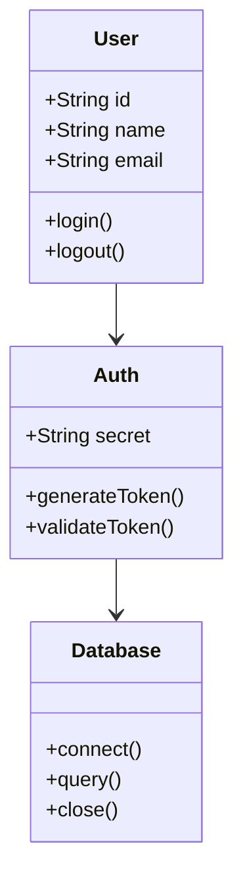

### 4. State Diagrams

State transitions:

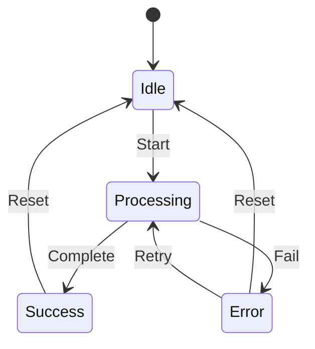

### 5. Entity-Relationship Diagrams

Database schemas:

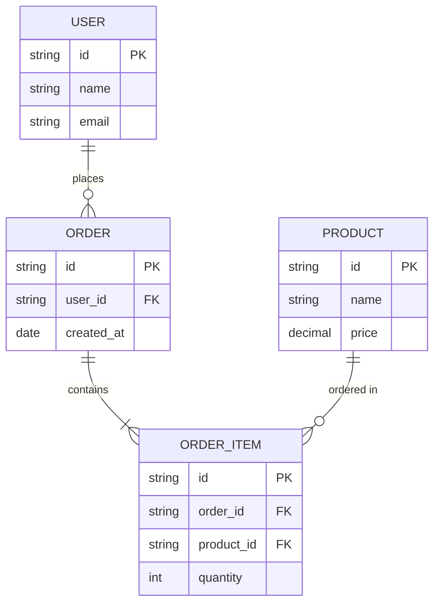

### 6. Gantt Charts

Project timelines:

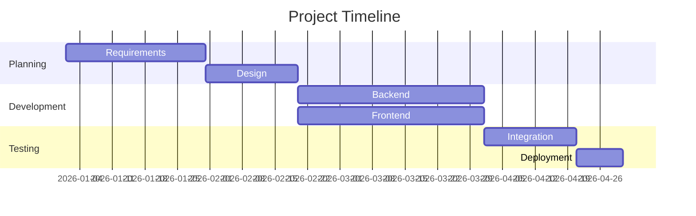

### 7. Pie Charts

Data distributions:

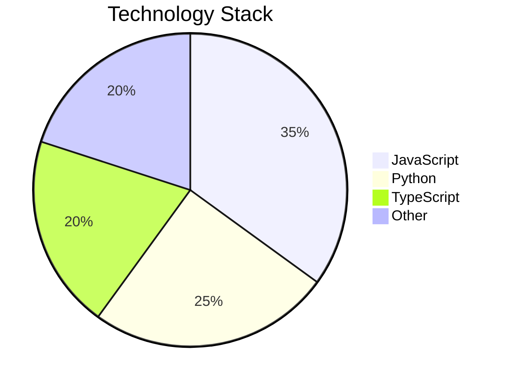

### 8. Mind Maps

Conceptual relationships:

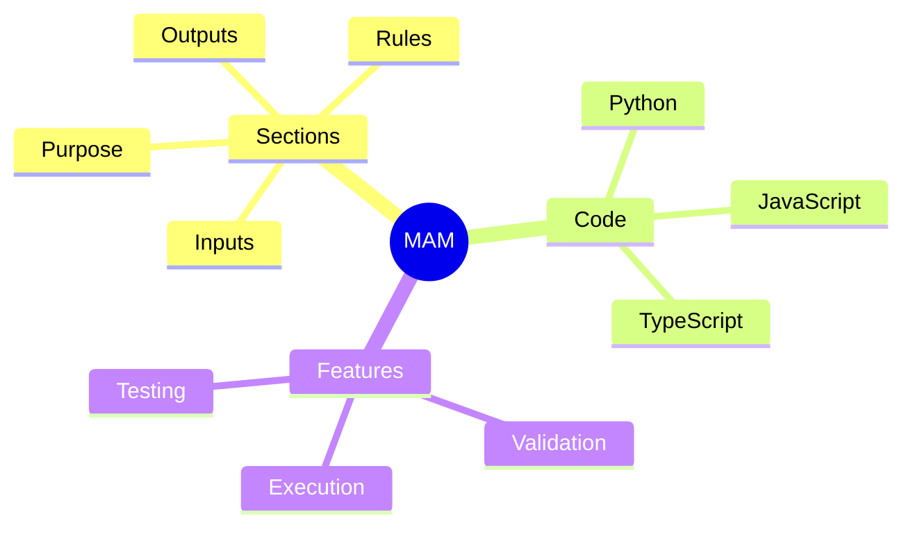

### 9. Timeline Diagrams

Historical events:

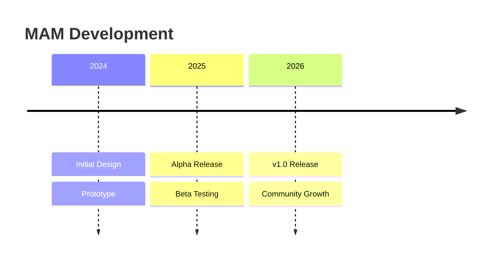

### 10. User Journey Diagrams

User experience flows:

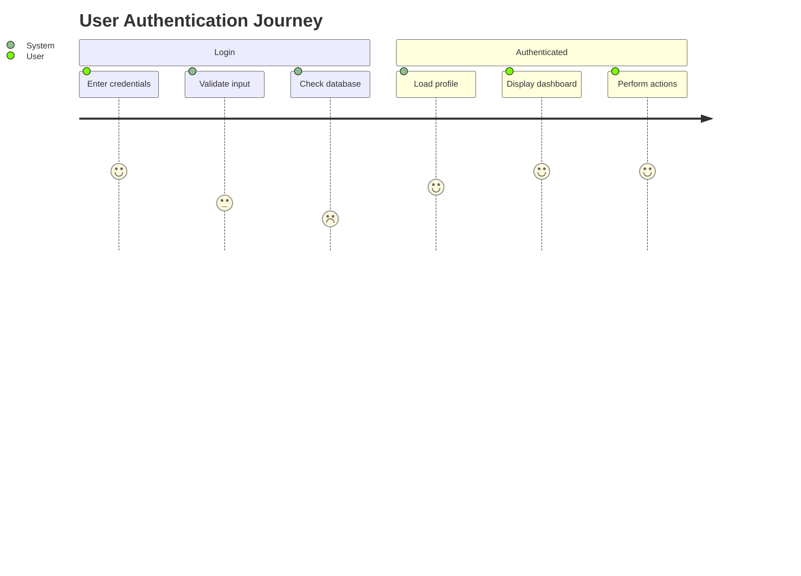

## Examples

### Authentication Flow

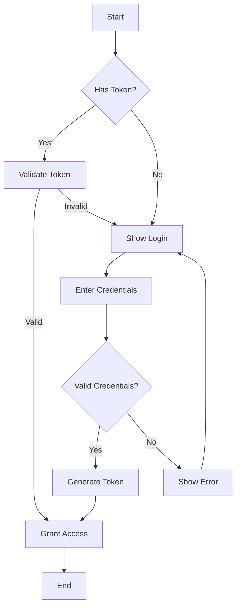

### API Request Flow

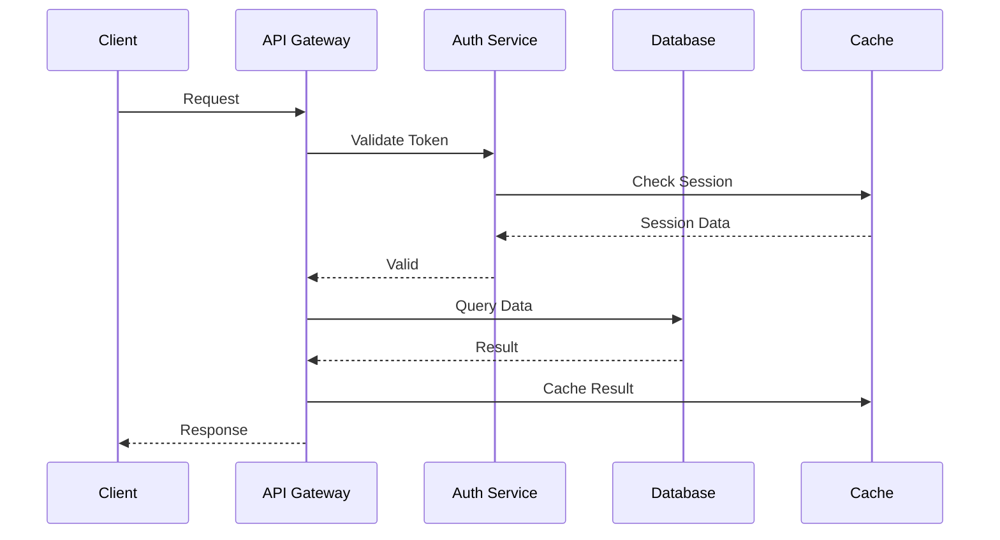

### Database Schema

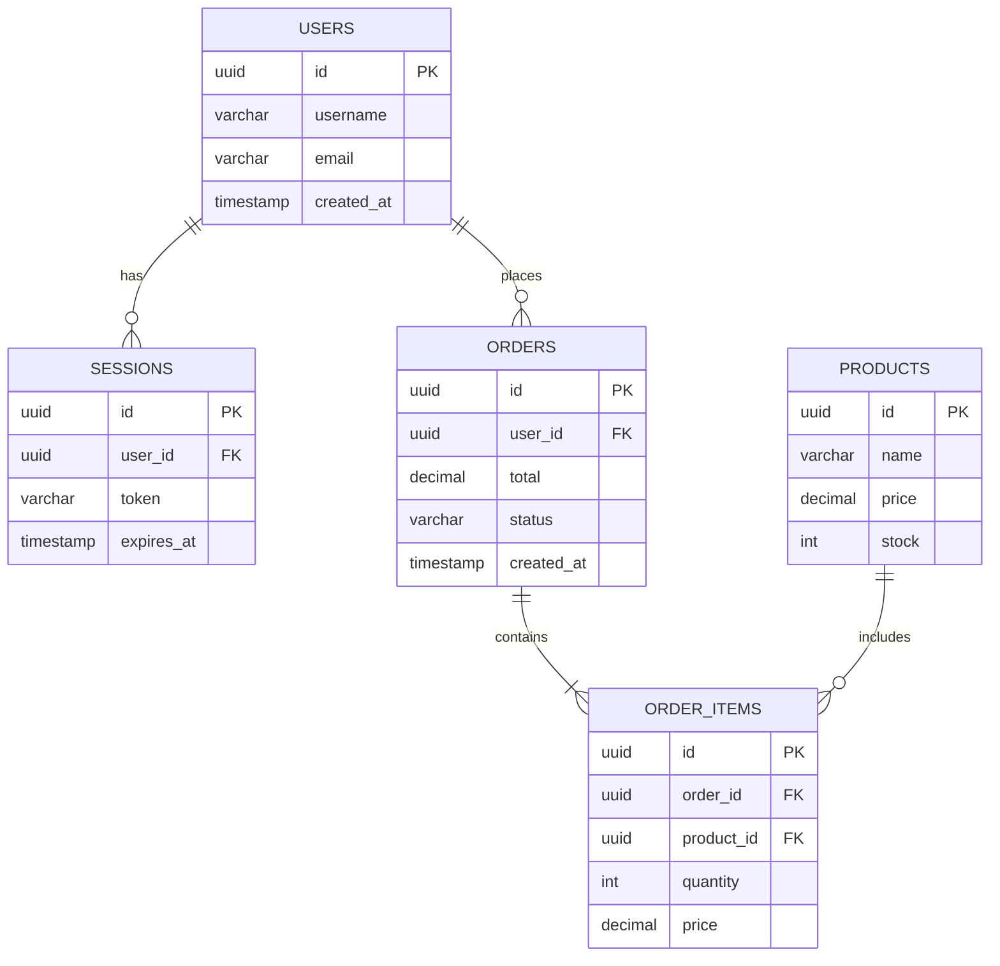

### State Machine

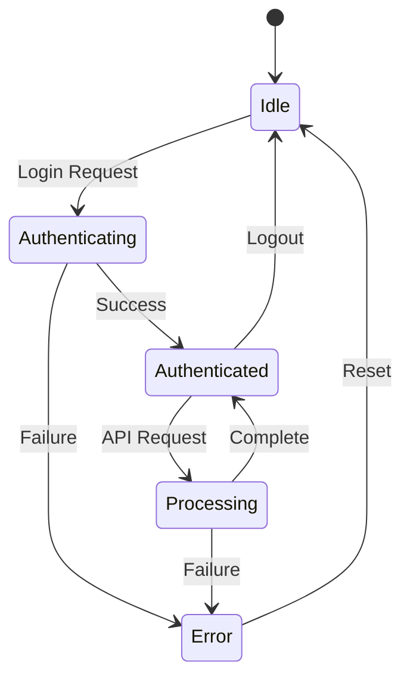

### Deployment Flow

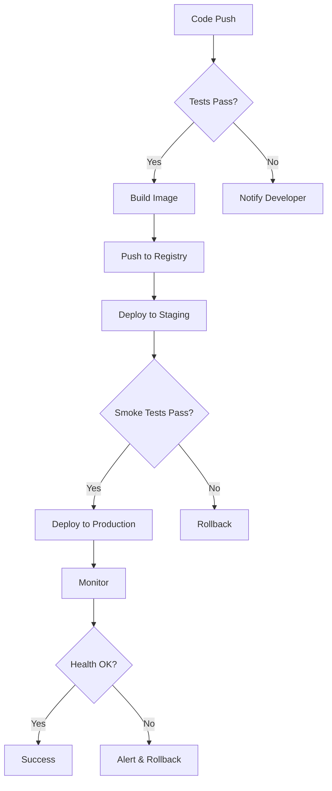

### Microservices Architecture

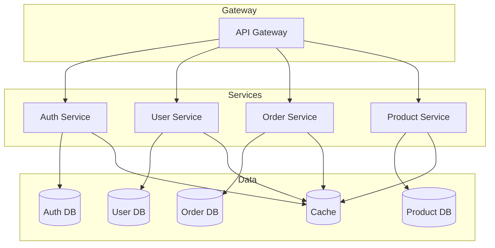

### CI/CD Pipeline

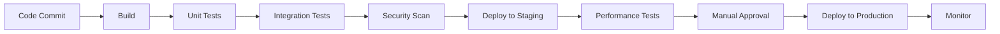

### Data Processing Pipeline

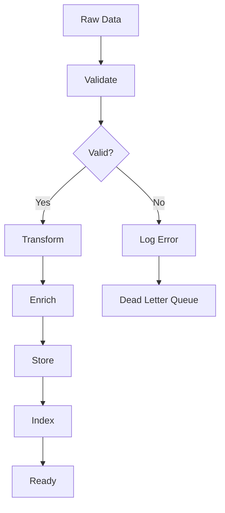

### User Registration Flow

```mermaid
sequenceDiagram
    participant U as User
    participant F as Frontend
    participant A as API
    participant D as Database
    participant E as Email Service
    
    U->>F: Fill Registration Form
    F->>A: POST /register
    A->>A: Validate Input
    A->>D: Check Email Exists
    D-->>A: Email Available
    A->>D: Create User
    D-->>A: User Created
    A->>E: Send Welcome Email
    E-->>A: Email Sent
    A-->>F: Registration Success
    F-->>U: Show Success Message
```

### Error Handling Flow

```mermaid
flowchart TD
    A[Error Occurs] --> B{Error Type}
    B -->|Validation| C[Return 400]
    B -->|Authentication| D[Return 401]
    B -->|Authorization| E[Return 403]
    B -->|Not Found| F[Return 404]
    B -->|Server Error| G[Return 500]
    C --> H[Log Error]
    D --> H
    E --> H
    F --> H
    G --> H
    H --> I[Alert if Critical]
```

## Edge Cases

### 1. Complex Diagrams

When diagrams become too complex:

```mermaid
flowchart TD
    A[Start] --> B[Process 1]
    B --> C[Process 2]
    C --> D[Process 3]
    % Too many nodes - use subgraphs
```

**Solution**: Break into smaller diagrams or use subgraphs.

### 2. Circular References

When diagrams have cycles:

```mermaid
flowchart TD
    A --> B
    B --> C
    C --> A  % Circular reference
```

**Solution**: Document cycles clearly or use state diagrams.

### 3. Missing Labels

When nodes lack labels:

```mermaid
flowchart TD
    A --> B
    B --> C
    C --> D
    % Nodes B, C, D have no labels
```

**Solution**: Always label all nodes.

### 4. Inconsistent Styling

When styling varies:

```mermaid
flowchart TD
    A[Start] --> B(Process)
    B --> C{Decision}
    % Inconsistent node shapes
```

**Solution**: Use consistent styling.

### 5. Large Diagrams

When diagrams are too large:

```mermaid
flowchart TD
    % 100+ nodes - hard to read
```

**Solution**: Break into multiple diagrams.

### 6. Complex Decisions

When decision trees are complex:

```mermaid
flowchart TD
    A{Decision 1} -->|Yes| B{Decision 2}
    A -->|No| C{Decision 3}
    B -->|Yes| D
    B -->|No| E
    C -->|Yes| F
    C -->|No| G
    % Deep nesting
```

**Solution**: Simplify or use multiple diagrams.

### 7. Parallel Processes

When showing parallel execution:

```mermaid
flowchart TD
    A --> B
    A --> C
    B --> D
    C --> D
    % Parallel branches
```

**Solution**: Use proper parallel notation.

### 8. Conditional Flows

When flows depend on conditions:

```mermaid
flowchart TD
    A -->|condition1| B
    A -->|condition2| C
    A -->|condition3| D
    % Multiple conditions
```

**Solution**: Document conditions clearly.

### 9. Error Paths

When error handling is complex:

```mermaid
flowchart TD
    A[Process] --> B{Success?}
    B -->|Yes| C[End]
    B -->|No| D[Error Handler]
    D --> E{Retry?}
    E -->|Yes| A
    E -->|No| F[Fail]
```

**Solution**: Include all error paths.

### 10. External Systems

When showing external dependencies:

```mermaid
flowchart TD
    A[Internal] --> B[External Service]
    B --> C[Internal]
    % External system unclear
```

**Solution**: Clearly mark external systems.

## Best Practices

### 1. Start Simple

Begin with simple diagrams:

```mermaid
flowchart TD
    A[Start] --> B[Process]
    B --> C[End]
```

### 2. Use Subgraphs

Group related elements:

```mermaid
flowchart TD
    subgraph Frontend
        A[Web App]
    end
    
    subgraph Backend
        B[API]
        C[Database]
    end
    
    A --> B
    B --> C
```

### 3. Label Everything

All nodes should have clear labels:

```mermaid
flowchart TD
    A[User Input] --> B[Validate Data]
    B --> C[Save to Database]
```

### 4. Use Consistent Styling

Define and use consistent styles:

```mermaid
flowchart TD
    classDef default fill:#f9f,stroke:#333
    classDef error fill:#f00,stroke:#333
    
    A[Start]:::default --> B[Error]:::error
```

### 5. Document Assumptions

Add comments for assumptions:

```mermaid
flowchart TD
    %% Assumes database is available
    A[Request] --> B[Query Database]
```

### 6. Use Meaningful Names

Use descriptive node names:

```mermaid
flowchart TD
    A[Receive User Request] --> B[Validate Input Parameters]
    B --> C[Process Business Logic]
```

### 7. Show Both Success and Error Paths

Include error handling:

```mermaid
flowchart TD
    A[Process] --> B{Success?}
    B -->|Yes| C[Return Result]
    B -->|No| D[Handle Error]
```

### 8. Keep Diagrams Focused

One diagram per concept:

```mermaid
flowchart TD
    %% Authentication flow only
    A[Login] --> B[Validate]
    B --> C[Grant Access]
```

### 9. Use Proper Arrow Direction

Show flow direction clearly:

```mermaid
flowchart LR
    A --> B --> C --> D
```

### 10. Test Rendering

Verify diagrams render correctly.

## Common Patterns

### Pattern 1: Simple Flow

```mermaid
flowchart TD
    A[Start] --> B[Process]
    B --> C[End]
```

### Pattern 2: Decision Tree

```mermaid
flowchart TD
    A{Condition?} -->|Yes| B[Action 1]
    A -->|No| C[Action 2]
```

### Pattern 3: Loop

```mermaid
flowchart TD
    A[Start] --> B[Process]
    B --> C{Continue?}
    C -->|Yes| B
    C -->|No| D[End]
```

### Pattern 4: Parallel Processing

```mermaid
flowchart TD
    A[Start] --> B[Task 1]
    A --> C[Task 2]
    B --> D[Join]
    C --> D
    D --> E[End]
```

### Pattern 5: Error Handling

```mermaid
flowchart TD
    A[Process] --> B{Success?}
    B -->|Yes| C[End]
    B -->|No| D[Retry]
    D --> A
```

### Pattern 6: State Machine

```mermaid
stateDiagram-v2
    [*] --> Active
    Active --> Inactive: Timeout
    Inactive --> Active: Activity
```

### Pattern 7: Sequence

```mermaid
sequenceDiagram
    A->>B: Request
    B-->>A: Response
```

### Pattern 8: Class Structure

```mermaid
classDiagram
    class A {
        +method()
    }
    A --> B
```

### Pattern 9: Data Flow

```mermaid
flowchart LR
    A[Source] --> B[Transform]
    B --> C[Destination]
```

### Pattern 10: Architecture

```mermaid
flowchart TB
    subgraph Client
        A[Web]
    end
    subgraph Server
        B[API]
        C[DB]
    end
    A --> B --> C
```

## Validation Rules

### Rule 1: Valid Mermaid Syntax

Diagrams must be valid Mermaid:

```python
def validate_mermaid(code: str) -> bool:
    # Simple validation
    if not code.strip():
        return False
    
    # Check for diagram type
    valid_types = ['flowchart', 'sequenceDiagram', 'classDiagram', 
                   'stateDiagram', 'erDiagram', 'gantt', 'pie']
    
    first_line = code.strip().split('\n')[0]
    return any(t in first_line for t in valid_types)
```

### Rule 2: Complete Diagrams

Diagrams should be complete:

```python
def validate_completeness(code: str) -> bool:
    # Check for start and end nodes
    lines = code.strip().split('\n')
    
    # Simple heuristic
    return len(lines) >= 3
```

### Rule 3: No Secrets

Diagrams must not contain secrets:

```python
def check_secrets(code: str) -> bool:
    secret_patterns = ['password', 'secret', 'token', 'key']
    return not any(p in code.lower() for p in secret_patterns)
```

### Rule 4: Clear Labels

All nodes should have labels:

```python
def check_labels(code: str) -> bool:
    # Check for unlabeled nodes
    import re
    nodes = re.findall(r'\[([^\]]*)\]', code)
    return all(node.strip() for node in nodes)
```

### Rule 5: Consistent Styling

Styling should be consistent:

```python
def check_styling_consistency(code: str) -> bool:
    # Check for consistent node shapes
    return True  # Simplified
```

## Related Sections

- **[Workflow](workflow.md)**: Process flows in detail
- **[Python](python.md)**: Code implementation
- **[JavaScript](javascript.md)**: Code implementation
- **[Tests](tests.md)**: Testing diagrams
- **[Examples](examples.md)**: Usage examples
- **[References](references.md)**: External documentation

## FAQ

### Q: What diagram types are supported?

**A:** Mermaid supports flowcharts, sequence diagrams, class diagrams, state diagrams, ER diagrams, Gantt charts, pie charts, mind maps, and timelines.

### Q: How do I create complex diagrams?

**A:** Use subgraphs to group related elements:

```mermaid
flowchart TD
    subgraph Group1
        A --> B
    end
    subgraph Group2
        C --> D
    end
```

### Q: Can I style diagrams?

**A:** Yes, use classDef:

```mermaid
flowchart TD
    classDef error fill:#f00
    A[Error]:::error
```

### Q: How do I show parallel processes?

**A:** Use multiple arrows from one node:

```mermaid
flowchart TD
    A --> B
    A --> C
    B --> D
    C --> D
```

### Q: Can I add comments?

**A:** Yes, use %% for comments:

```mermaid
flowchart TD
    %% This is a comment
    A --> B
```

### Q: How do I show external systems?

**A:** Use subgraphs or different node shapes:

```mermaid
flowchart TD
    A[Internal] --> B[(External DB)]
```

### Q: Can I use emojis?

**A:** Yes, but test rendering as support varies.

### Q: How do I handle large diagrams?

**A:** Break into multiple diagrams or use subgraphs.

### Q: Can I link diagrams?

**A:** Not directly. Use consistent naming across diagrams.

### Q: How do I show error paths?

**A:** Use conditional arrows:

```mermaid
flowchart TD
    A -->|Success| B
    A -->|Error| C
```

### Q: Can I use custom icons?

**A:** Not natively. Use node shapes or text representations.

### Q: How do I show data flow?

**A:** Use arrows with labels:

```mermaid
flowchart LR
    A -->|data| B
```

### Q: Can I create interactive diagrams?

**A:** Not in static Mermaid. Use Mermaid.js for interactive versions.

### Q: How do I show timing?

**A:** Use sequence diagrams:

```mermaid
sequenceDiagram
    A->>B: Request (100ms)
    B-->>A: Response (50ms)
```

### Q: Can I use Markdown in nodes?

**A:** Yes, use quotes:

```mermaid
flowchart TD
    A["**Bold** and *italic*"]
```

### Q: How do I show database schemas?

**A:** Use ER diagrams:

```mermaid
erDiagram
    USERS ||--o{ ORDERS : places
```

### Q: Can I animate diagrams?

**A:** Not in static Mermaid. Use Mermaid.js for animations.

### Q: How do I show states?

**A:** Use state diagrams:

```mermaid
stateDiagram-v2
    [*] --> Active
    Active --> Inactive
```

### Q: Can I export diagrams?

**A:** Yes, Mermaid CLI can export to PNG, SVG, PDF.

### Q: How do I show project timelines?

**A:** Use Gantt charts:

```mermaid
gantt
    title Project
    section Phase 1
    Task 1: a1, 2026-01-01, 30d
```

### Q: Can I use Mermaid in Markdown?

**A:** Yes, wrap in ```mermaid code blocks.

## Implementation Notes

### Diagram Extraction

```python
def extract_mermaid(content: str) -> list[str]:
    diagrams = []
    in_mermaid = False
    current_diagram = []
    
    for line in content.split('\n'):
        if line.strip().startswith('```mermaid'):
            in_mermaid = True
            current_diagram = []
        elif line.strip() == '```' and in_mermaid:
            in_mermaid = False
            diagrams.append('\n'.join(current_diagram))
        elif in_mermaid:
            current_diagram.append(line)
    
    return diagrams
```

### Diagram Validation

```python
def validate_mermaid_diagram(code: str) -> dict:
    errors = []
    
    # Check for diagram type
    valid_types = ['flowchart', 'sequenceDiagram', 'classDiagram', 
                   'stateDiagram', 'erDiagram', 'gantt', 'pie']
    
    first_line = code.strip().split('\n')[0]
    if not any(t in first_line for t in valid_types):
        errors.append("Invalid diagram type")
    
    # Check for empty diagram
    if len(code.strip().split('\n')) < 3:
        errors.append("Diagram too short")
    
    return {'valid': len(errors) == 0, 'errors': errors}
```

### Diagram Documentation Generator

```python
def document_diagram(code: str) -> str:
    # Extract diagram type
    first_line = code.strip().split('\n')[0]
    diagram_type = first_line.split()[0]
    
    return f"## {diagram_type.title()} Diagram\n\n```mermaid\n{code}\n```"
```

## References

- [MAM Specification - Mermaid](../SPEC.md#mermaid)
- [Mermaid Documentation](https://mermaid-js.github.io/mermaid/)
- [Mermaid Live Editor](https://mermaid.live/)
- [Diagramming Best Practices](https://www.lucidchart.com/pages/)

---

**Section Version:** 1.0.0
**Last Updated:** 2026-07-24
**Status:** Stable