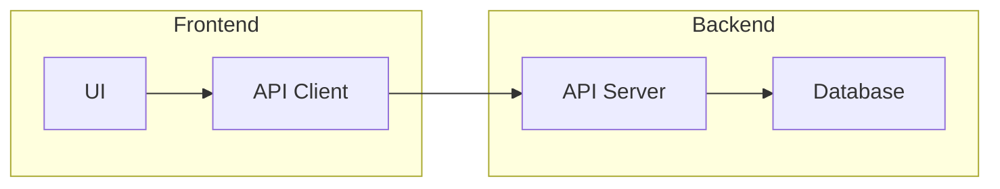

# Mermaid Section

## Description
The Mermaid section contains visual diagrams for architecture and reasoning.

## Supported Diagram Types
- flowchart / graph
- sequenceDiagram
- classDiagram
- stateDiagram
- erDiagram
- gantt
- pie
- mindmap
- timeline

## Example
```markdown
## Mermaid


```