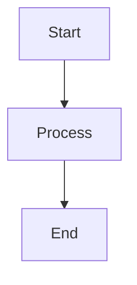
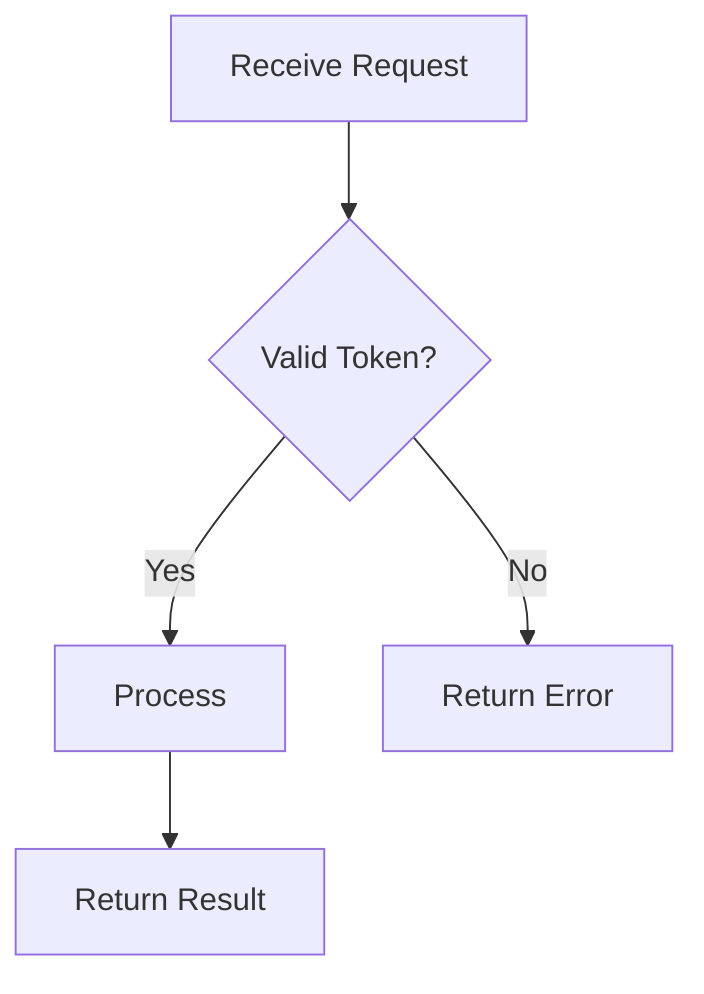

# Workflow Section

## Description
The Workflow section defines the process flow, typically using Mermaid diagrams.

## Syntax
```markdown
## Workflow


```

## Rules
- Use Mermaid diagram syntax
- Common diagram types: flowchart, sequence, state

## Example
```markdown
## Workflow


```